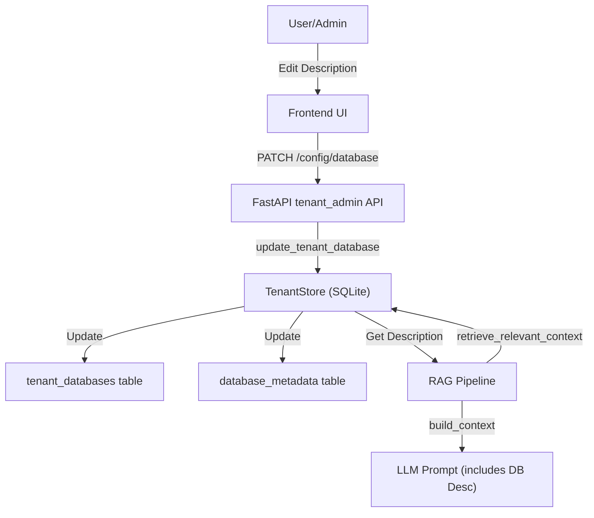

# Plan: Add Database Description to Metadata and RAG

This plan implements a comprehensive database description feature that helps the AI understand the purpose of each connected database.

## 1. Backend: Metadata and RAG Enhancement

### 1.1 Update Data Models

- Update `RetrievedContext` in [`backend/src/vanna/core/metadata/models.py`](backend/src/vanna/core/metadata/models.py) to include an optional `database_description` field.

### 1.2 Enhance Context Retrieval

- Modify `MetadataRetriever.retrieve_relevant_context` in [`backend/src/vanna/core/metadata/retriever.py`](backend/src/vanna/core/metadata/retriever.py) to fetch the database description using the `connection_id` (format `tenant_id:database_id`) from the `TenantStore`.
- Update `MetadataContextBuilder.build_context` in [`backend/src/vanna/core/metadata/context_builder.py`](backend/src/vanna/core/metadata/context_builder.py) to include the database description as a header in the prompt snippet.

### 1.3 Update Tenant Storage

- Add `update_tenant_database` method to `TenantStore` in [`backend/src/vanna/core/tenant/store.py`](backend/src/vanna/core/tenant/store.py) to allow updating the `description` and `is_primary` status of a connection. This method will update both the `tenant_databases` and `database_metadata` tables.

### 1.4 Add API Endpoint

- In [`backend/src/vanna/servers/fastapi/tenant_admin/routes.py`](backend/src/vanna/servers/fastapi/tenant_admin/routes.py), implement a new `PATCH` endpoint `/config/database/{database_id}` that accepts `DatabaseUpdate` and calls the `TenantStore.update_tenant_database` method.

## 2. Frontend: Admin UI Enhancements

### 2.1 Update Service Layer

- Add `updateDatabase` method to [`frontend/services/tenantService.ts`](frontend/services/tenantService.ts) to interact with the new `PATCH` endpoint.

### 2.2 Enhance Database Management UI

- Modify [`frontend/components/TenantAdmin/TenantDashboard.tsx`](frontend/components/TenantAdmin/TenantDashboard.tsx) to add an "Edit" button to each database card.
- Refactor [`frontend/components/TenantAdmin/AddDatabaseModal.tsx`](frontend/components/TenantAdmin/AddDatabaseModal.tsx) to support both "Add" and "Edit" modes. When in edit mode, the `database_id` and `connection_string` should be read-only or hidden if appropriate, allowing the user to focus on the `description` and `is_primary` status.

## Mermaid Diagram: Data Flow

