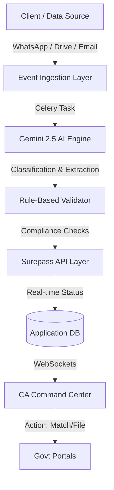

# Saral Returns: Comprehensive Revamp for Indian CA Practice

This plan outlines the structural and functional upgrade of Saral Returns to serve as an AI-first "Practice OS" for Chartered Accountants in India.

## 1. Architecture Overview

The system will shift from a batch-processing model to an event-driven, real-time compliance engine.

## 2. Core Module Upgrades

### 2.1. Advanced GST Intelligence

-   **Section 17(5) Rule Engine**: Enhance [`django_backend/apps/gst/modules/itc_rules_engine.py`](django_backend/apps/gst/modules/itc_rules_engine.py) to automatically flag blocked credits (e.g., motor vehicles, catering) using AI categorization.
-   **HSN & POS Validation**: Update [`django_backend/apps/core/services/vertex_ai_document_classifier.py`](django_backend/apps/core/services/vertex_ai_document_classifier.py) prompts to extract HSN/SAC and Place of Supply to detect tax type (IGST vs CGST/SGST) errors.
-   **Vendor Compliance Monitor**: Integrate Surepass "GSTIN Search" into a recurring task to alert CAs if a major supplier's GSTIN becomes inactive or suspended.

### 2.2. New Income Tax (ITR) Module

-   **Document Extractor**: Create a specialized extractor for Form 16, AIS/TIS PDFs, and Broker Capital Gain statements.
-   **Surepass ITR Integration**: Implement `get_itr_details` and `get_ais_details` in [`django_backend/apps/core/services/surepass_service.py`](django_backend/apps/core/services/surepass_service.py).
-   **Computation Engine**: Build a logic layer to calculate total income under Old vs. New Tax Regimes automatically.

### 2.3. Audit & CARO Compliance

-   **Section 43B(h) Tracker**: Monitor MSME payments via purchase registers and AI-extracted MSME certificates. Auto-flag liabilities for payments pending >45 days.
-   **Digital Working Papers**: Implement a structured audit module with CARO 2020 checklists and automated report drafting based on AI findings.

## 3. Communication Layer: WhatsApp-as-a-Platform

-   **Inbound Ingestion**: Update [`django_backend/apps/core/services/whatsapp_service.py`](django_backend/apps/core/services/whatsapp_service.py) to handle Twilio webhooks for incoming media.
-   **Automated Nudges**: Implement a nudge engine to ping clients on WhatsApp for missing documents detected in GSTR-2B or 26AS.

## 4. Frontend & Practice Management

-   **Compliance War Room**: Revamp [`frontend/web/src/components/portal/ClientDashboard.tsx`](frontend/web/src/components/portal/ClientDashboard.tsx) to show real-time compliance scores and estimated tax liabilities.
-   **Automated Billing**: Enhance [`django_backend/apps/billing/models.py`](django_backend/apps/billing/models.py) to calculate professional fees based on volume (e.g., number of invoices processed) and auto-calculate late fees for client-side delays.

## 5. Implementation Roadmap

1.  **Phase 1 (Week 1-2)**: Expand Surepass APIs and enhance Gemini prompts for HSN/POS.
2.  **Phase 2 (Week 3-4)**: Build the `income_tax` and `audit` backend apps.