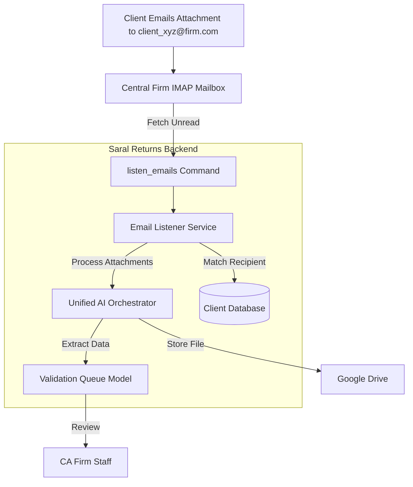

# Automated Email Ingestion Plan

This plan implements a "Zero-touch" data collection system for CA firms by processing client documents sent via email.

## 1. Database Schema Update

- Add `ingestion_email` field to the `Client` model in [`django_backend/apps/clients/models.py`](django_backend/apps/clients/models.py) to store the unique email address assigned to each client (e.g., `client_xyz@firm.com`).

## 2. Management Command for Email Processing

- Create a new management command [`django_backend/apps/core/management/commands/listen_emails.py`](django_backend/apps/core/management/commands/listen_emails.py) that:
    - Connects to a central IMAP mailbox using credentials from environment variables.
    - Processes unread emails by checking the `To` header against `Client.ingestion_email` (or `From` header against `Client.email` as fallback).
    - Downloads attachments to a temporary directory.
    - Uses `UnifiedAIOrchestrator` to classify and extract data from each attachment.
    - Creates `ValidationQueue` and `ValidationChange` records for extracted data (Invoices, TDS Challans, etc.).
    - Uploads the processed documents to the client's Google Drive folder.
    - Marks emails as seen after successful processing.

## 3. Service Layer Integration

- Refactor [`django_backend/apps/core/services/email_listener.py`](django_backend/apps/core/services/email_listener.py) to support the new unified AI processing and validation queue population.
- Ensure the `UnifiedAIOrchestrator` can be called granularly for single-file processing.

## 4. Frontend & API Updates

- Update `ClientSerializer` in [`django_backend/apps/clients/views.py`](django_backend/apps/clients/views.py) to include `ingestion_email`.
- Update the `Client` TypeScript interface in [`frontend/web/src/types/index.ts`](frontend/web/src/types/index.ts).
- (Optional) Add a field in the Client Edit UI to allow managers to set the `ingestion_email`.

## Data Flow Diagram

