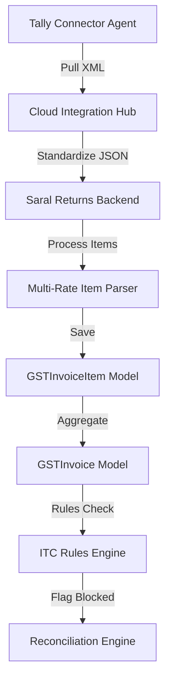

# Implementation Plan: CA Firm Practice Management and Compliance Optimization

This plan upgrades the system from a client-centric tool to a professional practice management platform, focusing on employee allocation, multi-rate accuracy, and proactive client/supplier communication.

## 1. Practice Management: Employee Allocation

Enable managers to assign specific clients to employees to streamline workflows and focus.

- Update `Client` model in [`django_backend/apps/clients/models.py`](django_backend/apps/clients/models.py) to include an `assigned_to` field linked to `authentication.User`.
- Modify `ClientViewSet` to support filtering by `assigned_to` via query parameters.
- Update `frontend/web/src/components/pages/clients/ClientsPage.tsx` to include a "My Clients" filter toggle.

## 2. Compliance Accuracy: Multi-Rate and ITC Rules

Handle real-world complex invoices with multiple tax rates and blocked credits.

- Create `GSTInvoiceItem` model in [`django_backend/apps/gst/models.py`](django_backend/apps/gst/models.py) to support line-item level HSN and GST rates.
- Update `calculate_invoice_tax` in [`django_backend/apps/gst/services/tax_calculator.py`](django_backend/apps/gst/services/tax_calculator.py) to aggregate totals from `GSTInvoiceItem`.
- Enhance [`django_backend/apps/gst/modules/itc_rules_engine.py`](django_backend/apps/gst/modules/itc_rules_engine.py) to flag blocked credits based on HSN (e.g., 8703 for motor vehicles) or Vendor categories.

## 3. Operational Efficiency: Bulk Sync and Agent Health

Monitor client infrastructure proactively and process data in batches.

- Add a `BulkSyncAction` to [`django_backend/apps/gst/views.py`](django_backend/apps/gst/views.py) to trigger Tally pulls for multiple clients in one request.
- Create an **Agent Health Hub** on the backend that aggregates `last_heartbeat` from `AgentState`.
- Implement a `PartnerDashboard` in `frontend/web/src/components/dashboard/InteractiveDashboard.tsx` to show firm-wide filing percentages and failing Tally agents.

## 4. Communication & Automation: WhatsApp Bridge

Automate data collection and follow-ups via WhatsApp.

- **OTP Bridge**: Update [`django_backend/apps/core/services/whatsapp_service.py`](django_backend/apps/core/services/whatsapp_service.py) to send OTP requests when filing is initiated and listen for incoming messages to fulfill the `OTPManager` requirement.
- **Supplier Follow-up**: Add a "Nudge Supplier" button in `ReconciliationResults.tsx` that triggers a WhatsApp message to vendors found in Books but missing in GSTR-2B.
- **Billing Integration**: Link `GSTRReturn` completion to [`django_backend/apps/billing/views.py`](django_backend/apps/billing/views.py) to automatically generate professional fee invoices.

## Data Flow for Multi-Rate Processing

