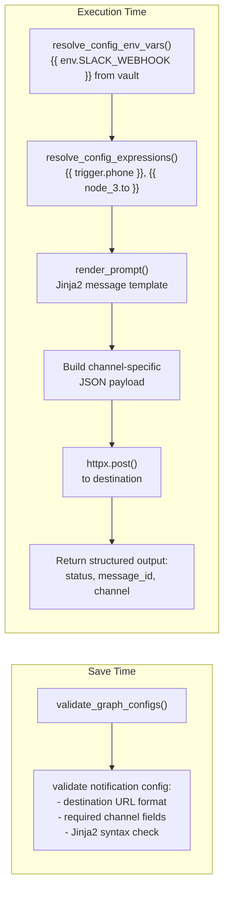
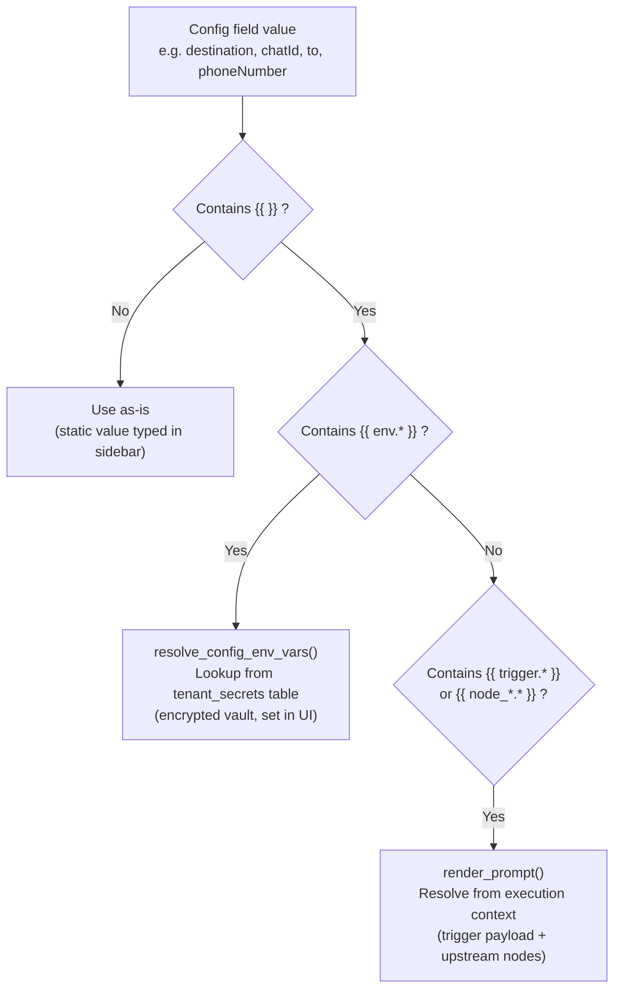
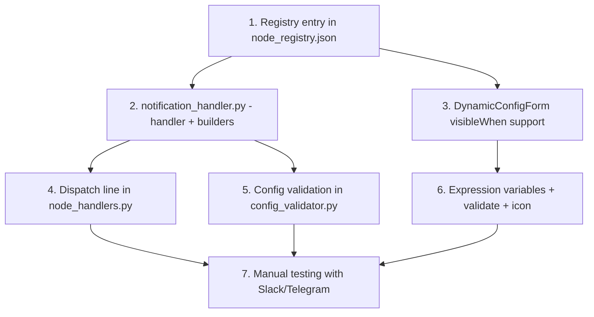

# Channel-Aware Notification Node

## Architecture



## Three-source config resolution

Every config field in the Notification node supports three ways to provide a value, resolved in order:



**Examples of each source:**

- **Static (per-node):** User types `https://hooks.slack.com/services/T00/B00/xxx` directly in the `destination` field
- **Vault (global config):** User types `{{ env.SLACK_OPS_WEBHOOK }}` in the `destination` field -- resolved from the tenant secrets configured in the Secrets UI
- **Trigger payload:** User types `{{ trigger.recipient_phone }}` in the `phoneNumber` field -- resolved at runtime from the incoming webhook/execute payload
- **Upstream node:** User types `{{ node_3.email }}` in the `to` field -- resolved from a previous node's output (e.g., an Entity Extractor that extracted an email address)
- **Mixed:** User types `https://api.telegram.org/bot{{ env.TELEGRAM_TOKEN }}/sendMessage` -- vault secret embedded in a URL template

**Implementation:** The existing `resolve_config_env_vars()` in [backend/app/engine/prompt_template.py](backend/app/engine/prompt_template.py) only handles `{{ env.* }}`. The notification handler adds a second resolution pass using `render_prompt()` on all string config values that still contain `{{ }}` after env resolution. This two-pass approach keeps backward compatibility (env vars resolve first via vault, then runtime expressions resolve from context).


## Supported Channels


| Channel           | Transport                                         | Destination                      | Channel-specific config             |
| ----------------- | ------------------------------------------------- | -------------------------------- | ----------------------------------- |
| `slack_webhook`   | POST to Incoming Webhook URL                      | Webhook URL                      | `username`, `iconEmoji`             |
| `teams_webhook`   | POST to Connector URL                             | Webhook URL                      | `title`, `themeColor`               |
| `discord_webhook` | POST to Discord Webhook URL                       | Webhook URL                      | `username`, `avatarUrl`             |
| `telegram`        | POST to `api.telegram.org/bot{token}/sendMessage` | Bot token (via `{{ env.* }}`)    | `chatId`, `parseMode`               |
| `whatsapp`        | POST to Meta Cloud API                            | Access token (via `{{ env.* }}`) | `phoneNumber`, `templateName`       |
| `pagerduty`       | POST to Events API v2                             | Routing key (via `{{ env.* }}`)  | `severity`, `eventAction`, `source` |
| `email`           | POST to SendGrid/Mailgun API or SMTP              | API key or SMTP config           | `to`, `subject`, `from`             |
| `generic_webhook` | POST/PUT to any URL                               | URL                              | `method`, `headers`                 |


## Files to modify/create

### Backend

**1. [shared/node_registry.json*](shared/node_registry.json)* — Add `notification` node type with config schema

- New category `"notification"` with label `"Notifications"` in the `categories` array
- New `node_types` entry:

```json
{
  "type": "notification",
  "category": "notification",
  "label": "Notification",
  "description": "Send a formatted message to Slack, Teams, Discord, Telegram, WhatsApp, PagerDuty, email, or a generic webhook",
  "icon": "bell",
  "config_schema": {
    "channel": {
      "type": "string",
      "default": "slack_webhook",
      "enum": ["slack_webhook", "teams_webhook", "discord_webhook", "telegram", "whatsapp", "pagerduty", "email", "generic_webhook"],
      "description": "Notification channel to send to"
    },
    "destination": {
      "type": "string",
      "default": "",
      "description": "Webhook URL, bot token, or API endpoint. Supports: static value, {{ env.SECRET }} from vault, or {{ trigger.field }} / {{ node_N.field }} from runtime context."
    },
    "messageTemplate": {
      "type": "string",
      "default": "",
      "description": "Jinja2 message template. Use {{ trigger.field }} or {{ node_2.response }} for dynamic content."
    },
    "username": {
      "type": "string", "default": "Orchestrator",
      "description": "Display name for the bot (Slack/Discord)",
      "visibleWhen": {"field": "channel", "values": ["slack_webhook", "discord_webhook"]}
    },
    "iconEmoji": {
      "type": "string", "default": ":robot_face:",
      "description": "Emoji icon for the Slack message",
      "visibleWhen": {"field": "channel", "values": ["slack_webhook"]}
    },
    "avatarUrl": {
      "type": "string", "default": "",
      "description": "Avatar image URL for the Discord bot",
      "visibleWhen": {"field": "channel", "values": ["discord_webhook"]}
    },
    "title": {
      "type": "string", "default": "",
      "description": "Card title (Teams)",
      "visibleWhen": {"field": "channel", "values": ["teams_webhook"]}
    },
    "themeColor": {
      "type": "string", "default": "0076D7",
      "description": "Hex color for the Teams card accent",
      "visibleWhen": {"field": "channel", "values": ["teams_webhook"]}
    },
    "chatId": {
      "type": "string", "default": "",
      "description": "Telegram chat/group ID. Static, {{ env.TELEGRAM_CHAT_ID }}, or {{ trigger.chat_id }}",
      "visibleWhen": {"field": "channel", "values": ["telegram"]}
    },
    "parseMode": {
      "type": "string", "default": "HTML",
      "enum": ["HTML", "Markdown", "MarkdownV2"],
      "description": "Telegram message format",
      "visibleWhen": {"field": "channel", "values": ["telegram"]}
    },
    "phoneNumber": {
      "type": "string", "default": "",
      "description": "Recipient phone in E.164 format. Static, {{ env.* }}, or {{ trigger.phone }}",
      "visibleWhen": {"field": "channel", "values": ["whatsapp"]}
    },
    "templateName": {
      "type": "string", "default": "",
      "description": "Approved WhatsApp message template name (required by Meta policy for business-initiated messages)",
      "visibleWhen": {"field": "channel", "values": ["whatsapp"]}
    },
    "severity": {
      "type": "string", "default": "warning",
      "enum": ["critical", "error", "warning", "info"],
      "description": "PagerDuty alert severity",
      "visibleWhen": {"field": "channel", "values": ["pagerduty"]}
    },
    "eventAction": {
      "type": "string", "default": "trigger",
      "enum": ["trigger", "acknowledge", "resolve"],
      "description": "PagerDuty event action",
      "visibleWhen": {"field": "channel", "values": ["pagerduty"]}
    },
    "pdSource": {
      "type": "string", "default": "orchestrator",
      "description": "PagerDuty source identifier",
      "visibleWhen": {"field": "channel", "values": ["pagerduty"]}
    },
    "to": {
      "type": "string", "default": "",
      "description": "Recipient email(s), comma-separated. Static, {{ env.* }}, or {{ trigger.email }}",
      "visibleWhen": {"field": "channel", "values": ["email"]}
    },
    "subject": {
      "type": "string", "default": "",
      "description": "Email subject (Jinja2 template). E.g. Alert: {{ node_3.severity }} - {{ trigger.service }}",
      "visibleWhen": {"field": "channel", "values": ["email"]}
    },
    "from": {
      "type": "string", "default": "",
      "description": "Sender email address",
      "visibleWhen": {"field": "channel", "values": ["email"]}
    },
    "emailProvider": {
      "type": "string", "default": "sendgrid",
      "enum": ["sendgrid", "mailgun", "smtp"],
      "description": "Email delivery provider",
      "visibleWhen": {"field": "channel", "values": ["email"]}
    },
    "httpMethod": {
      "type": "string", "default": "POST",
      "enum": ["POST", "PUT", "PATCH"],
      "description": "HTTP method for generic webhook",
      "visibleWhen": {"field": "channel", "values": ["generic_webhook"]}
    },
    "httpHeaders": {
      "type": "object", "default": {},
      "description": "Custom HTTP headers for generic webhook",
      "visibleWhen": {"field": "channel", "values": ["generic_webhook"]}
    }
  }
}
```

**2. [backend/app/engine/notification_handler.py](backend/app/engine/notification_handler.py)** — NEW file, channel-specific payload builders + send logic

This file contains:

- `_handle_notification(node_data, context, tenant_id)` — main handler with two-pass config resolution
- `_resolve_config_expressions(config, context)` — second-pass resolver for runtime expressions
- `_render_message(template, context)` — delegates to `render_prompt`
- One payload builder per channel: `_build_slack_payload`, `_build_teams_payload`, `_build_discord_payload`, `_build_telegram_payload`, `_build_whatsapp_payload`, `_build_pagerduty_payload`, `_build_email_payload`, `_build_generic_payload`
- `_send_notification(url, payload, headers)` — `httpx.post` with timeout and error handling

**Handler entry point — two-pass config resolution:**

```python
def _handle_notification(node_data, context, tenant_id):
    config = node_data.get("config", {})
    # Pass 1: {{ env.* }} already resolved by dispatch_node's resolve_config_env_vars()
    # Pass 2: resolve {{ trigger.* }} and {{ node_*.* }} from execution context
    config = _resolve_config_expressions(config, context)
    
    channel = config.get("channel", "generic_webhook")
    message = render_prompt(config.get("messageTemplate", ""), context)
    ...
```

```python
def _resolve_config_expressions(config: dict, context: dict) -> dict:
    """Resolve Jinja2 expressions in config string values against execution context.
    
    Runs AFTER resolve_config_env_vars (which handles {{ env.* }} from vault).
    This second pass resolves {{ trigger.* }}, {{ node_*.* }}, and any other
    context expressions in fields like destination, chatId, phoneNumber, to, subject.
    """
    from app.engine.prompt_template import render_prompt
    resolved = {}
    for key, value in config.items():
        if isinstance(value, str) and ("{{" in value or "{%" in value):
            resolved[key] = render_prompt(value, context)
        else:
            resolved[key] = value
    return resolved
```

This means every string config field — `destination`, `chatId`, `phoneNumber`, `to`, `subject`, `username`, etc. — automatically supports all three sources: static values, `{{ env.VAULT_SECRET }}`, and `{{ trigger.recipient }}` or `{{ node_3.extracted_email }}`.

Each builder takes the rendered message text + fully-resolved config and returns `(url, payload_dict, headers_dict)`. Examples of what each builder constructs:

**Slack:**

```python
def _build_slack_payload(message, config):
    payload = {
        "text": message,  # fallback
        "blocks": [{"type": "section", "text": {"type": "mrkdwn", "text": message}}],
    }
    if config.get("username"):
        payload["username"] = config["username"]
    if config.get("iconEmoji"):
        payload["icon_emoji"] = config["iconEmoji"]
    return config["destination"], payload, {"Content-Type": "application/json"}
```

**Telegram:**

```python
def _build_telegram_payload(message, config):
    token = config["destination"]  # already resolved from {{ env.* }}
    url = f"https://api.telegram.org/bot{token}/sendMessage"
    payload = {
        "chat_id": config["chatId"],
        "text": message,
        "parse_mode": config.get("parseMode", "HTML"),
    }
    return url, payload, {"Content-Type": "application/json"}
```

**WhatsApp (Meta Cloud API):**

```python
def _build_whatsapp_payload(message, config):
    access_token = config["destination"]  # {{ env.WHATSAPP_TOKEN }}
    url = f"https://graph.facebook.com/v21.0/{config.get('phoneNumberId', '')}/messages"
    if config.get("templateName"):
        # Template message (business-initiated)
        payload = {
            "messaging_product": "whatsapp",
            "to": config["phoneNumber"],
            "type": "template",
            "template": {"name": config["templateName"], "language": {"code": "en"}},
        }
    else:
        # Session reply (user-initiated within 24h window)
        payload = {
            "messaging_product": "whatsapp",
            "to": config["phoneNumber"],
            "type": "text",
            "text": {"body": message},
        }
    return url, payload, {"Authorization": f"Bearer {access_token}", "Content-Type": "application/json"}
```

**Handler return contract:**

```python
return {
    "success": True,
    "channel": channel,
    "status_code": resp.status_code,
    "message_preview": message[:200],
    "response_body": resp.text[:2000],
}
```

**3. [backend/app/engine/node_handlers.py](backend/app/engine/node_handlers.py)** — Add dispatch line

In `dispatch_node`, add before the final `handler = handlers.get(...)`:

```python
if label == "Notification":
    from app.engine.notification_handler import _handle_notification
    return _handle_notification(node_data, context, tenant_id)
```

Also add `"notification": _handle_action` to the `handlers` dict as a category fallback.

**4. [backend/app/engine/config_validator.py](backend/app/engine/config_validator.py)** — Add notification-specific validation

After the generic field checks, add notification-specific save-time validation:

- `channel` is required and must be a valid enum value
- `destination` is required and non-empty
- `messageTemplate` is non-empty
- Channel-specific required fields: `chatId` for Telegram, `phoneNumber` for WhatsApp, `to` + `subject` for email
- Validate `messageTemplate` Jinja2 syntax by attempting `_env.parse(template_str)` — catches syntax errors at save time
- Validate `destination` URL format for webhook channels (starts with `https://`)

### Frontend

**5. [frontend/src/components/sidebar/DynamicConfigForm.tsx](frontend/src/components/sidebar/DynamicConfigForm.tsx)** — Add `visibleWhen` conditional rendering

Before each field renders in the `Object.entries(schema).map` loop, add a visibility check:

```typescript
// At the top of the map callback, after extracting field and key:
if (field.visibleWhen) {
  const depValue = config[field.visibleWhen.field];
  if (!field.visibleWhen.values.includes(depValue as string)) {
    return null; // hide this field
  }
}
```

This is ~5 lines of code, fully generic, and reusable for any future node with conditional config fields. The `visibleWhen` schema property is ignored by the backend validator (it only checks known properties like `type`, `enum`, `min`, `max`).

Also add `"messageTemplate"` and `"subject"` to the `JINJA2_KEYS` set so they render as `ExpressionInput` with Jinja2 autocomplete (supporting `{{ trigger.* }}`, `{{ node_*.* }}`, `{{ env.* }}`). Add `"destination"`, `"chatId"`, `"phoneNumber"`, `"to"` to `EXPRESSION_KEYS` so they also get expression autocomplete — these are the fields most likely to reference trigger payload or upstream node data.

**6. [frontend/src/lib/expressionVariables.ts*](frontend/src/lib/expressionVariables.ts)* — Add output hints for Notification

Add to `NODE_OUTPUT_FIELDS`:

```typescript
"Notification": ["success", "channel", "status_code", "message_preview"],
```

**7. [frontend/src/lib/validateWorkflow.ts](frontend/src/lib/validateWorkflow.ts)** — Add client-side required fields

Add to `REQUIRED_FIELDS`:

```typescript
"Notification": ["channel", "destination", "messageTemplate"],
```

**8. [frontend/src/components/sidebar/NodePalette.tsx](frontend/src/components/sidebar/NodePalette.tsx)** — Add icon mapping

Add `"bell"` to the `ICON_MAP` if not already present (map to a Lucide `Bell` icon).

**9. [frontend/src/lib/templates/index.ts](frontend/src/lib/templates/index.ts)** — Add `notification` to `TemplateCategory` type

Add `"notification"` as a valid category so the palette groups it correctly. Add the new category to `TEMPLATE_CATEGORIES`:

```typescript
{ id: "notification", label: "Notifications" }
```

## Implementation order

The implementation has natural dependencies:




## Testing approach

- Test each channel builder in isolation with mock config
- Test `_handle_notification` with a mock `httpx` response
- Test `visibleWhen` rendering by selecting different channels in the sidebar and verifying field visibility
- Integration: create a workflow with Notification node, configure Slack webhook, execute, verify message arrives

