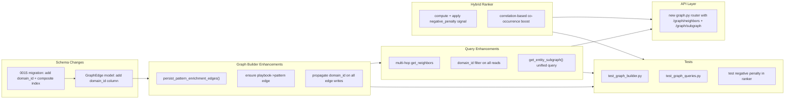

# Context Graph Gap Fixes

## Current State

The context graph uses a `GraphEdge` adjacency table with 5 edge types across 4 node types. It supports basic 1-hop queries, pattern-centric subgraph reads, and feeds into hybrid ranking. Key gaps exist versus PRD Section 11.10: enrichment metadata is virtual-only, playbook-pattern links are missing from the graph, negative knowledge doesn't penalize ranking, graph lacks domain scoping, traversal is depth-1 only, there is no generic graph API, correlation edges are isolated, and tests are minimal.

## Change Map




---

## 1. Schema: Add `domain_id` to `GraphEdge`

**New migration** `0015_graph_edges_domain_id.py` (revises `0014_notifications_and_playbook_approval_policy`):

- Add nullable `domain_id UUID` column to `graph_edges`
- Add composite index on `(tenant_id, domain_id, edge_type)` for scoped queries
- Add `graph/__init__.py` (empty, makes it a proper package)

**Model change** in [backend/src/contextedge/models/pattern.py](backend/src/contextedge/models/pattern.py) (`GraphEdge` class, lines 77-91):

- Add `domain_id: Mapped[uuid.UUID | None]` with index

---

## 2. Persist Pattern Enrichment as Real Graph Edges

**Problem**: Triggers, entities, errors, root causes are only "virtual" nodes created at read time in `get_pattern_subgraph`. They can't be queried by `get_neighbors` or influence ranking.

**Change** in [backend/src/contextedge/graph/builder.py](backend/src/contextedge/graph/builder.py): Add new function `persist_pattern_enrichment_edges()`:

```python
async def persist_pattern_enrichment_edges(
    db: AsyncSession,
    tenant_id: uuid.UUID,
    pattern_id: uuid.UUID,
    domain_id: uuid.UUID | None,
    trigger_conditions: list[str] | None,
    core_entities: list[str] | None,
    observed_errors: list[str] | None,
    root_causes: list[str] | None,
) -> list[GraphEdge]:
```

- For each enrichment category, generate a deterministic UUID (e.g., `uuid5(pattern_id, f"{type}:{value}")`) so edges are idempotent
- Edge types: `trigger_of`, `involved_in`, `discovered_in`, `causes`
- Weight: `1.5` for pattern enrichment data (matching current virtual node weight)
- Store `domain_id` on each edge

**Call sites**:

- [backend/src/contextedge/api/v1/patterns.py](backend/src/contextedge/api/v1/patterns.py) `discover_pattern()` -- after `build_episode_graph`, call `persist_pattern_enrichment_edges` with the synthesis data
- [backend/src/contextedge/services/pattern_service.py](backend/src/contextedge/services/pattern_service.py) `create_pattern_from_episodes()` -- call at the end with the provided enrichment data

**Update** `get_pattern_subgraph` in [backend/src/contextedge/graph/queries.py](backend/src/contextedge/graph/queries.py): Remove virtual node generation (lines 103-121) since those edges are now persisted. The existing edge query loop (lines 91-100) will pick them up automatically.

---

## 3. Add Playbook-to-Pattern Graph Edge

**Problem**: `Playbook.pattern_id` FK exists but no `GraphEdge` connects them, so graph traversal can't walk playbook -> pattern -> episode chains.

**Change** in [backend/src/contextedge/api/v1/playbooks.py](backend/src/contextedge/api/v1/playbooks.py) `generate_playbook()` (around line 424, after `link_node_to_identities`):

```python
await ensure_edge(
    db, user.tenant_id,
    "playbook", playbook.id,
    "pattern", pattern.id,
    "derived_from",
    domain_id=pattern.domain_id,
)
```

**Same change** in [backend/src/contextedge/workers/pattern_tasks.py](backend/src/contextedge/workers/pattern_tasks.py) `generate_playbook_candidate()` (around line 171, after `link_node_to_identities`).

Edge type: `derived_from` (playbook -> pattern).

---

## 4. Implement Negative Penalty Signal in Hybrid Ranker

**Problem**: `RankingWeights.negative_penalty = 0.05` is declared but never computed or applied. PRD 11.11 says "runtime retrieval avoids promoting known ineffective steps."

**Change** in [backend/src/contextedge/search/hybrid_ranker.py](backend/src/contextedge/search/hybrid_ranker.py):

Add a new function:

```python
async def _negative_penalty_for_playbook(
    db: AsyncSession,
    tenant_id: uuid.UUID,
    playbook_id: uuid.UUID,
    domain_id: uuid.UUID | None,
) -> float:
```

Logic:

- Count `GraphEdge` rows where `edge_type == "contradicts"` and source is the playbook
- Count `NegativeKnowledgeItem` rows in the same domain (if domain_id available from playbook)
- Normalize: `min(1.0, (contradiction_count * 0.3 + nk_overlap * 0.1))` -- higher value means more penalty

In the `rank_playbooks` loop (around line 209), add:

```python
neg_score = await _negative_penalty_for_playbook(db, tenant_id, pb.id, pb.domain_id)
```

Then subtract from total:

```python
total = (
    weights.keyword * keyword_score
    + weights.semantic * semantic_score
    + weights.graph_distance * graph_score
    + weights.evidence_quality * quality_score
    + weights.identity * identity_score
    + weights.recency * recency_score
    + weights.freshness * freshness
    - weights.negative_penalty * neg_score  # NEW
)
```

Add `"negative_penalty": neg_score` to the breakdown dict.

---

## 5. Multi-Hop Traversal in `get_neighbors`

**Problem**: `max_depth` parameter is accepted but only depth-1 is implemented.

**Change** in [backend/src/contextedge/graph/queries.py](backend/src/contextedge/graph/queries.py) `get_neighbors()`:

Replace the current single-query implementation with an iterative BFS:

```python
async def get_neighbors(
    db: AsyncSession,
    tenant_id: uuid.UUID,
    node_type: str,
    node_id: uuid.UUID,
    edge_type: str | None = None,
    max_depth: int = 1,
    domain_id: uuid.UUID | None = None,
) -> list[dict]:
```

- Maintain a `visited` set of `(node_type, node_id)` tuples
- For each depth level 1..max_depth, query 1-hop neighbors of the current frontier
- Cap `max_depth` at 3 to prevent runaway queries
- Each returned neighbor dict gains a `"depth": int` field
- Add optional `domain_id` filter

---

## 6. Generic Graph Exploration API

**Problem**: Graph reads are only exposed via `GET /patterns/{id}/graph`. No way to explore the graph from any arbitrary node.

**New file**: `backend/src/contextedge/api/v1/graph.py`

Endpoints:

- `GET /graph/neighbors?node_type=...&node_id=...&edge_type=...&max_depth=1&domain_id=...` -- calls `get_neighbors`
- `GET /graph/subgraph/{entity_type}/{entity_id}` -- calls a new `get_entity_subgraph` function (generalized from `get_pattern_subgraph`)
- `GET /graph/stats` -- returns edge counts by type and node type distribution for the tenant

**Register** in [backend/src/contextedge/api/v1/**init**.py](backend/src/contextedge/api/v1/__init__.py):

```python
from contextedge.api.v1 import graph
router.include_router(graph.router, prefix="/graph", tags=["graph"])
```

**New query function** in `queries.py`:

```python
async def get_entity_subgraph(
    db: AsyncSession,
    tenant_id: uuid.UUID,
    node_type: str,
    node_id: uuid.UUID,
    max_depth: int = 1,
    domain_id: uuid.UUID | None = None,
) -> dict:
```

Generalized version of `get_pattern_subgraph` that works for any node type.

---

## 7. Bridge CorrelationEdge Into Graph Ranking

**Problem**: Evidence-to-evidence correlations are invisible to the hybrid ranker. Two playbooks whose evidence is strongly correlated to query-related evidence get no ranking boost.

**Change** in [backend/src/contextedge/search/hybrid_ranker.py](backend/src/contextedge/search/hybrid_ranker.py):

Enhance `_graph_score_for_playbook` to also count correlation edges that connect the playbook's linked evidence to the semantic search hits:

```python
async def _graph_score_for_playbook(
    db: AsyncSession,
    tenant_id: uuid.UUID,
    playbook_id: uuid.UUID,
    semantic_evidence_ids: set[uuid.UUID] | None = None,
) -> float:
```

- Keep existing `GraphEdge` count (direct graph connectivity)
- Add: query `CorrelationEdge` where one side is in the playbook's evidence set and the other side is in `semantic_evidence_ids`
- Blend: `graph_count_score * 0.7 + correlation_boost * 0.3`

This requires threading `semantic_evidence_ids` from the semantic search results into the ranking loop. The semantic search already returns `EvidenceItem` objects (via `search_evidence_semantic_for_playbook`), so we extract their IDs.

---

## 8. Propagate `domain_id` on All Edge Writes

All existing `ensure_edge`, `add_edge`, `link_node_to_identities`, `build_episode_graph`, and `add_contradicts_edge` calls need to pass `domain_id` through.

**builder.py changes**:

- Add `domain_id: uuid.UUID | None = None` parameter to `add_edge`, `ensure_edge`, `link_node_to_identities`, `build_episode_graph`, `add_contradicts_edge`
- Set `edge.domain_id = domain_id` in `add_edge`

**Call-site updates** (each needs to pass the relevant domain_id):

- [patterns.py](backend/src/contextedge/api/v1/patterns.py) `discover_pattern()` -- pass `episodes[0].domain_id`
- [playbooks.py](backend/src/contextedge/api/v1/playbooks.py) `generate_playbook()` -- pass `pattern.domain_id`
- [pattern_tasks.py](backend/src/contextedge/workers/pattern_tasks.py) -- pass `pattern.domain_id`
- [identity_service.py](backend/src/contextedge/services/identity_service.py) `link_evidence_identities()` -- pass `evidence.domain_id`
- [contradiction_service.py](backend/src/contextedge/services/contradiction_service.py) `scan_contradictions()` -- pass `playbook.domain_id`

---

## 9. Tests

**New file**: `backend/tests/test_graph_builder.py`

- Test `add_edge` creates a `GraphEdge` with correct fields including `domain_id`
- Test `ensure_edge` is idempotent (second call returns same edge)
- Test `link_node_to_identities` deduplicates identity IDs
- Test `build_episode_graph` creates `belongs_to` + `affects` edges
- Test `persist_pattern_enrichment_edges` creates edges for each enrichment category
- Test `add_contradicts_edge` is idempotent

**New file**: `backend/tests/test_graph_queries.py`

- Test `get_neighbors` returns correct neighbors at depth=1
- Test `get_neighbors` with `max_depth=2` returns 2-hop neighbors
- Test `get_neighbors` with `domain_id` filter
- Test `get_entity_subgraph` returns nodes and edges dict
- Test `get_pattern_subgraph` no longer creates virtual nodes (edges are persisted)

**Extend**: `backend/tests/test_p1_contradictions.py`

- Verify `domain_id` is set on the `GraphEdge` created by contradiction scan

**New file**: `backend/tests/test_hybrid_ranker_negative.py`

- Test that a playbook with contradictions receives a lower score than one without
- Test that negative penalty appears in the scoring breakdown

---

## Execution Order

The changes have dependencies that dictate sequencing:

1. **Migration + model** (schema foundation)
2. **builder.py** enhancements (all writes depend on new schema)
3. **Call-site updates** for `domain_id` propagation + playbook-pattern edge + enrichment persistence
4. **queries.py** enhancements (multi-hop, entity subgraph, remove virtual nodes)
5. **hybrid_ranker.py** (negative penalty + correlation bridge)
6. **API layer** (new graph router)
7. **Tests** (verify everything)

