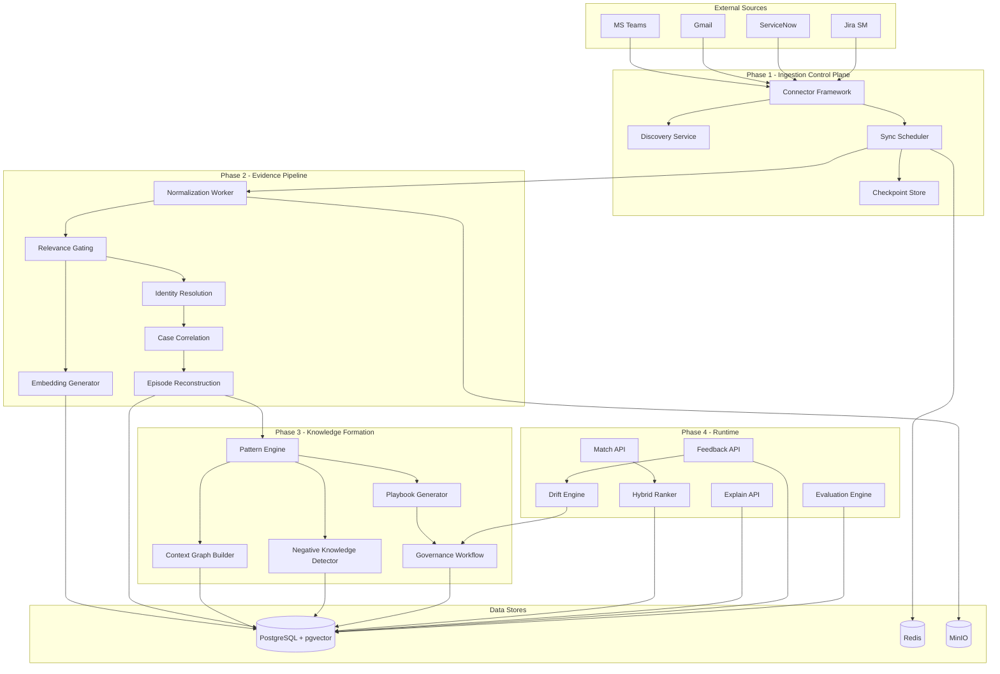

# ContextEdge -- Detailed Implementation Plan

## Technology Stack

### Backend

- **Framework**: Python 3.12+ / FastAPI (modular monolith, domain-separated routers)
- **ORM**: SQLAlchemy 2.0 (async) + Alembic for migrations
- **Task Queue**: Celery + Redis (for connectors, extraction pipelines, background jobs)
- **Auth**: python-jose (JWT), authlib (OIDC/SAML), passlib (password hashing for service accounts)
- **Validation**: Pydantic v2 (shared models between API and workers)

### Frontend

- **Framework**: Next.js 15 (App Router, Server Components where beneficial)
- **Styling**: Tailwind CSS 4 + shadcn/ui component library
- **Data Fetching**: TanStack Query v5
- **State**: Zustand (lightweight global state for tenant/workspace context)
- **Tables**: TanStack Table (virtualized for large datasets)
- **Charts**: Recharts
- **Forms**: React Hook Form + Zod validation

### Data Stores

- **Primary DB**: PostgreSQL 16 with pgvector extension (transactional + vector search)
- **Full-Text Search**: PostgreSQL FTS initially (tsvector/tsquery); OpenSearch added in Phase 4 if needed
- **Object Storage**: MinIO (S3-compatible, local)
- **Cache/Queue**: Redis 7 (Celery broker, caching, distributed locks)
- **Embeddings**: pgvector indexes on PostgreSQL

### AI/LLM Layer

- **Abstraction**: LiteLLM (unified interface across OpenAI, Anthropic, Azure OpenAI, local models)
- **Embeddings**: Provider-agnostic via LiteLLM; default to OpenAI `text-embedding-3-small`
- **Classification**: Lighter models (GPT-4o-mini / Claude Haiku) for relevance gating
- **Extraction**: Heavier models (GPT-4o / Claude Sonnet) for episode reconstruction and playbook generation
- **Prompt Management**: Version-tracked prompt templates stored in DB with model routing config

### Infrastructure

- **Local Dev**: Docker Compose (PostgreSQL + pgvector, Redis, MinIO, app containers)
- **CI/CD**: GitHub Actions
- **Observability**: Structlog (structured logging), Prometheus metrics via `prometheus-fastapi-instrumentator`, OpenTelemetry tracing (optional in MVP)

---

## Repository Structure

```
ContextEdge/
  docker-compose.yml
  docker-compose.dev.yml
  .env.example
  Makefile

  backend/
    pyproject.toml
    alembic.ini
    alembic/
      versions/
    src/
      contextedge/
        __init__.py
        main.py                    # FastAPI app factory
        config.py                  # Settings via pydantic-settings
        deps.py                    # Dependency injection (db, redis, current_user)
        middleware/
          tenant.py                # Tenant extraction + isolation middleware
          auth.py                  # JWT/OIDC validation
          audit.py                 # Audit log middleware
        models/                    # SQLAlchemy models (one file per domain)
          base.py                  # TenantScopedBase mixin
          tenant.py
          source.py
          evidence.py
          episode.py
          pattern.py
          playbook.py
          audit.py
          evaluation.py
        schemas/                   # Pydantic request/response schemas
        api/
          v1/
            tenants.py
            workspaces.py
            domains.py
            sources.py
            source_objects.py
            sync.py
            evidence.py
            threads.py
            episodes.py
            patterns.py
            playbooks.py
            runtime.py
            evaluations.py
            audit.py
            policies.py
            users.py
        services/                  # Business logic layer
          tenant_service.py
          source_service.py
          sync_service.py
          relevance_service.py
          correlation_service.py
          identity_service.py
          episode_service.py
          pattern_service.py
          playbook_service.py
          runtime_service.py
          evaluation_service.py
          audit_service.py
        connectors/                # Source connector implementations
          base.py                  # Abstract connector interface
          teams/
          gmail/
          servicenow/
          jira_sm/
        workers/                   # Celery task definitions
          sync_tasks.py
          hydration_tasks.py
          extraction_tasks.py
          pattern_tasks.py
          evaluation_tasks.py
        ai/                        # AI/LLM abstraction
          provider.py              # LiteLLM wrapper + model routing
          prompts/                 # Version-tracked prompt templates
          classifiers/
            relevance.py
          extractors/
            episode_extractor.py
            identity_extractor.py
          generators/
            playbook_generator.py
          embeddings.py
        graph/                     # Pattern/context graph logic
          builder.py
          queries.py
        search/                    # Search abstraction
          pg_fts.py                # PostgreSQL full-text search
          vector_search.py         # pgvector similarity
          hybrid_ranker.py         # Combined ranking
    tests/

  frontend/
    package.json
    next.config.ts
    tailwind.config.ts
    src/
      app/
        layout.tsx                 # Root layout with providers
        (auth)/
          login/page.tsx
        (dashboard)/
          layout.tsx               # App shell with nav
          overview/page.tsx
          sources/
            page.tsx               # Source list
            [id]/page.tsx          # Source detail
            [id]/discovery/page.tsx
          sync/page.tsx
          evidence/
            page.tsx
            [id]/page.tsx
          episodes/
            page.tsx
            [id]/page.tsx
          patterns/
            page.tsx
            [id]/page.tsx
          playbooks/
            page.tsx
            [id]/page.tsx
          evaluations/page.tsx
          policies/page.tsx
          audit/page.tsx
          settings/page.tsx
      components/
        ui/                        # shadcn/ui components
        shell/                     # App shell, nav, header
        sources/
        evidence/
        episodes/
        playbooks/
        patterns/
        common/                    # DataTable, Facets, Timeline, etc.
      lib/
        api.ts                     # API client (fetch wrapper)
        auth.ts                    # Auth utilities
        hooks/                     # TanStack Query hooks per domain
        stores/                    # Zustand stores (tenant context, etc.)
        types/                     # TypeScript types mirroring backend schemas
```

---

## Phased Implementation

### Phase 0: Foundation (Weeks 1-4)

The bedrock: tenancy, auth, database schema, API skeleton, Docker infra, frontend shell.

#### 0.1 -- Project scaffolding and Docker infrastructure

- Initialize monorepo with `backend/` and `frontend/` directories
- Create `docker-compose.yml` with: PostgreSQL 16 + pgvector, Redis 7, MinIO
- Create `docker-compose.dev.yml` adding: backend (uvicorn with reload), frontend (next dev), Celery worker, Celery Beat
- Create `.env.example` with all config variables
- Create `Makefile` with common commands (`make up`, `make migrate`, `make seed`, `make test`)

#### 0.2 -- Backend foundation

- FastAPI app factory with lifespan handler (DB pool, Redis connection)
- `pydantic-settings` config loading from environment
- SQLAlchemy 2.0 async engine + session factory
- Alembic setup with async support
- Base model mixin `TenantScopedBase` enforcing `tenant_id` on every table
- Health check endpoint (`/health`, `/ready`)

#### 0.3 -- Core data models (first migration)

Create SQLAlchemy models and initial Alembic migration for:

- `Tenant` (id, name, slug, config JSONB, sso_config, retention_defaults, created_at, updated_at)
- `Workspace` (id, tenant_id FK, name, config)
- `Domain` (id, tenant_id FK, workspace_id FK nullable, name, description)
- `User` (id, tenant_id FK, external_id, email, display_name, status, sso_provider)
- `RoleBinding` (id, user_id FK, role, scope_type, scope_id)
- `AuditLog` (id, tenant_id FK, actor_id, action, resource_type, resource_id, details JSONB, ip, timestamp)

#### 0.4 -- Authentication and authorization

- JWT token validation middleware (accepts tokens from external IdP)
- For MVP dev/test: local JWT issuer with username/password login endpoint
- OIDC integration stub (authlib) -- full SSO wired in Phase 5
- `get_current_user` dependency that extracts tenant context and permissions
- `TenantGuard` middleware: injects `tenant_id` into every DB query automatically
- RBAC decorator/dependency: `require_role("tenant_admin")`, `require_role("analyst")`
- Audit logging middleware: auto-log every mutating API call

#### 0.5 -- Admin APIs

- CRUD for Tenants, Workspaces, Domains, Users, RoleBindings
- Proper pagination (cursor-based), filtering, and sorting patterns established here and reused everywhere
- OpenAPI docs auto-generated

#### 0.6 -- Frontend shell

- Next.js project with Tailwind + shadcn/ui
- Auth flow: login page, token storage, auth context provider, route guards
- App shell layout: persistent left sidebar nav, tenant/workspace switcher in header, notification bell placeholder
- All navigation sections stubbed as pages (Overview, Sources, Sync, Evidence, Episodes, Patterns, Playbooks, Evaluations, Policies, Audit, Settings)
- Reusable `DataTable` component (TanStack Table with server-side pagination, sorting, filtering)
- Reusable `FacetedFilter` component
- API client utility with automatic auth headers and tenant context
- TanStack Query provider and first hooks (`useTenants`, `useCurrentUser`)

#### 0.7 -- Settings and basic admin pages

- Settings page: tenant config, workspace management, domain taxonomy
- Users page: list, invite, role assignment
- Audit log page: searchable table with actor/action/resource/time filters

---

### Phase 1: Source Ingestion Control Plane (Weeks 5-8)

Connect, discover, backfill, and sync from external sources.

#### 1.1 -- Source and SourceObject models

Add models + migration:

- `Source` (all fields from PRD Section 20.1 + `config JSONB` for connector-specific settings)
- `SourceObject` (all fields from PRD Section 20.2)
- `SourceCredential` (id, source_id FK, auth_type, encrypted_credentials, status, rotated_at) -- credentials encrypted at rest using Fernet with per-tenant key
- `SyncCheckpoint` (id, source_object_id FK, checkpoint_data JSONB, captured_at)
- `SyncRun` (id, source_id FK, source_object_id FK, run_type enum [discovery/backfill/incremental/recovery], status, started_at, completed_at, items_processed, errors JSONB)

#### 1.2 -- Connector framework

Abstract connector interface in `connectors/base.py`:

```python
class BaseConnector(ABC):
    @abstractmethod
    async def validate_credentials(self) -> CredentialStatus: ...
    @abstractmethod
    async def discover_objects(self) -> list[DiscoveredObject]: ...
    @abstractmethod
    async def backfill(self, obj: SourceObject, window: DateRange, checkpoint: Checkpoint | None) -> BackfillResult: ...
    @abstractmethod
    async def fetch_changes(self, obj: SourceObject, checkpoint: Checkpoint) -> ChangeResult: ...
    @abstractmethod
    async def hydrate_thread(self, thread_ref: str) -> HydratedThread: ...
    def rate_limit_config(self) -> RateLimitConfig: ...
```

Each connector implements this interface with source-specific logic. Connectors emit normalized `IngestionEvent` objects.

#### 1.3 -- MVP connectors (implement in parallel across team)

**Microsoft Teams connector** (`connectors/teams/`):

- OAuth2 app registration with Graph API
- Team/channel discovery via `/teams` and `/channels` endpoints
- Change notifications (webhooks) for near-real-time updates
- Delta queries for incremental sync
- Thread hydration via `/messages` with replies
- Rate limiting per Microsoft Graph throttling headers

**Gmail connector** (`connectors/gmail/`):

- Google Workspace service account with domain-wide delegation
- Mailbox watch setup via `users.watch()` + Pub/Sub
- History-based incremental sync via `users.history.list()`
- Thread-centric processing via `users.threads.get()`
- Attachment lazy fetch

**ServiceNow connector** (`connectors/servicenow/`):

- REST Table API for incident, problem, change, KB records
- `sysparm_query` for scoped retrieval
- Timestamp-based checkpointing on `sys_updated_on`
- Journal/comment field extraction for full conversation threads
- Attachment download via Attachment API

**Jira Service Management connector** (`connectors/jira_sm/`):

- Jira REST API v3 for issue retrieval
- JQL-based scoped queries
- Webhook registration for real-time updates
- Comment and worklog extraction
- Attachment handling

#### 1.4 -- Sync scheduler and workers

- Celery Beat schedule for periodic sync per source object
- Celery tasks: `discover_source`, `run_backfill`, `run_incremental_sync`, `hydrate_thread`
- Per-source-class queue routing (prevents one noisy source from blocking others)
- Exponential backoff retry with dead-letter after max attempts
- `SyncRun` records created/updated for every job execution
- Checkpoint updates are atomic (within the same DB transaction as processed items)

#### 1.5 -- Source management UI

- **Sources list page**: sortable/filterable table with auth status, checkpoint freshness, sync mode, owner
- **Source creation wizard**: select type -> enter credentials -> validate -> save
- **Source detail page**: metadata, auth status, capability matrix, discovery results, sync history, checkpoint state
- **Discovery inventory page**: list discovered objects (channels, mailboxes, KB collections) with recency/volume/sensitivity, allowlist/denylist controls, approve for backfill
- **Backfill wizard**: select objects -> date window -> throttle profile -> estimated duration -> confirm
- **Sync operations page**: live job table, retry/pause/resume actions, dead-letter view, queue depth indicators

---

### Phase 2: Evidence Pipeline and Episode Reconstruction (Weeks 9-14)

Turn raw ingested data into structured evidence, threads, and episodes.

#### 2.1 -- Evidence and thread models

Add models + migration:

- `RawEvidenceObject` (id, tenant_id, source_id, source_object_id, external_id, raw_payload JSONB, content_hash, stored_at, object_storage_key)
- `EvidenceItem` (all fields from PRD Section 20.3 + `embedding vector(1536)` via pgvector)
- `Thread` (id, tenant_id, source_id, source_object_id, external_thread_id, title, participant_count, message_count, first_message_at, last_message_at, hydration_status, relevance_state)
- `AttachmentArtifact` (id, evidence_id FK, filename, mime_type, size_bytes, object_storage_key, extracted_text, extraction_status)

#### 2.2 -- Ingestion and normalization workers

- Celery task `normalize_evidence`: takes raw ingestion events, creates `RawEvidenceObject` in MinIO + DB reference, then creates normalized `EvidenceItem` records
- Content deduplication via `content_hash`
- Attachment upload to MinIO with lazy text extraction (PDF, images via OCR queued separately)
- Thread assembly: group messages by thread/conversation/case ID from source

#### 2.3 -- AI relevance gating

- Lightweight classifier (GPT-4o-mini / Haiku) scores each evidence item:
  - `operational` / `possibly_relevant` / `not_relevant`
- Only `operational` and `possibly_relevant` items proceed to deeper processing
- Classification prompt is version-tracked in DB
- Celery task `classify_relevance` runs after normalization

#### 2.4 -- Embedding generation

- Celery task `generate_embeddings`: embed evidence body text via LiteLLM
- Store in `EvidenceItem.embedding` (pgvector column)
- Batch processing with rate limit awareness
- pgvector IVFFlat index on embedding column, partitioned by tenant_id

#### 2.5 -- Identity resolution models and service

Add models:

- `CanonicalIdentity` (id, tenant_id, entity_type [person/device/app/vendor/version/patch/service/environment], canonical_name, metadata JSONB)
- `IdentityAlias` (id, canonical_identity_id FK, alias_text, source_id, confidence, created_by)

Identity resolution service:

- Extract entity mentions from evidence using LLM
- Fuzzy matching against existing canonical identities
- Create new canonical identities when no match found
- Reviewer UI for manual mapping and corrections
- Alias dictionary support (admin-configurable)

#### 2.6 -- Case correlation

Add model:

- `CorrelationEdge` (id, tenant_id, source_evidence_id FK, target_evidence_id FK, correlation_type [same_case/related/same_pattern/unrelated], confidence, explanation, created_by)

Correlation service:

- Cross-source correlation using ticket IDs, timestamps, entity overlap, semantic similarity
- Confidence scoring per correlation
- Reviewer merge/split/reclassify actions

#### 2.7 -- Episode reconstruction

Add models:

- `Episode` (all fields from PRD Section 20.4)
- `EpisodeStep` (all fields from PRD Section 20.5)

Episode extraction pipeline (Celery task `reconstruct_episode`):

- Takes correlated evidence clusters
- LLM extraction (GPT-4o / Sonnet) to produce structured episode with ordered steps
- Each step retains `evidence_refs` pointing back to source evidence
- Extraction confidence scored per step and per episode
- Results stored as candidate episodes in `draft` status

#### 2.8 -- Evidence and episode UI

- **Evidence Explorer**: full-text search (PostgreSQL FTS), faceted filters (source class, domain, time range, relevance, entity, episode linkage), result cards with thread preview drawer, provenance side panel, inline actions (link to episode, mark irrelevant)
- **Thread detail page**: ordered message timeline, attachment previews, classification badges, linked episode references
- **Episode list page**: filters by domain, status, confidence, reviewer, sortable table
- **Episode workbench**: timeline view with ordered steps, visual separation by step type (complaint/diagnostic/failed/remediation/outcome), confidence markers per step, evidence links (click-to-navigate), merge/split actions, reviewer comments and approval controls

---

### Phase 3: Pattern Graph and Playbook Governance (Weeks 15-20)

Cluster episodes into patterns, build the knowledge graph, generate and govern playbooks.

#### 3.1 -- Pattern and knowledge models

Add models:

- `Pattern` (all fields from PRD Section 20.6)
- `PatternEvidenceLink` (id, pattern_id FK, episode_id FK, evidence_id FK, link_type, weight)
- `NegativeKnowledgeItem` (id, tenant_id, domain_id, step_text, failure_reason, status [ineffective/conditional/deprecated/prohibited], evidence_refs JSONB, created_by)
- `Contradiction` (id, tenant_id, source_a_ref, source_b_ref, contradiction_type, description, resolution_status, resolved_by)

#### 3.2 -- Pattern engine

- Cluster approved episodes by symptom similarity, entity overlap, and semantic embedding distance
- Use combination of: entity co-occurrence, embedding clustering (HDBSCAN), and LLM-assisted grouping
- Track pattern confidence, episode count, freshness, and contradiction score
- Detect contradictions: when different episodes for similar symptoms recommend conflicting remediations
- Surface negative knowledge: steps that repeatedly appear as `failed` across episodes

#### 3.3 -- Context graph

- Implement in-application graph using PostgreSQL adjacency tables (not a separate graph DB for MVP)
- Node types: Pattern, Episode, EpisodeStep, CanonicalIdentity, Playbook, EvidenceItem, NegativeKnowledgeItem
- Edge types: `causes`, `remediates`, `contradicts`, `related_to`, `affects`, `failed_for`, `works_in_environment`
- Graph query service for relationship traversal (what symptoms map to what causes, what remediations fail for which versions, etc.)
- Weighted edges based on evidence quality and recency

#### 3.4 -- Playbook generation and governance models

Add models:

- `Playbook` (all fields from PRD Section 20.7)
- `PlaybookVersion` (all fields from PRD Section 20.8, with `trigger_conditions JSONB`, `branching_logic JSONB`, `inputs JSONB`, `outputs JSONB`)
- `PlaybookEvidenceLink` (id, playbook_version_id FK, evidence_id FK, episode_id FK, link_type)
- `PlaybookApproval` (id, playbook_version_id FK, approver_id FK, action [approve/reject/request_changes], comments, decided_at)

#### 3.5 -- Playbook candidate generation

- LLM pipeline to synthesize a playbook candidate from a pattern cluster:
  - Trigger conditions derived from common initial symptoms
  - Branching logic from divergent diagnostic paths
  - Risk tier estimation
  - Confidence breakdown from evidence quality
  - Rollback notes from negative knowledge
- Generated candidates saved in `candidate` lifecycle state
- All generated content linked back to evidence

#### 3.6 -- Playbook governance service

- State machine: `candidate` -> `under_review` -> `approved` / `rejected`
- Approved playbooks: `approved` -> `restricted` / `deprecated` / `expired` / `retired`
- Versioning: each edit creates a new `PlaybookVersion`, with diff capability
- Approval policies: configurable by risk tier and domain
- Expiry rules: auto-transition to `expired` when `expiry_at` passes

#### 3.7 -- Pattern and playbook UI

- **Pattern explorer**: list view with counts/trend/confidence, graph visualization (using a React graph library like `react-force-graph` or `@xyflow/react`), contradiction panel, merge/split actions
- **Playbook queue**: candidate backlog table, reviewer assignment, priority by freshness and risk
- **Playbook detail page**: trigger conditions, branching logic visualization, scope boundaries, risk tier badge, automation mode, freshness indicator, evidence links, confidence breakdown, diff against prior version, reviewer discussion thread, approval history, publish/restrict/deprecate/expire/retire actions
- **Playbook editor**: structured editor for steps, branches, caveats, rollback notes; evidence trace preserved; human-added steps explicitly marked

---

### Phase 4: Runtime Retrieval, Evaluation, and Drift (Weeks 21-26)

The payoff: runtime APIs, evaluation harness, drift detection.

#### 4.1 -- Hybrid search and ranking

- Implement `hybrid_ranker.py` combining:
  - PostgreSQL FTS keyword matching (BM25-like via `ts_rank`)
  - pgvector semantic similarity
  - Graph distance from pattern relationships
  - Evidence quality score
  - Recency weighting
  - Negative knowledge penalties
  - Freshness penalty for aging playbooks
  - Caller scope policy filtering
- Ranking weights configurable per tenant/domain
- Consider adding OpenSearch at this point if PostgreSQL FTS performance is insufficient for the data volumes

#### 4.2 -- Runtime APIs

- `POST /api/v1/runtime/match`: accepts case context (symptoms, entities, environment), returns top-N matching approved playbooks with confidence, branch selection, evidence trace, freshness, contradictions, and fallback guidance
- `GET /api/v1/runtime/explain/{match_id}`: detailed explanation of why a playbook was matched, full evidence chain
- `GET /api/v1/runtime/playbooks/{stable_key}`: fetch specific approved playbook by stable key and optional version
- `POST /api/v1/runtime/feedback`: structured feedback (wrong match, step ineffective, version-specific, etc.)
- Security trimming: every retrieval filtered by caller's tenant, domain, and evidence permissions
- Service account authentication with scope-limited API tokens
- Response latency target: under 2 seconds for match, under 5 seconds for explain

#### 4.3 -- Feedback processing

- `RetrievalFeedback` model (id, tenant_id, match_id, playbook_id, feedback_type, details JSONB, submitted_by, submitted_at)
- Feedback triggers:
  - Confidence score adjustment on affected playbook
  - Scope rule updates queued for review
  - Branching condition refinements queued
  - Entries added to evaluation datasets
  - Review tasks created when feedback volume crosses threshold

#### 4.4 -- Evaluation and replay

Add models:

- `EvaluationDataset` (id, tenant_id, name, description, cases JSONB [list of historical case contexts with expected playbook matches])
- `EvaluationRun` (id, dataset_id FK, config JSONB [model/prompt versions, ranker weights], status, results JSONB, started_at, completed_at)

Evaluation service:

- Replay historical cases against current retrieval pipeline
- Score: correct match rate, top-k rate, evidence grounding, escalation precision, false automation rate, stale playbook exposure
- Compare model/prompt/ranking variants side-by-side
- Store results per run for regression detection

#### 4.5 -- Drift and freshness engine

- Scheduled Celery Beat job: `detect_drift`
- Checks each approved playbook for:
  - Declining success rate (from feedback)
  - Environment/version drift (new evidence referencing newer versions)
  - Contradiction growth (new negative knowledge)
  - Inactivity beyond expiry policy
  - Evidence quality degradation
- Auto-creates review tasks for degraded playbooks
- Marks expired playbooks based on `expiry_at`

#### 4.6 -- Evaluation and drift UI

- **Evaluation console**: create datasets, run evaluations, compare runs side-by-side, regression hotspots, failure case drill-down (links to episodes and playbooks)
- **Drift dashboard**: integrated into Overview page -- playbooks flagged for review, freshness heatmap, contradiction alerts

---

### Phase 5: Enterprise Hardening (Weeks 27-32+)

Production readiness, SSO, observability, advanced controls.

#### 5.1 -- Full SSO integration

- SAML 2.0 and OIDC configuration per tenant (via authlib)
- SCIM provisioning endpoint for user/group sync
- MFA enforcement delegated to IdP
- Session timeout and device trust policy hooks
- API token rotation for service accounts

#### 5.2 -- Notification system

- In-app notification center (WebSocket or SSE for real-time)
- Notification types: failed sync, expired credentials, new playbook candidates, drift alerts, contradiction alerts, evaluation regressions
- Optional email notifications (SMTP or provider API)
- Optional Teams/Slack webhook notifications for review tasks
- Per-user notification preferences

#### 5.3 -- Advanced policies

- Retention policy engine: auto-archive/delete evidence per source class and classification
- Redaction pipeline: PII/secret detection and masking before deep processing
- Legal hold support: flag evidence as held, prevent deletion
- Data classification labels enforced at storage and retrieval
- Export and deletion workflows for compliance

#### 5.4 -- Observability stack

- Prometheus metrics endpoint + Grafana dashboards
- OpenTelemetry tracing (distributed traces across API -> worker -> connector)
- Structured logging via structlog with correlation IDs
- Per-source health summary dashboard
- Per-tenant SLO reporting
- Alerting rules for sync failures, queue depth, retrieval latency

#### 5.5 -- Performance and scale

- Database partitioning strategy for large tenants (partition `EvidenceItem` by tenant_id and time)
- Read replicas for heavy query paths
- Connection pooling tuning (PgBouncer if needed)
- Redis cluster mode if needed
- MinIO bucket policies and lifecycle rules
- Noisy neighbor protections: per-tenant rate limits on APIs and queue fairness weights

#### 5.6 -- Deployment hardening

- Production Docker Compose with resource limits, health checks, restart policies
- Secrets management (Docker secrets or Vault integration)
- TLS termination
- Backup and restore scripts for PostgreSQL and MinIO
- Runbook for disaster recovery

---

## Data Flow Diagram




---

## Key Design Decisions

1. **Modular monolith over microservices**: For a small team, a single deployable backend with clean domain separation in code is far more productive. Service extraction can happen later at natural boundaries (connectors, runtime retrieval).
2. **PostgreSQL FTS over OpenSearch for MVP**: Reduces infrastructure complexity. PostgreSQL tsvector/tsquery handles moderate scale well. OpenSearch is added only if query performance degrades at scale.
3. **pgvector over dedicated vector DB**: Keeping vectors in PostgreSQL means simpler tenant isolation (same row-level security), simpler joins, and one fewer service to manage.
4. **LiteLLM for model abstraction**: Avoids vendor lock-in, allows per-task model routing (cheap models for classification, powerful models for extraction), and supports local models for development/testing.
5. **Celery over custom workers**: Mature, well-understood, handles retries/dead-letters/scheduling/monitoring, and the team likely has experience with it.
6. **Adjacency tables for graph over graph DB**: For MVP scale, PostgreSQL recursive CTEs and adjacency tables handle pattern graph queries adequately. Neo4j or similar is deferred unless query complexity demands it.

---

## Testing Strategy

- **Unit tests**: pytest for all services and utility functions
- **Integration tests**: testcontainers-python to spin up PostgreSQL + Redis for realistic DB tests
- **API tests**: FastAPI TestClient for endpoint testing with auth mocking
- **Frontend tests**: Vitest + React Testing Library for component tests; Playwright for critical E2E flows
- **Connector tests**: Mock external APIs with recorded fixtures (VCR-style)
- **AI pipeline tests**: Snapshot testing with cached LLM responses for deterministic extraction validation

