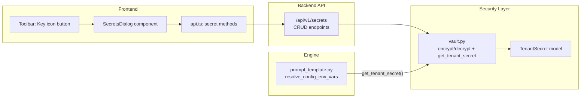

# Credential Management UI

## Current state

- **`tenant_secrets` table** already exists (migration `0000`), with columns: `id`, `tenant_id`, `key_name`, `encrypted_value`, `created_at`, `updated_at`. Unique index on `(tenant_id, key_name)`.
- **`TenantSecret` ORM model** lives in [backend/app/security/vault.py](backend/app/security/vault.py) (not re-exported from `models/__init__.py`).
- **`encrypt_secret` / `decrypt_secret`** Fernet helpers exist in `vault.py`.
- **`resolve_config_env_vars`** in [backend/app/engine/prompt_template.py](backend/app/engine/prompt_template.py) calls `get_tenant_secret(tenant_id, name)` — but **that function does not exist yet**, so `{{ env.* }}` resolution is broken at runtime.
- **No API endpoints** exist for secret management.
- **No frontend UI** exists for viewing or managing secrets.

## Architecture



## Changes

### 1. Fix `get_tenant_secret` in vault.py

Add the missing function that `prompt_template.py` already imports:

```python
def get_tenant_secret(tenant_id: str, key_name: str) -> str | None:
    from app.database import SessionLocal
    db = SessionLocal()
    try:
        row = db.query(TenantSecret).filter_by(
            tenant_id=tenant_id, key_name=key_name
        ).first()
        if row is None:
            return None
        return decrypt_secret(row.encrypted_value)
    finally:
        db.close()
```

This unblocks `{{ env.* }}` resolution at runtime.

### 2. New backend API router — `backend/app/api/secrets.py`

New file. Follow the same pattern as `knowledge.py`.

**Pydantic schemas** (in the same file):

- `SecretCreate`: `key_name` (str, 1-256, regex `^\w+$`), `value` (str, min 1)
- `SecretUpdate`: `value` (str, min 1)
- `SecretOut`: `id`, `key_name`, `created_at`, `updated_at` — **never expose the decrypted value**
- `SecretValueOut`: `key_name`, `value` (masked, e.g. `sk-...xxxx`) — for a "peek" endpoint

**Endpoints:**

| Method | Path | Status | Description |
|--------|------|--------|-------------|
| `POST` | `/api/v1/secrets` | 201 | Create a secret |
| `GET` | `/api/v1/secrets` | 200 | List all secrets (metadata only, no values) |
| `GET` | `/api/v1/secrets/{secret_id}` | 200 | Get one secret (metadata only) |
| `PUT` | `/api/v1/secrets/{secret_id}` | 200 | Update secret value |
| `DELETE` | `/api/v1/secrets/{secret_id}` | 204 | Delete a secret |

All endpoints use `Depends(get_tenant_id)` and `Depends(get_db)`.

- **Create**: validate `key_name` uniqueness (409 on duplicate), `encrypt_secret(value)`, insert row.
- **List/Get**: return `SecretOut` — never decrypt or expose the value.
- **Update**: `encrypt_secret(new_value)`, update `encrypted_value` and `updated_at`.
- **Delete**: standard 404/204.

No "peek" or "reveal" endpoint — raw secret values should never leave the backend after creation.

### 3. Mount the router in `main.py`

```python
from app.api.secrets import router as secrets_router
app.include_router(secrets_router, prefix="/api/v1/secrets", tags=["secrets"])
```

### 4. Frontend API types and methods — `api.ts`

Add to [frontend/src/lib/api.ts](frontend/src/lib/api.ts):

- `SecretOut` interface: `id`, `key_name`, `created_at`, `updated_at`
- `api.listSecrets()` — GET
- `api.createSecret(key_name, value)` — POST
- `api.updateSecret(id, value)` — PUT
- `api.deleteSecret(id)` — DELETE

### 5. New frontend dialog — `frontend/src/components/toolbar/SecretsDialog.tsx`

Follow the `KnowledgeBaseDialog` pattern:

- **Props**: `open`, `onOpenChange`
- **List view**: Table of secrets showing `key_name`, `created_at`, `updated_at`, delete button. No value column.
- **Create form**: `key_name` input (alphanumeric + underscore, validated), `value` input (password type, hidden by default with eye toggle). Reference hint: "Use as `{{ env.KEY_NAME }}` in node configs."
- **Edit**: Click a secret to update its value (never shows the old value — just a "Set new value" password field).
- **Delete**: Confirmation before deleting.
- **Empty state**: Explain what secrets are for and how `{{ env.* }}` works.

### 6. Add Secrets button to Toolbar

In [frontend/src/components/toolbar/Toolbar.tsx](frontend/src/components/toolbar/Toolbar.tsx):

- Import `KeyRound` icon from `lucide-react` and `SecretsDialog`
- Add `const [secretsOpen, setSecretsOpen] = useState(false)` state
- Add a button next to the Knowledge Bases button with the key icon
- Mount `<SecretsDialog open={secretsOpen} onOpenChange={setSecretsOpen} />` at the bottom

### 7. Update codewiki

- Update [codewiki/feature-roadmap.md](codewiki/feature-roadmap.md): mark #4 Credential Management UI as **Done**
- Update [codewiki/api-reference.md](codewiki/api-reference.md): add Secrets section
- Update [codewiki/security.md](codewiki/security.md): document the new vault API and UI

## Key design decisions

- **Never return decrypted values** from the API. Once a secret is saved, only `{{ env.* }}` resolution in the engine can read it. This follows the same pattern as n8n and Dify.
- **No migration needed** — the `tenant_secrets` table already exists with the right schema.
- **`key_name` validation** uses `^\w+$` (letters, digits, underscores) because `resolve_config_env_vars` uses `\w+` regex to match secret names.
- **RLS already covers** the `tenant_secrets` table (migration `0001`).
