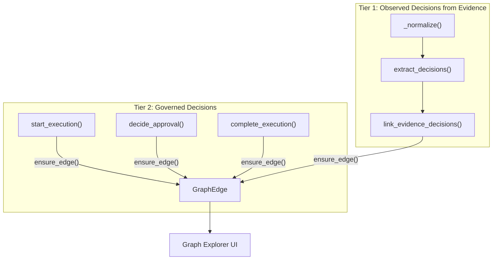

# Decision Capture in the Context Graph

## Current State

Decisions (approvals, actions, overrides) are recorded in `DecisionTraceEvent`, `OperationalEvent`, `ApprovalRequest`, and `ExecutionRun/StepRun` tables, but **none of these create `GraphEdge` rows**. The context graph only contains knowledge relationships (evidence-identity, playbook-pattern, contradictions, enrichment nodes).

## Architecture




## Tier 2: Graph Edges from Governed Decisions (low effort, high fidelity)

### New edge types and node types

New **node types**: `session`, `execution_run`, `approval_request`

New **edge types**:

- `executed_playbook` (session -> playbook): when execution starts
- `approved_by` (approval_request -> identity/person): when manager approves
- `denied_by` (approval_request -> identity/person): when manager denies
- `execution_outcome` (execution_run -> playbook): when execution completes, with outcome in metadata

### Insertion points in [execution_service.py](backend/src/contextedge/services/execution_service.py)

`**start_execution`** (after the `append_operational_event` block, ~line 187):

```python
from contextedge.graph.builder import ensure_edge

# session -> playbook (chose to execute)
if session_id:
    await ensure_edge(db, tenant_id, "session", session_id,
                      "playbook", playbook.id, "executed_playbook",
                      metadata={"execution_run_id": str(run.id),
                                "automation_mode": playbook.automation_mode})
```

`**decide_approval**` (after the `append_operational_event` block, ~line 445):

```python
edge_type = "approved_by" if decision == "approved" else "denied_by"
await ensure_edge(db, tenant_id, "approval_request", req.id,
                  "identity", decided_by, edge_type,
                  metadata={"comment": comment,
                            "safety_class": req.safety_class})
```

Note: `decided_by` is a user UUID. The `identity` node type here refers to a user/person identity. If your canonical identity system doesn't always have a user-to-identity mapping, you may want to use a new node type `user` or look up the canonical identity for the user.

`**complete_execution**` (after the `append_trace_event` block, ~line 486):

```python
await ensure_edge(db, tenant_id, "execution_run", run.id,
                  "playbook", run.playbook_id, "execution_outcome",
                  metadata={"outcome": outcome,
                            "outcome_summary": outcome_summary})
```

### Import needed

Add `from contextedge.graph.builder import ensure_edge` to [execution_service.py](backend/src/contextedge/services/execution_service.py).

---

## Tier 1: AI Decision Extractor from Evidence (medium effort, moderate fidelity)

### New file: `ai/extractors/decision_extractor.py`

Follow the same pattern as [identity_extractor.py](backend/src/contextedge/ai/extractors/identity_extractor.py):

- Define a `DECISION_PROMPT` that asks the LLM to extract structured action/decision facts from evidence text
- Categories: `approval`, `remediation`, `escalation`, `configuration_change`, `restart`, `access_grant`, `rollback`
- Output format: `{"decisions": [{"decision_type": "...", "actor": "...", "target": "...", "action": "...", "context": "..."}]}`
- Function: `async def extract_decisions(content: str) -> list[dict]`
- Call `llm_complete_json(prompt, task="classification")`

### New service function in [identity_service.py](backend/src/contextedge/services/identity_service.py) (or a new `decision_service.py`)

`link_evidence_decisions`:

1. Call `extract_decisions(content)`
2. For each extracted decision, resolve the `actor` and `target` against existing canonical identities (reuse `resolve_extracted_entities`)
3. Store decision refs on the evidence item (extend `canonical_entity_refs` with a `"decisions"` key, alongside existing `"identities"`)
4. Create graph edges:
  - `evidence --(records_decision)--> identity(actor)` with `metadata={"action": ..., "decision_type": ...}`
  - `evidence --(records_action_on)--> identity(target)` with same metadata

### Hook into normalization pipeline

In [extraction_tasks.py](backend/src/contextedge/workers/extraction_tasks.py) `_normalize()`, after the `link_evidence_identities` call (~line 80 for dedup path, ~line 120 for new evidence path):

```python
from contextedge.services.decision_service import link_evidence_decisions
# ... after identity linking ...
try:
    decision_refs = await link_evidence_decisions(
        db, tenant_id=tenant_id, evidence=ev,
        content=identity_content, source_id=raw.source_id)
    decision_count = len(decision_refs)
except Exception as exc:
    logger.warning("decision_extraction_failed", ...)
```

---

## Frontend: Register New Node/Edge Types

In [graph-constants.ts](frontend/src/components/graph/graph-constants.ts):

**Add to `NODE_TYPE_OPTIONS`**: `"session"`, `"execution_run"`, `"approval_request"`

**Add to `nodeColors`**:

- `session`: a new color (e.g., cyan-900 scheme)
- `execution_run`: a new color (e.g., lime-900 scheme)
- `approval_request`: a new color (e.g., yellow-900 scheme)

**Add to `edgeColors`**:

- `executed_playbook`: solid line, distinct color
- `approved_by`: solid green
- `denied_by`: solid red, dashed
- `execution_outcome`: solid line
- `records_decision`: dashed line
- `records_action_on`: dashed line

---

## Tests

- Add unit tests for Tier 2 edge creation in a new test file or extend [test_graph_builder.py](backend/tests/test_graph_builder.py)
- Add tests for `extract_decisions` (mock `llm_complete_json`)
- Add tests for `link_evidence_decisions` (mock extractor, verify edges created)

