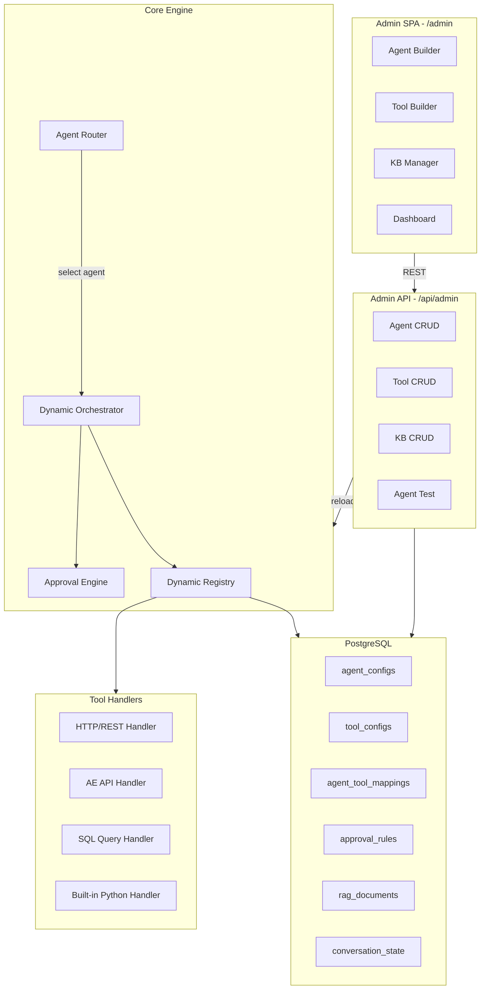
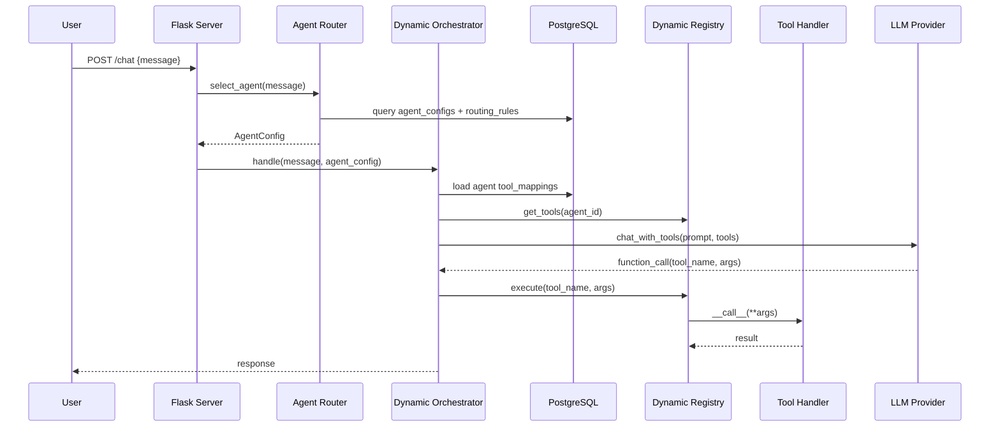

# Dynamic Agent & Tool Platform — Architecture Plan

## Current State

The system has hardcoded agents (`Orchestrator`, `ApprovalGate`, `EscalationAgent`, `RCAAgent`) in Python classes, and tools registered at import time via `tool_registry.register()` calls in `tools/*.py`. There is no admin UI, no CRUD API, and no database tables for agent/tool configuration.

## Target Architecture




---

## Phase 1: Database Schema & Models

New PostgreSQL tables (extend [setup_db.py](setup_db.py)):

### `agent_configs` table

- `id` (UUID, PK)
- `name` (VARCHAR, unique) — e.g. "AE Ops Agent", "HR Bot"
- `description` (TEXT)
- `system_prompt` (TEXT) — the base system prompt
- `model_provider` (VARCHAR) — "vertex_ai", "openai", "azure_openai"
- `model_name` (VARCHAR) — "gemini-2.0-flash", "gpt-4o", etc.
- `persona_rules` (JSONB) — `{"business": "Explain simply...", "technical": "Include IDs..."}`
- `max_iterations` (INT, default 15)
- `temperature` (FLOAT, default 0.1)
- `rag_enabled` (BOOLEAN, default true)
- `rag_collections` (JSONB) — which RAG collections this agent searches
- `approval_policy` (VARCHAR) — "default", "always_approve", "always_ask"
- `is_active` (BOOLEAN, default true)
- `is_default` (BOOLEAN) — the fallback agent when no routing matches
- `routing_rules` (JSONB) — keywords, patterns, or intents that route to this agent
- `created_at`, `updated_at` (TIMESTAMP)

### `tool_configs` table

- `id` (UUID, PK)
- `name` (VARCHAR, unique)
- `description` (TEXT)
- `category` (VARCHAR)
- `tier` (VARCHAR) — read_only, low_risk, medium_risk, high_risk
- `handler_type` (VARCHAR) — "http", "ae_api", "sql", "builtin"
- `handler_config` (JSONB) — type-specific config (see below)
- `parameters_schema` (JSONB) — JSON Schema for LLM function calling
- `required_params` (JSONB array)
- `always_available` (BOOLEAN, default false)
- `is_active` (BOOLEAN, default true)
- `created_at`, `updated_at` (TIMESTAMP)

`**handler_config` by type:**

- **http**: `{"url_template": "https://api.example.com/users/{{user_id}}", "method": "POST", "headers": {"Authorization": "Bearer {{env.API_KEY}}"}, "body_template": {...}, "timeout": 30, "response_mapping": {"status": "$.result.status"}}`
- **ae_api**: `{"endpoint": "/api/v1/workflows/{{workflow_name}}/executions", "method": "GET", "query_params": {"limit": "{{limit}}"}}`
- **sql**: `{"query_template": "SELECT * FROM executions WHERE workflow = :workflow_name LIMIT :limit", "connection": "default", "read_only": true}`
- **builtin**: `{"module": "tools.status_tools", "function": "check_workflow_status"}` (for existing Python tools)

### `agent_tool_mappings` table

- `agent_id` (UUID, FK -> agent_configs)
- `tool_id` (UUID, FK -> tool_configs)
- `is_always_available` (BOOLEAN) — override per-agent
- `priority` (INT) — ordering preference
- PK: (agent_id, tool_id)

### `approval_rules` table

- `id` (UUID, PK)
- `agent_id` (UUID, FK, nullable — null means global)
- `tool_pattern` (VARCHAR) — tool name or glob pattern
- `tier_override` (VARCHAR, nullable)
- `requires_approval` (BOOLEAN)
- `authorized_roles` (JSONB array)
- `conditions` (JSONB) — e.g. `{"method": "DELETE"}` or `{"param.workflow_name": {"in": ["payroll_*"]}}`

---

## Phase 2: Dynamic Registry & Handler System

### Dynamic Tool Registry (extend [tools/registry.py](tools/registry.py))

Replace the current import-time registration with a DB-backed registry:

```python
class DynamicToolRegistry(ToolRegistry):
    def load_from_db(self):
        """Load all active tool_configs from DB, create handlers."""
        rows = db.query("SELECT * FROM tool_configs WHERE is_active = true")
        for row in rows:
            definition = ToolDefinition(
                name=row["name"], description=row["description"],
                category=row["category"], tier=row["tier"],
                parameters=row["parameters_schema"],
                required_params=row["required_params"],
                always_available=row["always_available"],
            )
            handler = HandlerFactory.create(row["handler_type"], row["handler_config"])
            self.register(definition, handler)

    def reload(self):
        """Hot-reload tools without restarting the server."""
        self._tools.clear()
        self._handlers.clear()
        self.load_from_db()
        self._reindex_rag()
```

### Handler Factory (new file: `tools/handlers.py`)

```python
class HandlerFactory:
    @staticmethod
    def create(handler_type: str, config: dict) -> Callable:
        if handler_type == "http":
            return HTTPHandler(config)
        elif handler_type == "ae_api":
            return AEAPIHandler(config)
        elif handler_type == "sql":
            return SQLHandler(config)
        elif handler_type == "builtin":
            return BuiltinHandler(config)

class HTTPHandler:
    def __init__(self, config):
        self.config = config
    def __call__(self, **kwargs):
        url = render_template(self.config["url_template"], kwargs)
        method = self.config.get("method", "GET")
        headers = render_template(self.config.get("headers", {}), kwargs)
        body = render_template(self.config.get("body_template"), kwargs)
        resp = httpx.request(method, url, headers=headers, json=body, timeout=self.config.get("timeout", 30))
        resp.raise_for_status()
        return resp.json()
```

---

## Phase 3: Dynamic Agent System

### Agent Router (new file: `agents/router.py`)

```python
class AgentRouter:
    def select_agent(self, message: str, state: ConversationState) -> AgentConfig:
        """Select which agent handles this message based on routing rules."""
        agents = db.query("SELECT * FROM agent_configs WHERE is_active = true")
        for agent in agents:
            if self._matches_routing(message, agent["routing_rules"]):
                return AgentConfig.from_row(agent)
        return self._get_default_agent()
```

### Dynamic Orchestrator (refactor [agents/orchestrator.py](agents/orchestrator.py))

The current `Orchestrator._build_system_prompt()` and `_process_message()` become parameterized by `AgentConfig`:

- System prompt comes from `agent_configs.system_prompt` instead of hardcoded string
- Model comes from `agent_configs.model_name` instead of env var
- Tool subset comes from `agent_tool_mappings` for that agent
- Persona rules come from `agent_configs.persona_rules` JSONB
- Max iterations from `agent_configs.max_iterations`

The existing built-in agents (ApprovalGate, Escalation, RCA) become "system agents" — pre-seeded rows in `agent_configs` with `handler_type = "builtin"`.

---

## Phase 4: Admin REST API

New Flask blueprint: `admin/api.py` mounted at `/api/admin/`


| Method         | Endpoint                          | Description                   |
| -------------- | --------------------------------- | ----------------------------- |
| GET/POST       | `/api/admin/agents`               | List / Create agents          |
| GET/PUT/DELETE | `/api/admin/agents/:id`           | Read / Update / Delete agent  |
| POST           | `/api/admin/agents/:id/test`      | Send test message to agent    |
| POST           | `/api/admin/agents/:id/duplicate` | Clone an agent                |
| GET/POST       | `/api/admin/tools`                | List / Create tools           |
| GET/PUT/DELETE | `/api/admin/tools/:id`            | Read / Update / Delete tool   |
| POST           | `/api/admin/tools/:id/test`       | Execute tool with test params |
| GET/PUT        | `/api/admin/agents/:id/tools`     | Get / Set tool assignments    |
| GET/POST       | `/api/admin/approval-rules`       | Manage approval rules         |
| POST           | `/api/admin/reload`               | Hot-reload registry from DB   |
| GET            | `/api/admin/stats`                | Dashboard statistics          |
| POST           | `/api/admin/tools/import`         | Bulk import tools from JSON   |
| GET            | `/api/admin/tools/export`         | Export all tools as JSON      |


**Auth middleware**: JWT-based with roles (admin, editor, viewer). Add `admin_users` table or integrate with existing auth.

---

## Phase 5: Admin UI (React SPA)

Directory: `admin_ui/` with Vite + React + TypeScript build, output to `static/admin/`.

Served by Flask at `/admin` -> `static/admin/index.html`.

### Key Pages

1. **Dashboard** (`/admin/`)
  - Active agents count, total tools, conversations today, approval queue
  - Recent activity feed
2. **Agent Builder** (`/admin/agents/:id`)
  - Form: name, description, system prompt (with syntax highlighting / markdown preview)
  - Model selector (provider + model dropdown)
  - Persona rules editor (business / technical tabs)
  - Routing rules builder (keyword list, regex patterns, intent matching)
  - Tool assignment panel (drag-and-drop or checkbox list from available tools)
  - Settings: max iterations, temperature, RAG toggle, approval policy
  - "Test Agent" panel — inline chat to test the agent
3. **Tool Builder** (`/admin/tools/:id`)
  - Form: name, description, category, tier
  - Handler type selector (HTTP / AE API / SQL / Built-in)
  - Dynamic config form based on handler type:
    - HTTP: URL template, method, headers, body template, response mapping
    - AE API: endpoint, method, simplified params
    - SQL: query editor with syntax highlighting, read-only toggle
    - Built-in: module/function selector (dropdown of registered Python tools)
  - Parameter schema builder — visual JSON Schema editor for the LLM function params
  - "Test Tool" panel — fill in params and execute
4. **Approval Rules** (`/admin/approvals`)
  - Rule list with conditions editor
  - Pending approvals queue
5. **Knowledge Base** (`/admin/kb`)
  - Upload/manage KB articles, SOPs, tool docs
  - Re-index triggers

### Build & Serve

```
admin_ui/
  package.json
  vite.config.ts
  src/
    App.tsx
    pages/
      Dashboard.tsx
      AgentList.tsx
      AgentBuilder.tsx
      ToolList.tsx
      ToolBuilder.tsx
      ApprovalRules.tsx
      KnowledgeBase.tsx
    components/
      JsonSchemaEditor.tsx
      TemplateEditor.tsx
      TestPanel.tsx
```

Build output goes to `static/admin/`. Flask serves it:

```python
@app.route("/admin")
@app.route("/admin/<path:path>")
def admin_spa(path=""):
    return send_from_directory("static/admin", "index.html")
```

---

## Phase 6: Migration & Seeding

### Migration script: `migrate_to_dynamic.py`

1. Create new tables
2. Seed current hardcoded agents as rows in `agent_configs`
3. Seed all current `ToolDefinition` instances (from `tools/*.py`) as rows in `tool_configs` with `handler_type = "builtin"`
4. Create `agent_tool_mappings` linking the default agent to all current tools
5. Seed current approval tier rules into `approval_rules`

This ensures **zero breaking changes** — the existing system works identically after migration, but is now configurable.

---

## Data Flow After Changes




---

## Implementation Order (Recommended)

The phases are designed to be incremental — each phase delivers working value and doesn't break the existing system.

### Estimated Effort

- Phase 1 (Schema): ~1 day
- Phase 2 (Dynamic Registry): ~2 days
- Phase 3 (Dynamic Agents): ~2 days
- Phase 4 (Admin API): ~2 days
- Phase 5 (Admin UI): ~4-5 days
- Phase 6 (Migration): ~1 day

**Total: ~12-13 days for a single developer**

---

## Enterprise Considerations

- **Audit Trail**: All admin mutations logged to an `admin_audit_log` table (who changed what, when, before/after values)
- **Versioning**: `agent_configs` and `tool_configs` get a `version` column; old versions archived in `*_history` tables for rollback
- **Environment Promotion**: Export/import agents+tools as JSON bundles for dev -> staging -> prod promotion
- **Rate Limiting**: Per-agent and per-tool rate limits to prevent runaway LLM costs
- **Secrets Management**: Tool handler configs reference secrets by name (`{{env.API_KEY}}`), resolved at runtime from env vars or a secrets vault — never stored in plaintext in the DB
- **Multi-tenancy**: Optional `tenant_id` column on all config tables if the platform serves multiple organizations

