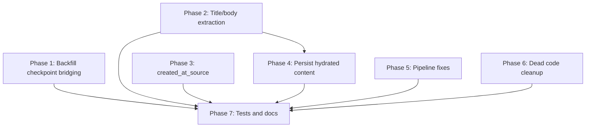

# Fix All Identified Codebase Gaps

## Phase 1: Critical — Backfill checkpoint bridging (C1-C3)

Same pattern as the Gmail fix we already shipped. Each connector's `backfill()` returns `new_checkpoint=None` on the last page, so no `SyncCheckpoint` row is written and subsequent incremental sync fails with `no_checkpoint_for_incremental`.

**C1 — Teams** (`[backend/src/contextedge/connectors/teams/connector.py](backend/src/contextedge/connectors/teams/connector.py)`)

- When `next_link` is None (last page), fetch a fresh delta link via `/messages/delta` and return `Checkpoint(data={"delta_link": new_delta})` instead of `None`
- Also fix the edge case where `@odata.nextLink` exists but has no `$skiptoken` — currently `skip_token` stays None while `has_more=True`, causing an infinite loop with no checkpoint

**C2 — ServiceNow** (`[backend/src/contextedge/connectors/servicenow/connector.py](backend/src/contextedge/connectors/servicenow/connector.py)`)

- When `has_more` is False, compute `last_updated` from the latest `sys_updated_on` in returned records and return `Checkpoint(data={"last_updated": latest_ts})`
- If no records returned, use the `window.end` timestamp

**C3 — Jira** (`[backend/src/contextedge/connectors/jira_sm/connector.py](backend/src/contextedge/connectors/jira_sm/connector.py)`)

- When `has_more` is False, use `latest_ts` from the last issue's `updated` field and return `Checkpoint(data={"last_updated": latest_ts})`
- If no issues returned, use `window.end.isoformat()`

---

## Phase 2: High — Title/body extraction for all connectors (H1-H2)

**Expand `evidence_title_from_payload` and `evidence_body_from_payload`** in `[backend/src/contextedge/services/evidence_normalization.py](backend/src/contextedge/services/evidence_normalization.py)`:

```python
def evidence_title_from_payload(payload: dict | None) -> str:
    p = payload or {}
    return (p.get("title") or p.get("subject") or p.get("summary")
            or p.get("short_description") or "Untitled")

def evidence_body_from_payload(payload: dict | None) -> str:
    p = payload or {}
    return (p.get("body") or p.get("body_text") or p.get("description")
            or p.get("text") or p.get("snippet") or str(p)[:8000])
```

This covers:

- **Jira**: `summary` (title), `description` (body)
- **ServiceNow**: `short_description` (title), `description` / `text` (body)
- **Gmail**: `subject` (title, already works), `snippet` (body, better than dict repr)
- **Teams**: `subject` / `body` (already works)

---

## Phase 3: High — Populate `created_at_source` from `_source_timestamp` (H3)

In `[backend/src/contextedge/workers/extraction_tasks.py](backend/src/contextedge/workers/extraction_tasks.py)`, in `_normalize()`:

- After loading the payload, parse `_source_timestamp` and set it on the new `EvidenceItem`:

```python
from datetime import datetime, timezone

source_ts = None
if payload.get("_source_timestamp"):
    try:
        source_ts = datetime.fromisoformat(payload["_source_timestamp"])
    except (ValueError, TypeError):
        pass
```

- Add `created_at_source=source_ts` to the `EvidenceItem(...)` constructor (line ~136)
- In the deduped branch, backfill `created_at_source` if the existing item has it as None

---

## Phase 4: High — Persist hydrated thread content (H4)

In `[backend/src/contextedge/workers/hydration_tasks.py](backend/src/contextedge/workers/hydration_tasks.py)`, after hydration:

- Persist each hydrated message as a `RawEvidenceObject` + enqueue `normalize_evidence` for it, so hydrated content becomes searchable evidence
- Update `Thread.first_message_at` and `Thread.last_message_at` from message timestamps (also fixes M1)
- Set `Thread.title` from the first message subject if currently None

This requires importing `persist_ingestion_events` and `queue_normalize_raw_objects`, and constructing lightweight `IngestionEvent`-like objects from `HydratedThread.messages`.

---

## Phase 5: Medium — Fix pipeline disconnections

**M7 — Relevance label mismatch** (`[backend/src/contextedge/api/v1/episodes.py](backend/src/contextedge/api/v1/episodes.py)`)

- Change the episode reconstruction filter from `["relevant", "operational"]` to `["operational", "possibly_relevant"]` to match actual classifier labels from `[backend/src/contextedge/ai/classifiers/relevance.py](backend/src/contextedge/ai/classifiers/relevance.py)`

**M8 — Sync retry uses wrong job type** (`[backend/src/contextedge/api/v1/sync.py](backend/src/contextedge/api/v1/sync.py)`)

- Check `run.run_type` and dispatch to `run_backfill.delay(...)` for backfill runs vs `run_incremental_sync.delay(...)` for incremental runs

**M10 — Teams hydrate_thread omits root message** (`[backend/src/contextedge/connectors/teams/connector.py](backend/src/contextedge/connectors/teams/connector.py)`)

- Fetch the root message via `/messages/{message_id}` first, then append replies, so the parent message body and author are included

**M1 — Thread timestamps** — addressed in Phase 4 above

**L7 — Offloaded payload in correlation** (`[backend/src/contextedge/services/correlation_service.py](backend/src/contextedge/services/correlation_service.py)`)

- Use `load_raw_payload(raw_object)` instead of reading `raw_object.raw_payload` directly, so offloaded rows are properly rehydrated before reading `_thread_id`

**L8 — Embedding provider error handling** (`[backend/src/contextedge/workers/extraction_tasks.py](backend/src/contextedge/workers/extraction_tasks.py)`)

- Wrap `_ensure_embedding` call in try/except so embedding failures don't crash normalization; log warning and continue

---

## Phase 6: Low — Dead code cleanup and minor fixes

**Remove or wire dead Celery tasks:**

- `generate_embeddings` in `[extraction_tasks.py](backend/src/contextedge/workers/extraction_tasks.py)` L320-330 — remove (embeddings are inline)
- `discover_source` in `[sync_tasks.py](backend/src/contextedge/workers/sync_tasks.py)` L12-23 — remove or wire to sources API
- `cluster_episodes` + `generate_playbook_candidate` in `[pattern_tasks.py](backend/src/contextedge/workers/pattern_tasks.py)` — keep but document as "future: scheduled pipeline"

**Remove dead auth code:**

- `validate_service_account_token` in `[middleware/auth.py](backend/src/contextedge/middleware/auth.py)` L60-66 — remove

**Fix hybrid ranker placeholder:**

- Remove unused `symptoms` parameter from `rank_playbooks` in `[hybrid_ranker.py](backend/src/contextedge/search/hybrid_ranker.py)`

**Document intentional gaps** in `[codewiki/KNOWN_GAPS.md](codewiki/KNOWN_GAPS.md)`:

- Retention service not scheduled (M6)
- Correlation does not auto-trigger episode reconstruction (M2)
- `workspace_id` / `domain_id` not set during normalization (L1)
- `body_summary` only via artifact path (L2)
- Semantic search not exposed in evidence API (L3)
- `evidence_quality` placeholder in ranker (L4)

---

## Phase 7: Tests and documentation

- Add tests for Teams/ServiceNow/Jira backfill checkpoint bridging (same pattern as `test_thread_linking.py`)
- Add tests for expanded `evidence_title_from_payload` / `evidence_body_from_payload`
- Add test for `created_at_source` population
- Add test for sync retry dispatching by `run_type`
- Add test for relevance label filter in episode reconstruction
- Update codewiki docs (03, 04, 08, 12, KNOWN_GAPS) with all changes
- Commit and push

---

## Dependency graph




Phases 1-6 are independent of each other and can be done in any order. Phase 7 depends on all prior phases.