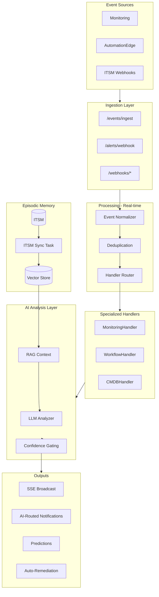

# Unified Event Management System (Updated)

## Infrastructure Validation Results

### Confirmed Available (No Work Needed)

| Component | Status | Location |

|-----------|--------|----------|

| SSE Infrastructure | COMPLETE | [`backend/app/api/v1/endpoints/sse.py`](backend/app/api/v1/endpoints/sse.py) |

| SSE Frontend Hook | COMPLETE | [`frontend/src/hooks/useAgentStream.ts`](frontend/src/hooks/useAgentStream.ts) |

| Notification Service | COMPLETE | [`backend/app/services/notification_service.py`](backend/app/services/notification_service.py) |

| Teams/Slack Connectors | COMPLETE | [`backend/app/connectors/teams.py`](backend/app/connectors/teams.py), [`slack.py`](backend/app/connectors/slack.py) |

| pgvector Models | COMPLETE | [`backend/app/models/vector_store.py`](backend/app/models/vector_store.py) |

| Vector Store Service | COMPLETE | [`backend/app/services/vector_store_service.py`](backend/app/services/vector_store_service.py) |

| Celery Infrastructure | COMPLETE | [`backend/app/tasks/celery_app.py`](backend/app/tasks/celery_app.py) |

| Frontend Stack | React + MUI | Existing component patterns |

### Needs Implementation

| Component | Gap |

|-----------|-----|

| Event Model | No unified event abstraction |

| Incident Resolution | Missing `resolution`, `close_code` columns |

| AI Routing | No intelligent channel selection |

| Event Feed UI | No intelligent feed component |

| ITSM Sync | sync_tasks.py was deleted |

| ELK Watcher Webhook | No endpoint for ELK log anomaly alerts |

---

## Event Sources Summary

| Source | Type | Method | Status |

|--------|------|--------|--------|

| **Datadog/SolarWinds/Nagios** | Monitoring Alerts | Webhook → `/alerts/webhook` | Exists |

| **AutomationEdge** | Workflow Failures | Webhook → `/events/ingest` | In Plan |

| **ServiceNow/ManageEngine** | ITSM Events | Webhook → `/webhooks/*` | Exists |

| **CMDB Changes** | Config Changes | Webhook → `/webhooks/servicenow/cmdb` | In Plan |

| **Elasticsearch/ELK** | Log Anomalies | ELK Watcher → `/events/elk-watcher` | In Plan |

### Existing ELK Infrastructure (Leverage)

- `ElasticsearchConnector` - Full connector for log queries
- `LogTelemetryService` - RCA log correlation with circuit breaker
- `ConnectorType.ELASTICSEARCH` - Connector type already defined

---

## Architecture (Agentic Hybrid Design)



---

## Phase 0: Validation Steps (MUST DO FIRST)

### 0.1 Verify pgvector Extension

```sql
-- Run in PostgreSQL
SELECT * FROM pg_extension WHERE extname = 'vector';
-- If empty, run: CREATE EXTENSION IF NOT EXISTS vector;
```

### 0.2 Verify OpenAI Configuration

```bash
# Check .env has OPENAI_API_KEY set
grep OPENAI_API_KEY backend/.env
```

### 0.3 Verify Redis Running

```bash
# Check Redis connection
redis-cli ping  # Should return PONG
```

### 0.4 Verify Celery Workers

```bash
# Check Celery status
celery -A app.tasks.celery_app inspect active
```

---

## Phase 1: Core Event Infrastructure

### 1.1 Create Event Model

**File**: [`backend/app/models/event.py`](backend/app/models/event.py) (NEW)

```python
class EventType(str, enum.Enum):
    MONITORING_ALERT = "monitoring_alert"
    WORKFLOW_FAILURE = "workflow_failure"
    ACTION_FAILURE = "action_failure"
    CMDB_CHANGE = "cmdb_change"
    SECURITY_EVENT = "security_event"

class EventCategory(str, enum.Enum):
    INFRASTRUCTURE = "infrastructure"
    APPLICATION = "application"
    AUTOMATION = "automation"
    SECURITY = "security"

class Event(Base, TimestampMixin):
    __tablename__ = "events"
    
    id = Column(Integer, primary_key=True)
    tenant_id = Column(Integer, ForeignKey("tenants.id"))
    external_id = Column(String(255), index=True)
    source = Column(String(100))  # datadog, automationedge, servicenow
    
    event_type = Column(SQLEnum(EventType), nullable=False)
    category = Column(SQLEnum(EventCategory))
    
    title = Column(String(500), nullable=False)
    message = Column(Text)
    severity = Column(SQLEnum(AlertSeverity))
    
    # Correlation
    affected_ci_id = Column(Integer, ForeignKey("configuration_items.id"))
    correlation_id = Column(String(255), index=True)  # Group related events
    parent_event_id = Column(Integer, ForeignKey("events.id"))  # Event chain
    
    # Source payload
    payload = Column(JSON)
    
    # AI Analysis
    ai_analysis = Column(JSON)  # LLM analysis result
    ai_analyzed_at = Column(DateTime)
    
    # Processing
    status = Column(String(50), default="new")  # new, processing, analyzed, resolved
    prediction_id = Column(Integer, ForeignKey("predictions.id"))
    
    # Deduplication
    fingerprint = Column(String(64), index=True)  # SHA256 of key fields
```

### 1.2 Add Incident Resolution Fields

**File**: [`backend/app/models/incident.py`](backend/app/models/incident.py) (MODIFY)

Add after line 77:

```python
# Resolution Details (for RAG/Episodic Memory)
resolution = Column(Text, nullable=True)
resolution_code = Column(String(100), nullable=True)
close_code = Column(String(100), nullable=True)
```

### 1.3 Create Migrations

**Files**:

- `backend/alembic/versions/xxx_add_events_table.py`
- `backend/alembic/versions/xxx_add_incident_resolution.py`

---

## Phase 2: Unified Event Ingestion

### 2.1 Create Events Endpoint

**File**: [`backend/app/api/v1/endpoints/events.py`](backend/app/api/v1/endpoints/events.py) (NEW)

```python
@router.post("/ingest/{tenant_id}")
async def ingest_event(
    tenant_id: int,
    event_data: GenericEventCreate,
    db: Session = Depends(get_db)
):
    # 1. Generate fingerprint for deduplication
    fingerprint = _generate_fingerprint(event_data)
    
    # 2. Check dedup window (5 min default)
    existing = _check_duplicate(db, tenant_id, fingerprint)
    if existing:
        return {"status": "duplicate", "event_id": existing.id}
    
    # 3. Create Event
    event = Event(
        tenant_id=tenant_id,
        event_type=event_data.event_type,
        source=event_data.source,
        title=event_data.title,
        message=event_data.message,
        severity=_map_severity(event_data.severity),
        payload=event_data.payload,
        fingerprint=fingerprint,
    )
    db.add(event)
    db.commit()
    
    # 4. Route to handler (async)
    process_event.delay(event.id)
    
    # 5. Broadcast via SSE
    await broadcast_event_received(tenant_id, event.id, event.event_type)
    
    return {"status": "accepted", "event_id": event.id}
```

### 2.2 ELK Watcher Webhook Endpoint

**File**: [`backend/app/api/v1/endpoints/events.py`](backend/app/api/v1/endpoints/events.py) (same file)

Leverages existing `ElasticsearchConnector` and `LogTelemetryService`:

```python
class ELKWatcherAlert(BaseModel):
    watch_id: str
    state: str  # "executed", "throttled", "acked"
    ctx: Optional[Dict] = None

@router.post("/elk-watcher/{tenant_id}")
async def receive_elk_watcher_alert(
    tenant_id: int,
    alert_data: ELKWatcherAlert,
    db: Session = Depends(get_db)
):
    """Receive log anomaly alerts from ELK Watcher"""
    if alert_data.state != "executed":
        return {"status": "ignored"}
    
    ctx = alert_data.ctx or {}
    hits = ctx.get("payload", {}).get("hits", {})
    total = hits.get("total", {}).get("value", 0)
    
    # Sample logs for AI context
    samples = [h.get("_source", {}).get("message", "")[:200] 
               for h in hits.get("hits", [])[:5]]
    
    event = Event(
        tenant_id=tenant_id,
        source="elasticsearch",
        event_type=EventType.LOG_ANOMALY,
        title=f"Log Anomaly: {alert_data.watch_id}",
        message=f"{total} matching logs detected",
        severity=AlertSeverity.CRITICAL if total > 100 else AlertSeverity.WARNING,
        payload={"watch_id": alert_data.watch_id, "total_hits": total, "samples": samples}
    )
    db.add(event)
    db.commit()
    
    process_event.delay(event.id)
    return {"status": "accepted", "event_id": event.id}
```

### 2.3 LogAnomalyHandler (Uses Existing ELK Infrastructure)

**File**: [`backend/app/services/event_handlers/log_handler.py`](backend/app/services/event_handlers/log_handler.py) (NEW)

```python
class LogAnomalyHandler(EventHandlerBase):
    """
    Handler for LOG_ANOMALY events from ELK Watcher.
    Leverages existing LogTelemetryService for deeper analysis.
    """
    
    async def handle(self, event: Event) -> EventAnalysisResult:
        # 1. Get historical context from RAG
        similar = await self.get_historical_context(event)
        
        # 2. Use LogTelemetryService for pattern analysis
        log_service = LogTelemetryService(self.db)
        
        # 3. Determine if this is a known pattern
        watch_id = event.payload.get("watch_id", "")
        samples = event.payload.get("samples", [])
        
        # 4. Build LLM prompt with context
        analysis = await self._analyze_with_llm(event, similar, samples)
        
        return analysis
```

---

## Phase 3: Event Handlers (Agentic)

### 3.1 Handler Base Class

**File**: [`backend/app/services/event_handlers/base.py`](backend/app/services/event_handlers/base.py) (NEW)

```python
class EventHandlerBase(ABC):
    def __init__(self, db: Session, vector_store: VectorStoreService):
        self.db = db
        self.vector_store = vector_store
    
    @abstractmethod
    async def handle(self, event: Event) -> EventAnalysisResult:
        """Analyze event and return structured result"""
        pass
    
    async def get_historical_context(self, event: Event, limit: int = 3) -> List[Dict]:
        """RAG: Get similar past incidents with resolutions"""
        return self.vector_store.find_similar_incidents(
            self.db,
            event.tenant_id,
            f"{event.title} {event.message}",
            limit=limit
        )
```

### 3.2 Monitoring Handler

**File**: [`backend/app/services/event_handlers/monitoring_handler.py`](backend/app/services/event_handlers/monitoring_handler.py) (NEW)

Handles: capacity predictions, threshold alerts, metric anomalies

### 3.3 Workflow Handler  

**File**: [`backend/app/services/event_handlers/workflow_handler.py`](backend/app/services/event_handlers/workflow_handler.py) (NEW)

Handles: AutomationEdge failures, action failures, pipeline errors

Unique features:

- Suggest retry vs rollback
- Check if transient failure
- Link to affected playbook

---

## Phase 4: Episodic Memory (ITSM Sync)

### 4.1 ITSM Sync Task

**File**: [`backend/app/tasks/sync_tasks.py`](backend/app/tasks/sync_tasks.py) (NEW)

```python
@celery_app.task(bind=True)
def sync_itsm_history(self, tenant_id: int, days_back: int = 90):
    """
    Sync resolved incidents from ServiceNow for RAG.
    Runs daily at 4 AM.
    """
    db = SessionLocal()
    try:
        # 1. Get ServiceNow connector
        connector = get_servicenow_connector(db, tenant_id)
        if not connector:
            return {"status": "skipped", "reason": "No ServiceNow connector"}
        
        # 2. Fetch resolved incidents with pagination
        sn = ServiceNowConnector(...)
        offset = 0
        total_synced = 0
        
        while True:
            incidents = asyncio.run(sn.get_resolved_incidents(
                days_back=days_back,
                limit=100,
                offset=offset
            ))
            
            if not incidents:
                break
            
            # 3. Upsert to local DB
            for inc_data in incidents:
                incident = _upsert_incident(db, tenant_id, inc_data)
                
                # 4. Generate embeddings
                if incident.resolution:
                    vector_store.index_incident(db, tenant_id, incident.id)
                    total_synced += 1
            
            offset += 100
            if offset > 10000:  # Safety limit
                break
        
        return {"status": "success", "synced": total_synced}
    finally:
        db.close()
```

### 4.2 ServiceNow Method

**File**: [`backend/app/connectors/servicenow.py`](backend/app/connectors/servicenow.py) (MODIFY)

Add method:

```python
async def get_resolved_incidents(
    self, days_back: int = 90, limit: int = 100, offset: int = 0
) -> List[Dict]:
    query = f"sys_updated_on>javascript:gs.daysAgo({days_back})^stateIN6,7,8"
    params = {
        "sysparm_query": query,
        "sysparm_limit": limit,
        "sysparm_offset": offset,
        "sysparm_fields": "sys_id,number,short_description,description,close_notes,close_code,priority,category,resolved_at,sys_updated_on"
    }
    # ... fetch and return
```

---

## Phase 5: AI-Routed Notifications

### 5.1 Notification Router Service

**File**: [`backend/app/services/notification_router.py`](backend/app/services/notification_router.py) (NEW)

Leverages existing notification infrastructure:

```python
class NotificationRouter:
    """
    AI-driven notification routing.
    Decides: which channel, what format, whether to suppress.
    """
    
    async def route_event_notification(
        self,
        event: Event,
        analysis: EventAnalysisResult,
        db: Session
    ) -> Optional[int]:  # Returns notification_id or None if suppressed
        
        # 1. Check suppression rules
        if self._should_suppress(event, analysis):
            logger.info(f"Suppressing notification for event {event.id}")
            return None
        
        # 2. Determine channel based on context
        channel_decision = await self._decide_channel(event, analysis)
        
        # 3. Format message with AI reasoning
        message = self._format_intelligent_message(event, analysis)
        
        # 4. Create notification via existing service
        notification = await create_notification(
            tenant_id=event.tenant_id,
            notification_type=NotificationType.ALERT_TRIGGERED,
            related_entity_type="event",
            related_entity_id=event.id,
            db=db,
            channel_id=channel_decision.channel_id
        )
        
        return notification.id if notification else None
    
    def _should_suppress(self, event, analysis) -> bool:
        # Suppress if auto-remediation in progress
        # Suppress if duplicate within correlation window
        # Suppress if below confidence threshold
        pass
    
    async def _decide_channel(self, event, analysis) -> ChannelDecision:
        # Critical + Production -> PagerDuty
        # Warning + Dev -> Slack #dev-alerts
        # Correlated cluster -> War Room channel
        pass
```

---

## Phase 6: Intelligent Event Feed (Frontend)

### 6.1 Event Feed Component

**File**: [`frontend/src/components/EventFeed.tsx`](frontend/src/components/EventFeed.tsx) (NEW)

```typescript
// Uses existing useAgentStream hook
const EventFeed: React.FC = () => {
  const { events, isConnected } = useAgentStream({
    eventTypes: ['event.received', 'event.analyzed', 'prediction.created']
  });
  
  // Group events by correlation_id
  const groupedEvents = useMemo(() => groupByCorrelation(events), [events]);
  
  return (
    <Box>
      {/* Tabs: Needs Attention | Watching | Auto-Healing */}
      <Tabs value={tab}>
        <Tab label={`Needs Attention (${needsAttention.length})`} />
        <Tab label={`Watching (${watching.length})`} />
        <Tab label={`Auto-Healing (${autoHealing.length})`} />
      </Tabs>
      
      {/* Event Cards with AI Reasoning */}
      {groupedEvents.map(group => (
        <EventCard 
          key={group.correlation_id}
          events={group.events}
          aiReasoning={group.analysis?.reasoning}
          actions={['remediate', 'escalate', 'dismiss']}
        />
      ))}
    </Box>
  );
};
```

### 6.2 SSE Event Types

**File**: [`backend/app/api/v1/endpoints/sse.py`](backend/app/api/v1/endpoints/sse.py) (MODIFY)

Add helper functions:

```python
async def broadcast_event_received(tenant_id: int, event_id: int, event_type: str):
    await broadcaster.broadcast(tenant_id, {
        "event": "event.received",
        "event_id": event_id,
        "event_type": event_type,
        "timestamp": datetime.utcnow().isoformat()
    })

async def broadcast_event_analyzed(tenant_id: int, event_id: int, analysis: dict):
    await broadcaster.broadcast(tenant_id, {
        "event": "event.analyzed",
        "event_id": event_id,
        "severity": analysis.get("severity"),
        "reasoning": analysis.get("reasoning"),
        "recommended_action": analysis.get("recommended_action"),
        "timestamp": datetime.utcnow().isoformat()
    })
```

---

## Phase 7: Configuration

### 7.1 Add Settings

**File**: [`backend/app/core/config.py`](backend/app/core/config.py) (MODIFY)

```python
# Event Management
EVENT_DEDUP_WINDOW_SECONDS: int = 300
EVENT_RETENTION_DAYS: int = 90
EVENT_ANALYSIS_TIMEOUT: int = 10

# Handler Toggles
EVENT_HANDLERS: Dict[str, bool] = {
    "monitoring_alert": True,
    "workflow_failure": True,
    "cmdb_change": True,
}

# ITSM Sync
ITSM_HISTORY_SYNC_ENABLED: bool = True
ITSM_HISTORY_DAYS_BACK: int = 90
ITSM_HISTORY_MAX_RECORDS: int = 10000

# AI Routing
AI_NOTIFICATION_ROUTING_ENABLED: bool = True
AI_NOTIFICATION_SUPPRESS_ON_AUTO_REMEDIATION: bool = True
AI_NOTIFICATION_CORRELATION_WINDOW_SECONDS: int = 300
```

---

## Files Summary

| Action | File | Phase |

|--------|------|-------|

| CREATE | `backend/app/models/event.py` | 1 |

| MODIFY | `backend/app/models/incident.py` | 1 |

| CREATE | `backend/alembic/versions/xxx_add_events_table.py` | 1 |

| CREATE | `backend/alembic/versions/xxx_add_incident_resolution.py` | 1 |

| CREATE | `backend/app/api/v1/endpoints/events.py` | 2 |

| CREATE | `backend/app/services/event_handlers/base.py` | 3 |

| CREATE | `backend/app/services/event_handlers/monitoring_handler.py` | 3 |

| CREATE | `backend/app/services/event_handlers/workflow_handler.py` | 3 |

| CREATE | `backend/app/tasks/sync_tasks.py` | 4 |

| MODIFY | `backend/app/connectors/servicenow.py` | 4 |

| MODIFY | `backend/app/tasks/celery_app.py` | 4 |

| CREATE | `backend/app/services/notification_router.py` | 5 |

| CREATE | `frontend/src/components/EventFeed.tsx` | 6 |

| MODIFY | `backend/app/api/v1/endpoints/sse.py` | 6 |

| MODIFY | `backend/app/core/config.py` | 7 |

---

## Validation Checklist (Before Each Phase)

- [ ] **Phase 0**: pgvector installed, OpenAI key set, Redis running, Celery active
- [ ] **Phase 1**: Run migrations, verify Event table created
- [ ] **Phase 2**: Test `/events/ingest` endpoint manually
- [ ] **Phase 3**: Verify handlers produce valid analysis JSON
- [ ] **Phase 4**: Test ITSM sync with sandbox ServiceNow
- [ ] **Phase 5**: Verify notifications route to correct channels
- [ ] **Phase 6**: Verify SSE events appear in frontend