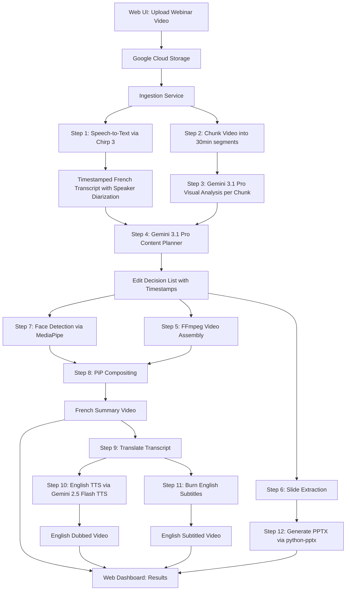

# GHPL Webinar Video Summarizer

## Architecture Overview




## Google Cloud AI Models Used


| Role                                       | Model                                                            | Why                                                                                                                                              |
| ------------------------------------------ | ---------------------------------------------------------------- | ------------------------------------------------------------------------------------------------------------------------------------------------ |
| **Video understanding & content analysis** | **Gemini 3.1 Pro** (Feb 2026, latest)                            | Best reasoning; 1M token context; native video input (~45 min with audio); chapter extraction, content categorization, key-moment identification |
| **Cost-effective batch tasks**             | **Gemini 2.5 Flash**                                             | Slide descriptions, summary refinement, subtitle formatting; 10x cheaper than Pro                                                                |
| **Speech-to-Text**                         | **Chirp 3** (Speech-to-Text V2)                                  | Latest multilingual ASR; French transcription with speaker diarization and timestamps; handles long audio                                        |
| **Translation**                            | **Cloud Translation API v3**                                     | French-to-English text translation at $20/M characters                                                                                           |
| **Text-to-Speech**                         | **Gemini 2.5 Flash TTS** (GA Sep 2025) + **Chirp 3 HD** fallback | SOTA natural voiceover; natural-language style prompts for tone, pace, emotion; 30 voices, 70+ locales; far surpasses Neural2 in expressivity    |
| **Face detection**                         | **MediaPipe Face Detection**                                     | Local, fast, free; detects speaker faces for PiP compositing                                                                                     |


**Note on models mentioned in requirements:** "Nano Banana" is a nickname for Gemini 2.5 Flash's image editing mode -- not applicable here. Veo 3 is for generating new video from text, not editing existing footage. Gemini 3.0 Pro is superseded by 3.1 Pro (Feb 2026).

---

## Tech Stack (All SOTA as of Feb 2026)

- **Frontend**: React 19 + Vite 6 + Tailwind CSS v4.2 + shadcn/ui (Radix primitives, accessible, copy-paste components)
- **Backend**: Python 3.12+ FastAPI (async REST API + WebSocket for progress)
- **Task Queue**: Taskiq + Redis (async-native, built for FastAPI; replaces Celery)
- **Video Processing**: FFmpeg 7 (clipping/assembly) + MoviePy 2.0 (PiP compositing, v2 API)
- **Face Detection**: MediaPipe (180+ FPS, best for frontal webcam faces)
- **Slide Generation**: python-pptx 0.6.22
- **Storage**: Google Cloud Storage (video files) + PostgreSQL via SQLModel (job metadata; SQLModel = Pydantic + SQLAlchemy)
- **AI SDK**: `google-cloud-aiplatform` (Gemini 3.1 Pro, 2.5 Flash), `google-cloud-speech` (Chirp 3), `google-cloud-translate` (v3), `google-cloud-texttospeech` (Gemini TTS + Chirp 3 HD)
- **Real-time**: WebSockets (FastAPI native) for live pipeline progress to frontend

---

## Project Structure

```
GHPLWebinar/
  backend/
    app/
      main.py                  # FastAPI app entry + WebSocket endpoint
      config.py                # GCP project, model IDs, settings
      routers/
        upload.py              # POST /api/upload (video upload)
        jobs.py                # GET /api/jobs, GET /api/jobs/{id}
        download.py            # GET /api/download/{id}/{artifact}
        ws.py                  # WebSocket /ws/jobs/{id} (live progress)
      services/
        transcription.py       # Chirp 3 STT with diarization
        video_analysis.py      # Gemini 3.1 Pro video understanding
        content_planner.py     # Gemini 3.1 Pro editorial planning
        video_assembly.py      # FFmpeg clipping + MoviePy 2.0 PiP compositing
        slide_extractor.py     # Frame extraction + python-pptx
        translation.py         # Cloud Translation API v3
        tts.py                 # Gemini 2.5 Flash TTS + Chirp 3 HD fallback
        subtitle_burner.py     # FFmpeg subtitle overlay
      models/
        job.py                 # Job status model (SQLModel = Pydantic + SQLAlchemy)
      workers/
        pipeline.py            # Taskiq async task: full processing pipeline
        broker.py              # Taskiq Redis broker config
    requirements.txt
    Dockerfile
  frontend/                    # React 19 + Vite 6 + Tailwind v4.2 + shadcn/ui
    src/
      App.tsx
      components/
        UploadForm.tsx         # shadcn/ui drag-and-drop video upload
        JobDashboard.tsx       # WebSocket-powered live progress
        ResultsView.tsx        # Video players + download links
      hooks/
        useJobProgress.ts      # WebSocket hook for real-time updates
      lib/
        api.ts                 # fetch-based API client (no axios needed)
    package.json
    vite.config.ts
    tailwind.config.ts         # Tailwind v4 CSS-first config
    components.json            # shadcn/ui config
  docker-compose.yml           # Backend + Redis + Frontend
  README.md
```

---

## Detailed Processing Pipeline

### Step 1: Transcription (Chirp 3)

- Extract audio track from video via FFmpeg
- Send to Speech-to-Text V2 with Chirp 3 model
- Enable `speaker_diarization` to identify different speakers
- Output: timestamped transcript with speaker labels in JSON

### Step 2: Video Chunking

- Split the 2-3 hour video into ~30 minute chunks (with 30s overlap) using FFmpeg
- Upload chunks to GCS for Gemini processing
- Rationale: Gemini 3.1 Pro supports ~45 min with audio; 30 min gives safety margin

### Step 3: Visual Analysis (Gemini 3.1 Pro)

- For each chunk, prompt Gemini 3.1 Pro with the video + corresponding transcript segment
- Extract: slide transition timestamps, speaker visibility timestamps, content categories (intro/research/product/Q&A), key visual moments, product names mentioned, speaker names

### Step 4: Content Planning (Gemini 3.1 Pro)

- Feed the full transcript + all chunk analyses into Gemini 3.1 Pro (text-only, fits in 1M context)
- Prompt it to produce an **Edit Decision List (EDL)** in JSON:

```json
{
  "introduction": [
    {"start": "00:02:15", "end": "00:06:30", "description": "Speaker intro and topic overview"}
  ],
  "research_discussion": [
    {"start": "00:15:00", "end": "00:18:45", "description": "Key study on metformin efficacy"},
    {"start": "00:32:10", "end": "00:36:20", "description": "Clinical trial results"}
  ],
  "product_discussion": [
    {"start": "01:05:00", "end": "01:09:30", "description": "Metformin GH benefits", "products": ["Metformin GH"]},
    {"start": "01:22:00", "end": "01:25:15", "description": "DAPAGEN M overview", "products": ["DAPAGEN M"]}
  ],
  "excluded_qa": [
    {"start": "02:15:00", "end": "02:45:00", "reason": "Q&A session"}
  ],
  "speakers": [
    {"name": "Dr. Example", "timestamps": ["00:02:15-00:06:30", "00:15:00-00:18:45"]}
  ]
}
```

### Step 5-8: Video Assembly + PiP

- Use FFmpeg to extract clips per the EDL
- Use MediaPipe to detect face regions in each clip
- When a slide is shown and a speaker face is detected in the original frame, create a PiP layout (speaker face in corner, slide enlarged)
- Concatenate all clips with crossfade transitions
- Add intro card (title + speaker names) and outro card (thank you / end credits) using MoviePy text overlays
- Output: 15-20 min French summary video

### Step 9-11: English Versions

- **Translation**: Send French transcript segments (matching the EDL) to Cloud Translation API v3 for French-to-English
- **Dubbed version**: Feed English text to **Gemini 2.5 Flash TTS** with natural-language style prompts (e.g., "professional medical presenter, calm authoritative tone, moderate pace") to generate expressive English voiceover. Segment audio to match original clip durations with slight speed adjustment via FFmpeg `atempo` filter. Replace audio track. Fall back to **Chirp 3 HD voices** if Gemini TTS is unavailable for a locale.
- **Subtitled version**: Generate SRT file from English translation with timestamps, burn into French video using FFmpeg `ass`/`srt` subtitle filter

### Step 12: PPT Extraction

- At each slide transition timestamp (from Step 3), extract a high-res frame using FFmpeg
- Deduplicate near-identical frames using perceptual hashing (imagehash library)
- Insert each unique slide image into a PPTX file using python-pptx
- Slides remain in French (as per requirements)

---

## Key Technical Constraints & Mitigations

- **Video length vs. Gemini limit**: Chunking into 30-min segments with overlap ensures complete coverage. Full transcript is processed as text (well within 1M token limit).
- **Processing time**: A 2-3 hour video will take approximately 15-30 minutes to fully process. The Taskiq async pipeline with WebSocket progress reporting keeps the user informed in real-time.
- **Cost per webinar**: Estimated ~$5-15 per webinar (Gemini Pro for ~6 chunks at ~$0.50-2 each + STT + TTS + Translation). At 25/year, annual cost is ~$125-375.
- **PiP quality**: MediaPipe face detection works well for webcam-style speaker shots. If the original video already has a PiP layout, we detect and preserve it rather than re-compositing.

---

## SOTA Audit (Feb 2026)

Every component has been validated against the latest available technology:

- **Gemini 3.1 Pro** (released Feb 20, 2026): Latest reasoning model, 77.1% ARC-AGI-2 (vs 31.1% for 3.0), 1M token context, 100MB file upload, MEDIUM thinking level
- **Gemini 2.5 Flash**: Best price-performance for batch tasks ($0.50/M input tokens)
- **Chirp 3** (GA Oct 2025): Latest ASR, 85+ languages, built-in denoiser, speaker diarization
- **Gemini 2.5 Flash TTS** (GA Sep 2025, upgraded Dec 2025): Replaced Neural2; natural-language style prompts for tone/pace/emotion, 30 voices, 70+ locales, far more expressive
- **Chirp 3 HD voices** (GA Oct 2025): Fallback TTS; captures human intonation nuances, SSML support, instant voice cloning
- **Cloud Translation API v3**: Current; no newer version exists
- **React 19** (stable Dec 2024): Server Components, Actions, `use()` hook, React Compiler for auto-memoization
- **Tailwind CSS v4.2** (Feb 2026): 5x faster full builds, CSS-first config, container queries, first-party Vite plugin
- **shadcn/ui** (86k+ stars): SOTA React component library; Radix primitives + Tailwind, accessible, full code ownership
- **Taskiq** (async-first task queue): Native async/await, built for FastAPI, dependency injection; replaces Celery
- **MoviePy 2.0** (Jan 2025): Latest release with breaking API changes from v1
- **MediaPipe Face Detection**: 180+ FPS, best for frontal webcam faces (our use case); YOLO better for crowds/angles but overkill here
- **FastAPI**: Still dominant Python async framework (84k stars, used by OpenAI/Anthropic/Microsoft)
- **python-pptx 0.6.22**: Best free PPTX generation library; Aspose is commercial alternative

## Frontend Design

The web app will have three main screens:

1. **Upload Screen**: Drag-and-drop zone for video upload, optional metadata fields (webinar title, date, speaker names, GHPL products to highlight)
2. **Processing Dashboard**: Real-time progress bar showing current pipeline step (Transcribing -> Analyzing -> Planning -> Assembling -> Translating -> Finalizing), with estimated time remaining
3. **Results Screen**: Side-by-side video players for French/English versions, download buttons for all artifacts (French video, English dubbed, English subtitled, PPT, transcript JSON)

---

## Enterprise Branding & Theming (Optional)

The application supports fully customizable enterprise branding so GHPL (or any client) can white-label the tool to match their corporate identity.

### Theme Configuration

A `branding.config.ts` file (frontend) and corresponding `branding` table (backend DB) allow per-tenant customization:

```typescript
interface BrandingConfig {
  companyName: string;               // e.g. "GHPL"
  logoUrl: string;                   // Header + intro/outro card logo
  faviconUrl: string;
  primaryColor: string;              // CSS HSL value for shadcn/ui theme
  accentColor: string;               // Buttons, links, progress bars
  backgroundColor: string;           // Page background
  fontFamily: string;                // e.g. "Inter", "Poppins", corporate font
  introCard: {
    backgroundImage?: string;        // Custom intro slide background
    titleTemplate: string;           // e.g. "GHPL Webinar Series: {title}"
    subtitleTemplate: string;        // e.g. "Presented by {speakers}"
    logoPosition: "top-left" | "top-right" | "center";
  };
  outroCard: {
    backgroundImage?: string;
    thankYouText: string;            // e.g. "Thank you for watching | GHPL"
    contactInfo?: string;            // Optional footer text
    logoPosition: "center" | "bottom-right";
  };
  watermark?: {
    imageUrl: string;                // Semi-transparent logo overlay
    position: "top-left" | "top-right" | "bottom-left" | "bottom-right";
    opacity: number;                 // 0.0 - 1.0
  };
  emailFooter?: string;             // If notification emails are sent
}
```

### How It Works

- **Web UI theming**: shadcn/ui uses CSS variables (`--primary`, `--accent`, `--background`, etc.) in `globals.css`. The branding config dynamically overrides these at runtime, giving the entire UI a corporate look with zero code changes. Dark/light mode respects the brand palette.
- **Video intro/outro cards**: MoviePy 2.0 generates title cards using the configured logo, background image, title template, font, and colors. These are prepended/appended to the summary video during assembly (Step 5-8).
- **Video watermark**: If configured, a semi-transparent company logo is overlaid on the entire summary video using FFmpeg's `overlay` filter at the specified corner and opacity.
- **PPT branding**: python-pptx applies a branded slide master (company logo on every slide, corporate color scheme, footer text) to the extracted slides PPTX.
- **Multi-tenant ready**: Branding is stored per-tenant in the DB. If only one client (GHPL), a single default config suffices. Scales to multiple clients without code changes.

### Project Structure Additions

```
frontend/
  src/
    lib/
      branding.ts              # BrandingConfig type + loader
    styles/
      globals.css              # CSS variables dynamically set from branding
    components/
      BrandedHeader.tsx        # Logo + company name header
      ThemeProvider.tsx         # Applies CSS variable overrides at runtime

backend/
  app/
    models/
      branding.py              # BrandingConfig SQLModel
    services/
      branding.py              # Load/save branding config, generate themed assets
    assets/
      templates/
        intro_card.py          # MoviePy intro card generator with branding
        outro_card.py          # MoviePy outro card generator with branding
        slide_master.py        # python-pptx branded slide master template
```

### Default GHPL Theme

Out of the box, the app ships with a GHPL-branded default theme:

- GHPL logo in header and video intro/outro cards
- Corporate primary color applied across UI and video overlays
- "GHPL Webinar Series" title template for intro cards
- "Thank you | GHPL" outro text
- GHPL logo watermark at bottom-right, 15% opacity

