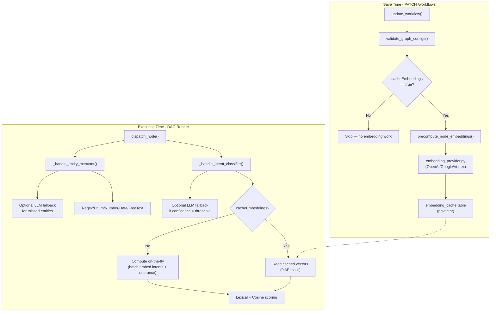

# Intent Classifier + Entity Extractor Nodes

## Architecture




## Files to modify / create

**Backend - new files:**

- `backend/app/models/embedding_cache.py` — SQLAlchemy model
- `backend/alembic/versions/00XX_add_embedding_cache.py` — migration
- `backend/app/engine/intent_classifier.py` — handler (ported from IntentEdge `views.py`)
- `backend/app/engine/entity_extractor.py` — handler (ported from IntentEdge `views.py`)
- `backend/app/engine/embedding_cache_helper.py` — `get_or_embed()` + `precompute_node_embeddings()`

**Backend - modify:**

- [backend/app/engine/node_handlers.py](backend/app/engine/node_handlers.py) — 2 dispatch lines (~line 64)
- [backend/app/api/workflows.py](backend/app/api/workflows.py) — hook `precompute_node_embeddings` into `create_workflow` (~~line 93) and `update_workflow` (~~line 159)
- [backend/app/engine/config_validator.py](backend/app/engine/config_validator.py) — validation rules for new nodes
- [backend/app/models/**init**.py](backend/app/models/__init__.py) — import new model (if barrel file exists)

**Shared:**

- [shared/node_registry.json](shared/node_registry.json) — 2 new node type entries + new "nlp" category

**Frontend - modify:**

- [frontend/src/components/sidebar/DynamicConfigForm.tsx](frontend/src/components/sidebar/DynamicConfigForm.tsx) — `IntentListEditor` and `EntityListEditor` components
- [frontend/src/lib/expressionVariables.ts](frontend/src/lib/expressionVariables.ts) — output fields for new nodes
- [frontend/src/lib/validateWorkflow.ts](frontend/src/lib/validateWorkflow.ts) — validation for new nodes

---

## Phase 1: Database — Embedding Cache Table

New model in `backend/app/models/embedding_cache.py`:

```python
class EmbeddingCache(Base):
    __tablename__ = "embedding_cache"

    id = Column(UUID(as_uuid=True), primary_key=True, default=uuid.uuid4)
    tenant_id = Column(String(64), nullable=False)
    text_hash = Column(String(64), nullable=False)
    text = Column(Text, nullable=False)
    provider = Column(String(32), nullable=False)
    model = Column(String(128), nullable=False)
    # embedding VECTOR column added via raw SQL (same pattern as kb_chunks)
    created_at = Column(DateTime(timezone=True), default=_utcnow)

    __table_args__ = (
        Index("ix_emb_cache_lookup", "tenant_id", "provider", "model", "text_hash", unique=True),
    )
```

Alembic migration following the exact pattern from `0009_add_knowledge_base_tables.py`:

- `CREATE TABLE embedding_cache (...)`
- `ALTER TABLE embedding_cache ADD COLUMN embedding vector`
- `CREATE INDEX ix_emb_cache_embedding ON embedding_cache USING hnsw (embedding vector_cosine_ops)`

---

## Phase 2: Embedding Cache Helper

New file `backend/app/engine/embedding_cache_helper.py` with three functions:

`**get_or_embed(tenant_id, texts, provider, model, db)**` — Check DB by `(tenant_id, provider, model, text_hash)`, batch-embed only missing texts via `get_embeddings_batch_sync()` from [backend/app/engine/embedding_provider.py](backend/app/engine/embedding_provider.py), upsert new rows, return `list[list[float]]`. Used both at save-time (for cached intents) and at runtime (for on-the-fly intents when `cacheEmbeddings` is false — in this case it still uses the same function but the caller doesn't persist to DB, just gets vectors back).

`**embed_batch_transient(texts, provider, model)**` — Lightweight wrapper around `get_embeddings_batch_sync()` that returns vectors without any DB interaction. Used at runtime when `cacheEmbeddings` is false — compute and discard after use.

`**precompute_node_embeddings(graph_json, tenant_id, db)**` — Scan `graph_json["nodes"]` for Intent Classifier nodes where `config.cacheEmbeddings == true`. If none found, return immediately (no DB or API work). For matching nodes, concatenate each intent's `name + description + examples` into text, call `get_or_embed()`. Returns `list[str]` warnings.

---

## Phase 3: Node Registry

Add a new `"nlp"` category and two node types to [shared/node_registry.json](shared/node_registry.json):

**Intent Classifier** (`intent_classifier`, category `nlp`):

- `utteranceExpression` (string, default `"trigger.message"`) — in `EXPRESSION_KEYS`
- `intents` (array of objects: `{name, description, examples[], priority}`) — rendered by new `IntentListEditor`
- `allowMultiIntent` (boolean, default `false`)
- `mode` (enum: `hybrid`, `llm_only`, `heuristic_only`, default `hybrid`)
  - `heuristic_only` — lexical + embedding scoring, zero LLM cost
  - `hybrid` — heuristic first, LLM fallback when confidence < threshold
  - `llm_only` — always LLM, no embeddings needed at all
- `provider` / `model` — same enums as LLM Router, with `visibleWhen: {field: "mode", values: ["hybrid", "llm_only"]}`
- `embeddingProvider` / `embeddingModel` — enum from `EMBEDDING_REGISTRY` keys, with `visibleWhen: {field: "mode", values: ["hybrid", "heuristic_only"]}`
- `cacheEmbeddings` (boolean, default `false`) — with `visibleWhen: {field: "mode", values: ["hybrid", "heuristic_only"]}`
  - When `false` (default): intent embeddings computed on-the-fly at execution time. Good for small intent lists (under ~10 intents). No save-time work.
  - When `true`: intent embeddings precomputed at workflow save time and persisted in `embedding_cache` table. Recommended for large intent lists or high-throughput workflows. Runtime reads from cache — zero embedding API calls except the utterance.
  - Not shown when `mode == "llm_only"` since embeddings are irrelevant in that mode.
- `confidenceThreshold` (number, default `0.6`, min 0, max 1)
- `historyNodeId` (string) — in `NODE_ID_KEYS`

**Entity Extractor** (`entity_extractor`, category `nlp`):

- `sourceExpression` (string, default `"trigger.message"`) — in `EXPRESSION_KEYS`
- `entities` (array of objects: `{name, type(enum), pattern, enum_values[], description, required}`) — rendered by new `EntityListEditor`
- `scopeFromNode` (string) — in `NODE_ID_KEYS`
- `intentEntityMapping` (object) — JSON editor
- `llmFallback` (boolean, default `false`)
- `provider` / `model` — with `visibleWhen: {field: "llmFallback", values: [true]}`

---

## Phase 4: Backend Handlers

### Intent Classifier (`backend/app/engine/intent_classifier.py`)

Port directly from IntentEdge's [predictions/views.py](D:\Projects\IntentEdge\intent_service\intent_service\predictions\views.py):

- `**_normalize(t)`** — collapse whitespace, strip, lowercase (line 23)
- `**_cosine(a, b)`** — standard cosine similarity (lines 26-31)
- `**_match_intents(utt, intents_config, allow_multi, utterance_vec, intent_vecs)`** — adapted to work with config dicts instead of Django ORM objects. Same scoring formula: `total = lexical + embed_score * EMBED_SCORE_WEIGHT` where `EMBED_SCORE_WEIGHT = 4.0`. Same multi-intent band logic: `score >= max(1.0, best - 1.0)`. Same confidence: `min(0.95, 0.5 + best * 0.1)`.
- `**_handle_intent_classifier(node_data, context, tenant_id)`** — Main handler:
  1. Resolve utterance from config expression
  2. If `mode != "llm_only"`, get intent vectors:
    - If `cacheEmbeddings == true`: load pre-computed vectors from `embedding_cache` by `text_hash` (0 API calls)
    - If `cacheEmbeddings == false`: compute on-the-fly via `get_embeddings_batch_sync()` for all intents + utterance in one batch call
  3. Embed utterance (if not already embedded in step 2)
  4. Run `_match_intents()` for heuristic scoring
  5. If `mode == "hybrid"` and confidence < `confidenceThreshold`, make one LLM call (reuse `call_llm` from [llm_providers.py](backend/app/engine/llm_providers.py)) with IntentEdge's classification prompt structure
  6. If `mode == "llm_only"`, skip heuristic entirely, use LLM directly (no embeddings needed)
  7. Return `{"intents": [...], "confidence": float, "fallback": bool, "scores": {...}, "mode_used": str}`

### Entity Extractor (`backend/app/engine/entity_extractor.py`)

Port `_extract_entities` from IntentEdge (lines 98-120) almost verbatim — it's already a pure function on dicts:

- `**_extract_entities_from_config(text, entity_configs)`** — same regex/enum/number/date/free_text logic
- `**_scope_entities(entity_configs, intent_entity_mapping, matched_intents)`** — adapted from `_scope_entities_for_match` to work with config dicts
- `**_handle_entity_extractor(node_data, context, tenant_id)`** — Main handler:
  1. Resolve source text from config expression
  2. If `scopeFromNode` is set, read matched intents from that node's output
  3. Apply `intentEntityMapping` scoping
  4. Run `_extract_entities_from_config()` on scoped entity list
  5. If `llmFallback` and some `required` entities are missing, make one LLM call
  6. Return `{"entities": {...}, "<each_entity_name>": "<value>", "missing_required": [...], "extraction_method": str}`

### Dispatch wiring

Two lines added to `dispatch_node()` in [node_handlers.py](backend/app/engine/node_handlers.py) at ~line 64:

```python
if label == "Intent Classifier":
    from app.engine.intent_classifier import _handle_intent_classifier
    return _handle_intent_classifier(node_data, context, tenant_id)
if label == "Entity Extractor":
    from app.engine.entity_extractor import _handle_entity_extractor
    return _handle_entity_extractor(node_data, context, tenant_id)
```

---

## Phase 5: Save-Time Hooks

In [backend/app/api/workflows.py](backend/app/api/workflows.py), add after `validate_graph_configs()` in both `create_workflow` (~~line 93) and `update_workflow` (~~line 159):

```python
from app.engine.embedding_cache_helper import precompute_node_embeddings
emb_warnings = precompute_node_embeddings(body.graph_json, tenant_id, db)
```

`**precompute_node_embeddings` is conditional** — it scans for Intent Classifier nodes where `cacheEmbeddings == true`. If no such nodes exist (all nodes have `cacheEmbeddings: false` or `mode: "llm_only"`), the function returns immediately with no DB/API work. This means:

- Simple workflows with small intent lists: zero save-time overhead
- Workflows that opt into caching: embeddings precomputed and persisted

The embedding provider/model for precomputation comes from the node's `embeddingProvider` / `embeddingModel` config fields (defaulting to `openai` / `text-embedding-3-small`).

Also add validation rules in [config_validator.py](backend/app/engine/config_validator.py):

- Intent Classifier: `intents` must be non-empty array, each intent must have `name`
- Entity Extractor: `entities` must be non-empty array, regex entities must have `pattern`, enum entities must have `enum_values`

---

## Phase 6: Frontend — Config Form Editors

In [DynamicConfigForm.tsx](frontend/src/components/sidebar/DynamicConfigForm.tsx), add two specialized editors:

`**IntentListEditor`** — Triggered when `field.type === "array" && key === "intents" && nodeType === "intent_classifier"`. Renders a list of intent cards, each with:

- `name` (text input, required)
- `description` (text input)
- `examples` (comma-separated tag input or textarea)
- `priority` (number, default 100)
- Add/remove/reorder buttons

`**EntityListEditor`** — Triggered when `field.type === "array" && key === "entities" && nodeType === "entity_extractor"`. Renders a list of entity cards, each with:

- `name` (text input, required)
- `type` (select: regex, enum, number, date, free_text)
- `pattern` (text input, shown only when type=regex)
- `enum_values` (tag input, shown only when type=enum)
- `description` (text input)
- `required` (checkbox)
- Add/remove buttons

Both editors follow the existing component patterns (tailwind classes, `Label`, `Input`, `Select` from `@/components/ui`). Falls back to `JsonTextarea` if the schema doesn't match the expected shape.

---

## Phase 7: Frontend — Expression Variables + Validation

In [expressionVariables.ts](frontend/src/lib/expressionVariables.ts), add to `NODE_OUTPUT_FIELDS`:

```typescript
"Intent Classifier": ["intents", "confidence", "fallback", "scores", "mode_used"],
"Entity Extractor":  ["entities", "missing_required", "extraction_method"],
```

In [validateWorkflow.ts](frontend/src/lib/validateWorkflow.ts), add:

- Intent Classifier: warn if `intents` is empty or any intent has empty `name`
- Entity Extractor: warn if `entities` is empty or any entity has empty `name`

---

## Key design decisions

- **Two separate nodes** (not one combined): allows independent use, simpler config panels, clear canvas semantics
- **Embedding persistence is opt-in** (`cacheEmbeddings` toggle, default `false`):
  - `false` (default): embeddings computed on-the-fly at execution time. Zero save-time overhead. Good for small intent lists (3-10 intents) where a single batch embed call (~100-200ms) is acceptable.
  - `true`: embeddings precomputed at workflow save time and persisted in DB. Runtime reads from cache — zero embedding API calls except the utterance. Recommended for large intent lists (15+) or high-throughput workflows (hundreds of executions/day).
  - `llm_only` mode: embeddings are never needed regardless of this toggle (field hidden in UI).
- **Generic `embedding_cache` table**: not intent-specific. Reusable by any future node that needs embeddings. Table + migration are always created; the toggle only controls whether the save hook writes to it.
- `**heuristic_only` mode**: zero LLM cost at all. Lexical + embedding scoring is deterministic, fast (<10ms once vectors are available), and often sufficient.
- **Entity values as top-level output keys**: `node_4.amount`, `node_4.account_id` work directly in downstream Conditions — no JSON parsing needed.
- **LLM Router is preserved**: it remains the simple "I don't want to configure examples" option. Intent Classifier is the production-grade upgrade.

**Embedding strategy summary by mode:**

- `llm_only`: no embeddings, no cache, LLM does all classification
- `hybrid` / `heuristic_only` + `cacheEmbeddings: false`: on-the-fly batch embed at runtime (N intents + 1 utterance in one API call)
- `hybrid` / `heuristic_only` + `cacheEmbeddings: true`: intent vectors cached at save time, only utterance embedded at runtime (1 API call)

