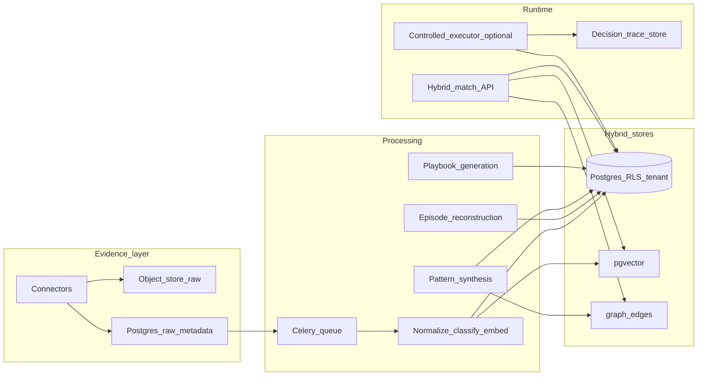

# ContextEdge: MVP review and production evolution plan

## A. Current MVP summary

**Product shape:** A **playbook-centric** platform with pipelines for **ingestion → normalized evidence → (LLM) episode reconstruction → patterns → playbook versions → approval → runtime matching**. Described in-app as “Operational Memory and Living Playbook Platform” (`[backend/src/contextedge/main.py](backend/src/contextedge/main.py)`).

**Backend (modular monolith):** FastAPI app with Prometheus metrics, CORS, **tenant JWT / service-token** context (`[backend/src/contextedge/main.py](backend/src/contextedge/main.py)`, `[backend/src/contextedge/deps.py](backend/src/contextedge/deps.py)`, `[backend/src/contextedge/middleware/request_context.py](backend/src/contextedge/middleware/request_context.py)`), and routers under `/api/v1` for **auth, tenants, workspaces, domains, users, audit, sources, sync, evidence, threads, episodes, patterns, playbooks, runtime, evaluations, policies, drift** (`[backend/src/contextedge/api/v1/__init__.py](backend/src/contextedge/api/v1/__init__.py)`).

**Data stores:**

- **PostgreSQL** with **pgvector** on `evidence_items.embedding` (`[backend/src/contextedge/models/evidence.py](backend/src/contextedge/models/evidence.py)`); migrations under `[backend/alembic/versions/](backend/alembic/versions/)`.
- **Redis:** app lifespan client (`[backend/src/contextedge/main.py](backend/src/contextedge/main.py)`); **Celery** broker/result backends (`[backend/src/contextedge/config.py](backend/src/contextedge/config.py)`); **ephemeral** runtime match explain payload (`runtime:match:{match_id}`) in `[backend/src/contextedge/api/v1/runtime.py](backend/src/contextedge/api/v1/runtime.py)`.
- **Object storage:** **MinIO settings exist** (`[backend/src/contextedge/config.py](backend/src/contextedge/config.py)`); `RawEvidenceObject.object_storage_key` and `AttachmentArtifact.object_storage_key` exist in the model (`[backend/src/contextedge/models/evidence.py](backend/src/contextedge/models/evidence.py)`), but **ingestion persistence shown** writes **JSONB payloads** to `raw_evidence_objects` without MinIO usage in `[backend/src/contextedge/services/ingestion_persistence.py](backend/src/contextedge/services/ingestion_persistence.py)`. Treat **blob offload as partial / not proven in code path**.

**Graph:** **No Neo4j.** A **relational adjacency** table `graph_edges` (`[backend/src/contextedge/models/pattern.py](backend/src/contextedge/models/pattern.py)`) with helpers in `[backend/src/contextedge/graph/builder.py](backend/src/contextedge/graph/builder.py)` and read APIs in `[backend/src/contextedge/graph/queries.py](backend/src/contextedge/graph/queries.py)` (including **virtual nodes** from pattern JSON fields).

**Workers / jobs (Celery):** `[backend/src/contextedge/workers/extraction_tasks.py](backend/src/contextedge/workers/extraction_tasks.py)` — normalize raw → `EvidenceItem`, relevance classification, embedding, episode reconstruction (`_reconstruct`). `[backend/src/contextedge/workers/pattern_tasks.py](backend/src/contextedge/workers/pattern_tasks.py)` — batch pattern clustering, async playbook generation (uses **NegativeKnowledgeItem**). `[backend/src/contextedge/workers/evaluation_tasks.py](backend/src/contextedge/workers/evaluation_tasks.py)` — evaluation runs, drift detection. Sync/backfill orchestration in `[backend/src/contextedge/services/sync_worker_service.py](backend/src/contextedge/services/sync_worker_service.py)` (connectors, checkpoints, enqueue normalize).

**Retrieval strategy (runtime):** **Hybrid ranker** `[backend/src/contextedge/search/hybrid_ranker.py](backend/src/contextedge/search/hybrid_ranker.py)`: playbook **FTS** (`[backend/src/contextedge/search/pg_fts.py](backend/src/contextedge/search/pg_fts.py)`), **semantic** match against **evidence linked to the published playbook version** (`[backend/src/contextedge/search/vector_search.py](backend/src/contextedge/search/vector_search.py)`), weak **graph** signal (count of `graph_edges` touching `playbook`), fixed **“quality”** placeholder, freshness/recency from playbook validation/expiry. **Risk tier cap** by role / service token (`[backend/src/contextedge/search/risk_policy.py](backend/src/contextedge/search/risk_policy.py)`, `[backend/src/contextedge/api/v1/runtime.py](backend/src/contextedge/api/v1/runtime.py)`).

**Agent orchestration:** **No separate agent executor** with tools. “Runtime” is **POST `/runtime/match`**, **GET `/runtime/explain/{match_id}`**, **GET `/runtime/playbooks/{stable_key}`**, **POST `/runtime/feedback`** (`[backend/src/contextedge/api/v1/runtime.py](backend/src/contextedge/api/v1/runtime.py)`). Consumers are expected to **execute approved playbook content** out-of-band.

**Playbook handling:** `Playbook` + versioned `PlaybookVersion` (JSON: triggers, branching, steps, evidence_refs, `playbook_confidence`, `execution_confidence_guidance`) (`[backend/src/contextedge/models/playbook.py](backend/src/contextedge/models/playbook.py)`); **lifecycle state machine** and `PlaybookApproval` rows in `[backend/src/contextedge/services/playbook_service.py](backend/src/contextedge/services/playbook_service.py)`; HTTP CRUD/transitions in `[backend/src/contextedge/api/v1/playbooks.py](backend/src/contextedge/api/v1/playbooks.py)`. **AI generation** from patterns (HTTP and Celery) — Celery path **loads negative knowledge**; HTTP `/playbooks/generate` currently passes **empty** negative list (demo gap).

**Memory handling today:**

- **Long-term (implicit):** evidence, episodes, patterns, playbooks, policies, graph edges, optional identities/correlations.
- **Short-term:** **Redis-only** match explain cache (TTL 1h), not a durable case session store.
- **Reasoning:** **Episode steps** capture some diagnostic narrative; **no first-class decision trace** (tool, branch rationale, observation linkage) persisted for runtime agents.

**Confidence / fallback:** Hybrid ranker sets `**confidence = total` weighted score** (`[backend/src/contextedge/search/hybrid_ranker.py](backend/src/contextedge/search/hybrid_ranker.py)`) — **not** separated extraction vs playbook vs execution confidence. Runtime returns `**fallback_guidance`** if no results or top confidence **< 0.3** (`[backend/src/contextedge/api/v1/runtime.py](backend/src/contextedge/api/v1/runtime.py)`).

**Classification (quality):**


| Area                 | Assessment                                                                                                                                                                                                                                                                                                                                                                                                                                                                                                      |
| -------------------- | --------------------------------------------------------------------------------------------------------------------------------------------------------------------------------------------------------------------------------------------------------------------------------------------------------------------------------------------------------------------------------------------------------------------------------------------------------------------------------------------------------------- |
| Implemented well     | Tenant-scoped models; playbook lifecycle + approvals; hybrid retrieval skeleton; drift job + feedback hooks; sync checkpoints; policy types on tenant; audit middleware pattern                                                                                                                                                                                                                                                                                                                                 |
| Implemented but weak | Graph used as **edge count** + virtual subgraph; evidence **list** API ignores `query`; correlation **service** without clear ingestion wiring; MinIO **not integrated** in shown ingestion path; confidence conflation                                                                                                                                                                                                                                                                                         |
| Partial              | Access policy FK on evidence; workspace on user model — **enforcement depth** varies; contradiction / negative knowledge **tables** vs **detectors**                                                                                                                                                                                                                                                                                                                                                            |
| Missing              | Durable **short-term** case memory; **decision trace** store; **state vs event** clocks; retrieval-time **ABAC** for evidence vectors; **execution** audit of tool/actions; hot/warm/cold tiering                                                                                                                                                                                                                                                                                                               |
| Risky / brittle      | Default `**jwt_secret_key`** (`[backend/src/contextedge/config.py](backend/src/contextedge/config.py)`); **demo-disabled** role checks on pattern discover / playbook generate (`[backend/src/contextedge/api/v1/patterns.py](backend/src/contextedge/api/v1/patterns.py)`, `[backend/src/contextedge/api/v1/playbooks.py](backend/src/contextedge/api/v1/playbooks.py)`); synchronous `_reconstruct` in HTTP path (`[backend/src/contextedge/api/v1/episodes.py](backend/src/contextedge/api/v1/episodes.py)`) |


---

## B. What is good and should be kept

- **Playbook as first-class artifact** with **versioning**, **published_at** semantics, **evidence links**, and **explicit lifecycle** (`[backend/src/contextedge/models/playbook.py](backend/src/contextedge/models/playbook.py)`, `[backend/src/contextedge/services/playbook_service.py](backend/src/contextedge/services/playbook_service.py)`).
- **Hybrid retrieval** composition (keyword + vector + graph hint + freshness) — right direction for enterprise precedent matching (`[backend/src/contextedge/search/hybrid_ranker.py](backend/src/contextedge/search/hybrid_ranker.py)`).
- **Postgres adjacency graph** (`graph_edges`) — avoids Neo4j ops tax for MVP+; can remain **optional acceleration** later.
- **Sync control plane** concepts: `Source`, `SourceObject`, `SyncCheckpoint`, `SyncRun`, incremental vs backfill flags (`[backend/src/contextedge/models/source.py](backend/src/contextedge/models/source.py)`, `[backend/src/contextedge/services/sync_worker_service.py](backend/src/contextedge/services/sync_worker_service.py)`).
- **Governance hooks:** `TenantPolicy` types, evidence `access_policy_id`, playbook risk tier + automation_mode, role-based runtime caps (`[backend/src/contextedge/models/policy.py](backend/src/contextedge/models/policy.py)`, `[backend/src/contextedge/api/v1/runtime.py](backend/src/contextedge/api/v1/runtime.py)`).
- **Evaluation + drift** scaffolding (`[backend/src/contextedge/services/evaluation_service.py](backend/src/contextedge/services/evaluation_service.py)`, `[backend/src/contextedge/services/drift_service.py](backend/src/contextedge/services/drift_service.py)`, `[backend/src/contextedge/workers/evaluation_tasks.py](backend/src/contextedge/workers/evaluation_tasks.py)`).

---

## C. Weaknesses and risks

1. **Security / production config:** Weak JWT secret default; service token JSON in settings — must be **secrets management** in prod.
2. **Authorization gaps:** Demo-loosened roles on high-impact AI endpoints; evidence listing accepts `query` but **does not search** (`[backend/src/contextedge/api/v1/evidence.py](backend/src/contextedge/api/v1/evidence.py)`).
3. **Confidence semantics:** Single scalar conflates **retrieval score** with **trust**; playbook version has separate `playbook_confidence` but ranker ignores it for gating.
4. **No durable execution memory:** Cannot audit **what an agent checked, called, saw, and why** at resolution time — only pre-authored playbook JSON and episodic extraction.
5. **Correlation / identity:** `CorrelationEdge` + `correlation_service` exist but **no end-to-end** “ticket + Slack + mail same case” pipeline surfaced in APIs reviewed.
6. **Contradiction pipeline:** `Contradiction` model exists (`[backend/src/contextedge/models/pattern.py](backend/src/contextedge/models/pattern.py)`); **no automated KB/SOP contradiction job** found in drift (drift is playbook-centric).
7. **Storage strategy:** Large raw payloads in **Postgres JSONB** without mandatory object-store offload; attachment path unclear from ingestion snippet.
8. **Tight coupling for scale:** HTTP reconstruction calls LLM **inline** (`[backend/src/contextedge/api/v1/episodes.py](backend/src/contextedge/api/v1/episodes.py)`) — latency, timeout, and partial failure risks.

---

## D. Comparison with improved context-graph architecture


| Target idea                            | Current codebase                                                                                                                                                                                                                                          |
| -------------------------------------- | --------------------------------------------------------------------------------------------------------------------------------------------------------------------------------------------------------------------------------------------------------- |
| **State clock vs event clock**         | **Partial:** `EvidenceItem` / playbook fields imply “current truth” (relevance, lifecycle, expiry); **event clock** (immutable “what happened when” sequence) is **not** modeled as an append-only event log — only `audit_logs`, `sync_runs`, approvals. |
| **Short / long / reasoning memory**    | **Long:** relational. **Short:** Redis cache only. **Reasoning:** episode steps only; **no** structured trace of runtime decisions/tools.                                                                                                                 |
| **Decision traces first-class**        | **Missing** as persisted entities; runtime explain is **retrieval** breakdown, not **execution** graph.                                                                                                                                                   |
| **Playbook-centric output**            | **Strong** — keep as north star.                                                                                                                                                                                                                          |
| **Contradiction / negative knowledge** | **Tables + partial use** (Celery generator pulls negative knowledge; HTTP generate does not). **Detection** not systematic.                                                                                                                               |
| **Confidence / freshness**             | **Freshness** in ranker + drift heuristics; **frequencies / success rates** not computed from closed-loop outcomes.                                                                                                                                       |
| **Practical hybrid persistence**       | **Aligned** (Postgres + vectors + optional graph table). **Object store** underutilized in code shown.                                                                                                                                                    |


---

## E. Updated target architecture (incremental, no rewrite)




**Stay as-is:** FastAPI monolith layout; core tables (`sources`, `evidence_items`, `episodes`, `patterns`, `playbooks`, `playbook_versions`); Celery worker pattern; hybrid ranker structure; `graph_edges` as lightweight graph.

**Modularize next (packages / boundaries):** `ingestion/`, `memory/` (short/long/reasoning), `retrieval/` (already under `search/`), `governance/` (policies + approvals), `runtime/` (match + future executor), `observability/` (audit + metrics + trace export).

**Extract later (only if needed):** High-volume **ingestion workers** or **executor** service; read replicas for search; dedicated **event bus** (Kafka) if replay/compliance demands exceed Postgres.

**Defer:** Neo4j; full microservices split; generic “chat memory” product.

---

## F. Updated memory model

- **Short-term memory (durable):** `case_sessions` / `resolution_sessions`: tenant_id, external_case_ids map, active_symptoms/entities, pinned playbook candidates, **policy snapshot**, TTL / closed_at, **links to evidence read set** (not full text duplication).
- **Long-term memory:** Existing **EvidenceItem**, **Episode**, **Pattern**, **PlaybookVersion**; add **entity** tables or normalize `canonical_entity_refs` into rows when resolution volume justifies it.
- **Reasoning memory:** `decision_traces` (tree/DAG JSON or normalized steps): step_type ∈ {observe, retrieve, branch, tool_call, human_input, playbook_step}, inputs/outputs hashes, **pointers** to evidence/playbook version/step id, **branch_reason** (structured + text), **confidence** fields (model cal + policy cap).
- **State clock:** Materialized “current facts” table or view: entity_id, attribute, value, **valid_from**, **valid_to**, **source_evidence_ids**, **confidence**, **superseded_by**.
- **Event clock:** `domain_events` append-only: ingestion, classification, episode_created, pattern_updated, playbook_published, playbook_executed_step, contradiction_detected, analyst_override — **for audit and replay**.

---

## G. Data model / schema changes (proposed)

**Evidence / raw**

- `raw_evidence_objects`: enforce **content_addressable** `object_storage_key` for large payloads; keep **metadata + hash** in Postgres; optional **encryption_key_id**.
- `evidence_items`: add **source_event_time**, **ingestion_batch_id**; **retention_until**; separate `**extraction_confidence`** vs `**classification_confidence`**; JSON `**provenance_chain**` (connector, cursor, parent_external_id).

**Case correlation**

- `case_links`: tenant_id, **canonical_case_id**, system, external_id, confidence, first_seen, last_seen (many external IDs → one case).
- Use / extend `correlation_edges` with **typed** correlation (same_ticket_thread, same_device, same_user) + **evidence of link**.

**Playbooks**

- Keep `playbook_versions` JSON but add `**step_id` stable keys** inside JSON for trace linkage.
- `playbook_step_safety`: optional side table or JSON per step: **safety_class** (read_only, config_change, destructive), **required_approval**, **rollback_ref**.

**Approvals / review**

- Already have `playbook_approvals`; add **separation of duties** flags (reviewer ≠ approver) via policy config; **version-specific** approval requirements.

**Evaluation**

- Extend `evaluation_runs.results` schema to include **per-case traces** (matched evidence ids, scores, policy decisions) — or child table `evaluation_case_results`.

**Audit**

- Keep `audit_logs`; add **correlation_id** / **trace_id**; **hash chain** optional for tamper-evidence (P2).

**Memory / trace**

- New: `resolution_sessions`, `decision_traces`, `domain_events` (see F).

**Graph**

- Keep `graph_edges`; add node types: `kb_article`, `sop`, `tool`, `observation`, `decision_step`; edge types: `contradicts`, `supersedes`, `supported_by`, `invalidated_by`.

**Tenant / access**

- RLS policies on **evidence_items**, **episodes**, **playbooks** keyed by tenant_id; optional **workspace_id** enforcement join table; `**access_policy_id`** evaluation at **read** time for embeddings/FTS.

**Provenance / temporal / confidence / negative / tenant fields:** fold into above (valid_from/to on state rows; contradiction links; negative knowledge already has `NegativeKnowledgeItem` — add **frequency**, **last_confirmed_at**, **expiry**).

---

## H. Module / service changes


| Change                    | Likely files / new modules                                                                                                                                                                           |
| ------------------------- | ---------------------------------------------------------------------------------------------------------------------------------------------------------------------------------------------------- |
| Durable sessions + traces | New `backend/src/contextedge/models/session.py`, `services/session_service.py`, `api/v1/runtime_sessions.py` (or extend `[runtime.py](backend/src/contextedge/api/v1/runtime.py)`)                   |
| Event clock               | New `services/event_log.py`, `models/domain_event.py`; emit from `[playbook_service.py](backend/src/contextedge/services/playbook_service.py)`, sync, ingestion                                      |
| Fix evidence search       | `[backend/src/contextedge/api/v1/evidence.py](backend/src/contextedge/api/v1/evidence.py)` + reuse FTS/vector helpers                                                                                |
| Access-aware retrieval    | `[backend/src/contextedge/search/vector_search.py](backend/src/contextedge/search/vector_search.py)`, `[hybrid_ranker.py](backend/src/contextedge/search/hybrid_ranker.py)` — join policy resolution |
| Correlation ingestion     | Connectors + new worker task calling `[correlation_service.py](backend/src/contextedge/services/correlation_service.py)`                                                                             |
| Contradiction detection   | New `services/contradiction_service.py`, Celery beat task; compare **KB evidence_type** vs **pattern/playbook** claims                                                                               |
| Object storage            | New `services/object_store.py` (MinIO SDK), wire `[ingestion_persistence.py](backend/src/contextedge/services/ingestion_persistence.py)` + attachments                                               |
| Reinstate RBAC            | `[patterns.py](backend/src/contextedge/api/v1/patterns.py)`, `[playbooks.py](backend/src/contextedge/api/v1/playbooks.py)`                                                                           |
| Async reconstruction      | `[episodes.py](backend/src/contextedge/api/v1/episodes.py)` — enqueue Celery instead of inline `_reconstruct`                                                                                        |


**API surface additions (conceptual):** `POST /runtime/sessions`, `POST /runtime/sessions/{id}/trace_events`, `GET /runtime/sessions/{id}/trace`; `GET /evidence/search` real query; `POST /cases/link`; `POST /contradictions/scan`.

---

## I. Runtime flow changes (step-by-step)

1. **New ticket ingestion:** Connector event → **blob** to object store (optional) + `raw_evidence_objects` row → Celery normalize → `EvidenceItem` + embedding + relevance → **domain_event** `evidence_ingested` → enqueue **correlation** (same case keys).
2. **Slack/Teams/mailbox enrichment:** Thread model (`[evidence.py](backend/src/contextedge/models/evidence.py)`) hydrated; link messages to `thread_id`; correlation merges into **case_links**.
3. **Episode reconstruction:** Evidence cluster (manual or correlated) → Celery `reconstruct` → `Episode` + `EpisodeStep` + extraction confidence → reviewer queue.
4. **Issue pattern creation:** Approved episodes → pattern extract (`[patterns.py](backend/src/contextedge/api/v1/patterns.py)`) or batch cluster (`[pattern_tasks.py](backend/src/contextedge/workers/pattern_tasks.py)`) → `PatternEvidenceLink` → `build_episode_graph` (`[graph/builder.py](backend/src/contextedge/graph/builder.py)`).
5. **Contradiction detection:** Scheduled job: for each **KB/SOP** evidence linked to domain, **retrieve** candidate patterns/playbooks → LLM/规则 **contradiction** score → `Contradiction` row + **graph** `contradicts` edge → alert + drift feed.
6. **Playbook generation:** Pattern + episodes + **NegativeKnowledgeItem** (HTTP path aligned with Celery) → `Playbook` candidate + version → lifecycle `candidate`.
7. **Playbook review/approval:** `transition_playbook` (`[playbook_service.py](backend/src/contextedge/services/playbook_service.py)`) → publish version → audit + domain_event.
8. **Runtime ticket resolution:** Open **resolution_session** → `POST /runtime/match` (policy-scoped) → optional **executor** walks playbook steps; each step appends **decision_trace** (inputs, tool results, branch) → low confidence triggers **human gate** or broadened retrieval.
9. **Low-confidence fallback:** Separate **retrieval_confidence** from **policy_allow**; return structured actions: `expand_query`, `request_fields`, `escalate`, `human_review_queue` (not only string guidance).
10. **Reasoning trace persistence:** Append-only trace rows tied to session + playbook_version + step_id.
11. **Analyst correction:** UI/API writes **override** on episode step or playbook version → **domain_event** `analyst_correction` → adjusts pattern confidence / negative knowledge / contradiction status.
12. **Drift/expiry refresh:** Extend `[drift_service.py](backend/src/contextedge/services/drift_service.py)` with **KB freshness**, **pattern staleness**, **contradiction open count**; optional auto `under_review` transition with policy guardrails.

---

## J. Governance, safety, and audit improvements

- **Secrets:** Fail fast if `jwt_secret_key` is default in non-dev; rotate keys; document KMS.
- **RBAC:** Restore `require_role` on AI endpoints; add **separation** via `TenantPolicy` type `approval`.
- **Action safety classes:** Encode in playbook JSON schema + validate on publish; runtime executor refuses **destructive** without elevation + approval token.
- **Audit:** Ensure **every** lifecycle transition and policy change calls `[middleware/audit](backend/src/contextedge/middleware/audit.py)` (verify coverage for sync, ingestion, runtime session).
- **Retrieval ABAC:** Resolve `access_policy_id` before returning evidence chunks to ranker or UI.

---

## K. Evaluation and replay strategy

**Today:** `[evaluation_service.py](backend/src/contextedge/services/evaluation_service.py)` replays **rank_playbooks** only — good for **retrieval regression**.

**Extend:**

- **Golden sets** with expected **playbook + minimum evidence link coverage**.
- **Replay harness** that feeds historical **case_sessions** and compares **decision_trace** shape (step order, branch taken) — requires trace implementation.
- **Offline** mode: fixture DB + frozen embeddings flag (P2).

---

## L. Priority-ranked implementation plan

**P0 — Must-fix (safety/stability)**

- **Why:** Prevents unauthorized AI mutation and credential compromise.
- **Items:** Remove default JWT secret in prod; **re-enable** role checks on pattern discover / playbook generate; move long LLM reconstruction off request thread to Celery; fix **evidence `query` param** or remove it from API contract.
- **Type:** config + API + worker wiring.
- **Risk:** Low; **compat:** API behavior change for previously open endpoints.

**P1 — Important architecture**

- **Decision traces + durable sessions;** domain event log; **object storage** for raw/attachments; **access-aware vector retrieval**; **case_links + correlation** wired from connectors; **contradiction** batch job; **separate confidence dimensions** in ranker response.
- **Type:** schema + new modules + Celery tasks.
- **Risk:** Medium; **migrations** additive; feature-flag executor.

**P2 — Scale/quality**

- **State clock** materialization; **frequentist** confidence from feedback + outcomes; **hot/warm/cold** (archive old raw to object store only); read replicas; richer graph queries (2-hop) without Neo4j.

**P3 — Future**

- Neo4j **only if** multi-hop graph analytics outpaces Postgres; separate executor service; ML-based correlation.

*(Each P1 item should name affected files as in section H.)*

---

## M. Migration strategy

1. **Additive migrations** for new tables (`domain_events`, `resolution_sessions`, `decision_traces`, `case_links`).
2. **Dual-write** domain events from critical paths before enforcing consumers.
3. **Backfill** object_storage_key for large `raw_payload` in batch job.
4. **Gradual** ranker change: return **both** `retrieval_score` and `calibrated_confidence` (deprecated field for one release).
5. **Executor** behind feature flag; default remains “match + fetch playbook” for existing clients.

---

## N. Recommended next 3 implementation steps

1. **P0 hardening:** Production-safe auth settings, restore RBAC on AI routes, enqueue episode reconstruction from `[episodes.py](backend/src/contextedge/api/v1/episodes.py)`, and fix or implement evidence search on `query` in `[evidence.py](backend/src/contextedge/api/v1/evidence.py)`.
2. **P1a decision backbone:** Add `resolution_sessions` + `decision_traces` + minimal API to append/query traces; extend `/runtime/match` to create session id and persist **ranking breakdown** to Postgres (Redis becomes cache only).
3. **P1b ingestion integrity:** Implement MinIO (or S3-compatible) client and wire `[ingestion_persistence.py](backend/src/contextedge/services/ingestion_persistence.py)` + attachment pipeline; add correlation worker invoking `[correlation_service.py](backend/src/contextedge/services/correlation_service.py)`.

---

## O. Additional findings from deep module review

### O.1 AI modules assessment

**LLM provider** (`[backend/src/contextedge/ai/provider.py](backend/src/contextedge/ai/provider.py)`):

- Uses **LiteLLM** for multi-provider abstraction (OpenAI, Google, Vertex AI, Anthropic) -- good choice for provider portability.
- **DEBUG print statements** leak API key prefixes and credential paths to stdout (lines 16, 22, 27). **P0 fix:** remove or gate behind `app_debug`.
- `llm_complete_json` uses `json_object` response format and `json.loads` directly -- **no fallback** for malformed LLM output. A `JSONDecodeError` will propagate as an unhandled 500. **P0 fix:** wrap in try/except with structured error.
- **No token counting or cost tracking.** For production, add token usage logging from the LiteLLM response.
- `litellm.num_retries = 5` is aggressive -- **30+ seconds** of retries on 503 can stall Celery workers. Consider reducing to 3 with exponential backoff config.

**Episode extractor** (`[backend/src/contextedge/ai/extractors/episode_extractor.py](backend/src/contextedge/ai/extractors/episode_extractor.py)`):

- Evidence body truncated to **2000 chars** per item. For long tickets/logs, this discards diagnostic detail. Consider 4000 or dynamic budget based on item count.
- Prompt is well-structured with explicit step types and failure semantics. The `failed_flag`/`successful_flag` post-processing is correct.
- **No provenance pass-through:** the prompt receives evidence IDs but the LLM output does not map steps back to specific evidence items. `evidence_refs` on `EpisodeStep` is populated from LLM output if present, but the prompt does not instruct the LLM to return `evidence_refs`. **P1 fix:** add instruction to map steps to evidence IDs.

**Pattern extractor** (`[backend/src/contextedge/ai/extractors/pattern_extractor.py](backend/src/contextedge/ai/extractors/pattern_extractor.py)`):

- Solid prompt structure extracting trigger conditions, entities, errors, root causes, resolution steps, evidence summary.
- Limits to **5 steps per episode** in the prompt -- acceptable for synthesis.

**Playbook generator** (`[backend/src/contextedge/ai/generators/playbook_generator.py](backend/src/contextedge/ai/generators/playbook_generator.py)`):

- Generates branching logic with `decision_points` (after_step, condition, goto). This is the closest thing to executable playbook structure.
- **No step_id generation** -- steps are indexed by `order` only. This makes trace linkage fragile. **P1 fix:** add `step_id` (stable UUID or slug) to the prompt schema.
- **No safety_class per step.** The prompt requests `risk_tier` at the playbook level but does not classify individual steps as read_only/config_change/destructive.

**Relevance classifier** (`[backend/src/contextedge/ai/classifiers/relevance.py](backend/src/contextedge/ai/classifiers/relevance.py)`):

- Clean 3-class classifier (operational, possibly_relevant, not_relevant). Lightweight gate before expensive extraction -- good design.
- Body truncated to **2000 chars**.

**Embeddings** (`[backend/src/contextedge/ai/embeddings.py](backend/src/contextedge/ai/embeddings.py)`):

- 3072-dimensional vectors (text-embedding-3-large or Gemini). **Batch embedding** support exists -- good for backfill.
- Empty text returns zero vector instead of null -- this means empty evidence will still appear in vector search with poor distances. Consider skipping embedding for empty items.

### O.2 FTS implementation

**pg_fts.py** (`[backend/src/contextedge/search/pg_fts.py](backend/src/contextedge/search/pg_fts.py)`):

- Uses `func.to_tsvector('english', ...)` computed on every query -- **no stored tsvector column or GIN index**. This means FTS runs a sequential scan or at best a filter on every search.
- **P1 fix:** Add a generated `tsvector` column on `evidence_items` and `playbooks` with a GIN index. This is the single biggest retrieval performance win.
- Evidence FTS (`search_evidence_fts`) exists but is **not called** from the evidence API -- confirms the `query` param bug from the original plan.

### O.3 Infrastructure (docker-compose)

**docker-compose.dev.yml** (`[docker-compose.dev.yml](docker-compose.dev.yml)`):

- Services: Postgres, Redis, MinIO, backend (uvicorn), celery-worker (6 queues: default, sync, hydration, extraction, pattern, evaluation), celery-beat, frontend (Next.js).
- MinIO is **provisioned** and `MINIO_ENDPOINT` is passed -- but no code creates buckets or uploads. **P1b:** auto-create bucket on startup.
- No **health check** defined for backend or celery-worker in compose. Celery worker health is not monitored.

**Celery config** (`[backend/src/contextedge/workers/celery_app.py](backend/src/contextedge/workers/celery_app.py)`):

- `task_acks_late=True` + `worker_prefetch_multiplier=1` -- correct for reliability (at-least-once with no prefetch).
- **Only one beat schedule:** `detect_drift` every 6h. No scheduled correlation, contradiction scan, retention, or stale-pattern sweep. **P1e:** add contradiction scan to beat.
- Queue routing is clean: sync, hydration, extraction, pattern, evaluation.

### O.4 Frontend auth assessment

**Token handling** (`[frontend/src/lib/auth.ts](frontend/src/lib/auth.ts)`):

- JWT stored in **localStorage**. This is **XSS-vulnerable** -- any injected script can steal the token.
- **P1 risk (not P0):** For enterprise production, migrate to **httpOnly cookie** + CSRF protection. However, this is a backend+frontend change and can be deferred if the app is internal-only initially. Flag as P1 security.
- Token expiry is checked client-side by parsing the JWT payload. No refresh token flow implemented in frontend (backend has `jwt_refresh_token_expire_days` in config but no refresh endpoint found).

### O.5 Audit middleware assessment

**Request audit** (`[backend/src/contextedge/middleware/request_audit.py](backend/src/contextedge/middleware/request_audit.py)`):

- Uses a **synchronous engine** (`create_engine`) with raw SQL to insert into `audit_logs` -- separate from the async session. This means audit writes happen outside the request transaction.
- The sync engine is created lazily and **never disposed** -- no connection pool cleanup.
- **No correlation_id or trace_id** on audit rows -- harder to link to specific sessions later.

**Explicit audit** (`[backend/src/contextedge/middleware/audit.py](backend/src/contextedge/middleware/audit.py)`):

- Clean async helper that writes via the request's `AsyncSession`. Used in playbook transitions, episode approve, evidence policy update. **Not** used in sync/ingestion worker paths.

### O.6 Testing gaps

Existing tests (6 files in `[backend/tests/](backend/tests/)`):

- `test_playbook_service.py` -- lifecycle transitions, version creation, semantic versioning. **Good coverage** of core governance logic.
- `test_sync_worker_service.py` -- normalization queue, handoff, dedup. **Good coverage** of sync internals.
- `test_health.py`, `test_cors.py`, `test_tenant_schemas.py` -- basic smoke tests.
- `conftest.py` -- only adds `src/` to `sys.path`, no shared fixtures for DB or HTTP client.

**Missing test coverage:**

- No API-level tests (no `TestClient` / `httpx.AsyncClient` fixtures).
- No tests for RBAC enforcement (who can call what).
- No tests for the AI extractors/generators (even with mocked LLM).
- No tests for hybrid_ranker, vector_search, pg_fts.
- No tests for episode reconstruction, pattern discovery.
- No tests for drift service, evaluation service.
- No integration tests with real DB (Postgres fixture).

### O.7 Notification service

(`[backend/src/contextedge/services/notification_service.py](backend/src/contextedge/services/notification_service.py)`):

- **Stub-only.** All three channels (in_app, email, webhook) only log. No DB persistence for in-app, no SMTP client, no webhook HTTP call.
- The `NotificationType` enum includes `CONTRADICTION_ALERT` and `EVALUATION_REGRESSION` -- confirms these are intended features.
- **Not wired** from any service or worker currently.

### O.8 Retention service

(`[backend/src/contextedge/services/retention_service.py](backend/src/contextedge/services/retention_service.py)`):

- Archives evidence by setting `relevance_state = "archived"`. Does **not** delete raw objects or object storage blobs.
- Has `apply_legal_hold` using `sensitivity_label = "legal_hold"` -- but `apply_retention_policy` does **not check** for legal hold before archiving.
- **Bug:** retention query does not filter out `sensitivity_label = "legal_hold"` items. **P0 fix.**
- No Celery beat task to run retention -- purely callable.

### O.9 Connector architecture

(`[backend/src/contextedge/connectors/base.py](backend/src/contextedge/connectors/base.py)`):

- Clean ABC with `validate_credentials`, `discover_objects`, `backfill`, `fetch_changes`, `hydrate_thread`, `rate_limit_config`.
- `IngestionEvent` dataclass has `external_id`, `source_type`, `object_type`, `content`, `thread_id`, `timestamp`, `metadata` -- good provenance shape.
- Only ServiceNow connector implemented (`[connectors/servicenow/connector.py](backend/src/contextedge/connectors/servicenow/connector.py)`).

---

## P. Refined P0 implementation spec

### P0a: Security hardening

**Files:** `[config.py](backend/src/contextedge/config.py)`, `[provider.py](backend/src/contextedge/ai/provider.py)`, `[patterns.py](backend/src/contextedge/api/v1/patterns.py)`, `[playbooks.py](backend/src/contextedge/api/v1/playbooks.py)`

1. In `config.py`, add a `@model_validator` that raises `ValueError("JWT_SECRET_KEY must be changed from default in non-development environments")` when `app_env != "development"` and `jwt_secret_key == "change-me-in-production"`.
2. In `provider.py`, replace `print(f"DEBUG: ...")` lines 16, 22, 27 with `logger.debug(...)` gated on `settings.app_debug`.
3. In `provider.py` `llm_complete_json`, wrap `json.loads(result)` in try/except `json.JSONDecodeError` and return a structured error dict or raise a domain exception.
4. In `patterns.py` line 68, uncomment `user.require_role("domain_admin")`.
5. In `playbooks.py` line 190, uncomment `user.require_role("knowledge_manager")`.
6. In `playbooks.py` `/playbooks/generate`, load negative knowledge from `NegativeKnowledgeItem` (same as Celery path in `pattern_tasks.py` lines 114-123) instead of passing empty list.

### P0b: Async episode reconstruction

**Files:** `[episodes.py](backend/src/contextedge/api/v1/episodes.py)`

1. Replace inline `await _reconstruct(db, cluster_id, user.tenant_id)` with `from contextedge.workers.extraction_tasks import reconstruct_episode_task; reconstruct_episode_task.delay(cluster_id, str(user.tenant_id))`.
2. Remove `await db.commit()` after the now-async call.
3. Return `{"status": "reconstruction_queued", "task_id": task.id, "evidence_count": len(evidence_ids)}`.

### P0c: Evidence search

**Files:** `[evidence.py](backend/src/contextedge/api/v1/evidence.py)`

1. When `query` param is provided, call `search_evidence_fts(db, user.tenant_id, query, limit=limit)` from `[pg_fts.py](backend/src/contextedge/search/pg_fts.py)`.
2. Extract evidence items from the FTS result tuples and return them (same `EvidenceItemResponse` schema).
3. When `query` is not provided, fall back to the current filter-only path.

### P0d: Retention legal hold bug

**Files:** `[retention_service.py](backend/src/contextedge/services/retention_service.py)`

1. Add `.where(EvidenceItem.sensitivity_label != "legal_hold")` (or `is_(None)` + not "legal_hold") to the retention query on line 31.

### P0e: Test additions

**New files:** `backend/tests/test_rbac.py`, `backend/tests/test_evidence_search.py`, `backend/tests/test_playbook_generate.py`

1. `test_rbac.py`: Mock `CurrentUser` without required roles; assert patterns.discover and playbooks.generate return 403.
2. `test_evidence_search.py`: Mock FTS results; assert evidence list with `query` param calls `search_evidence_fts` and returns results.
3. `test_playbook_generate.py`: Mock `llm_complete_json`; assert `/playbooks/generate` loads negative knowledge items and passes them to the generator.

---

## Q. Refined P1 implementation sequence with dependencies

```
P1a: decision traces/sessions (no deps)
P1b: object store (no deps)
P1c: correlation worker (depends on P0c evidence search for testing)
P1d: confidence separation (depends on P1a for session context)
P1e: contradiction detection (depends on P1c for case correlation)
P1f: access-aware retrieval (no deps, but test after P0c)
```

### P1a: Resolution sessions + decision traces

**Migration:** Add two tables:

```sql
-- resolution_sessions
CREATE TABLE resolution_sessions (
  id UUID PRIMARY KEY DEFAULT gen_random_uuid(),
  tenant_id UUID NOT NULL REFERENCES tenants(id),
  external_case_ids JSONB DEFAULT '[]',
  symptoms JSONB DEFAULT '[]',
  entities JSONB DEFAULT '[]',
  policy_snapshot JSONB DEFAULT '{}',
  status VARCHAR(30) DEFAULT 'active',
  created_at TIMESTAMPTZ DEFAULT NOW(),
  closed_at TIMESTAMPTZ,
  created_by UUID
);
CREATE INDEX ix_res_sessions_tenant ON resolution_sessions(tenant_id);
CREATE INDEX ix_res_sessions_status ON resolution_sessions(tenant_id, status);

-- decision_trace_events (append-only)
CREATE TABLE decision_trace_events (
  id UUID PRIMARY KEY DEFAULT gen_random_uuid(),
  session_id UUID NOT NULL REFERENCES resolution_sessions(id),
  tenant_id UUID NOT NULL,
  seq INT NOT NULL,
  event_type VARCHAR(50) NOT NULL, -- observe, retrieve, branch, tool_call, human_input, playbook_step
  playbook_version_id UUID,
  playbook_step_ref VARCHAR(100),
  inputs JSONB,
  outputs JSONB,
  branch_reason TEXT,
  confidence FLOAT,
  created_at TIMESTAMPTZ DEFAULT NOW()
);
CREATE INDEX ix_trace_session ON decision_trace_events(session_id);
```

**New files:** `models/session.py`, `services/session_service.py`, `api/v1/sessions.py`.
**Modify:** `api/v1/runtime.py` -- `POST /runtime/match` optionally creates or references a session; persist ranking breakdown as a `decision_trace_event` with `event_type = 'retrieve'`.

### P1b: Object store wiring

**New file:** `services/object_store.py` -- async MinIO client (using `miniopy-async` or sync `minio` in thread pool).

- `ensure_bucket()` called on app startup.
- `upload_raw(tenant_id, raw_id, payload_bytes) -> object_key`
- `download_raw(object_key) -> bytes`

**Modify:** `services/ingestion_persistence.py` -- if `len(json.dumps(payload)) > 32768`, serialize to object store, set `object_storage_key`, set `raw_payload = None` (or a stub `{"_offloaded": true}`).

### P1c: Correlation worker

**Migration:** Add `case_links` table.
**New file:** `workers/correlation_tasks.py` -- Celery task that, for each new `EvidenceItem`, checks for matching `external_id` patterns, `thread_id`, or entity overlap and writes `CorrelationEdge` rows + `case_links`.
**Add to Celery task chain:** after `normalize_evidence` completes, enqueue `correlate_evidence`.

### P1d: Confidence separation

**Modify:** `search/hybrid_ranker.py` -- `RankedPlaybook` gains `retrieval_score` (weighted combo), `playbook_confidence` (from `PlaybookVersion.playbook_confidence`), `execution_confidence_guidance` (from version).
**Modify:** Runtime match response schema to return all three.
**Deprecation:** Keep `confidence` field as alias for `retrieval_score` for one release.

### P1e: Contradiction detection

**New file:** `services/contradiction_service.py` -- compare KB-type evidence body against playbook version steps using LLM or semantic similarity.
**New Celery beat task:** `detect_contradictions` every 12h -- scan approved playbooks per domain, fetch linked KB evidence, score contradiction, write `Contradiction` rows and `graph_edges` with type `contradicts`.
**Wire notification:** call `send_notification(CONTRADICTION_ALERT, ...)` when contradiction found.

### P1f: Access-aware retrieval

**Modify:** `search/vector_search.py` -- add optional `allowed_policy_ids` or `viewer_user_id` param; join `evidence_items.access_policy_id` against `tenant_policies` to filter.
**Modify:** `search/hybrid_ranker.py` -- pass policy context from the authenticated user through to vector and FTS calls.

---

## R. FTS performance fix (P1 or P0+)

Add stored tsvector columns with GIN indexes. This is a **high-impact, low-risk** migration:

```sql
ALTER TABLE evidence_items ADD COLUMN search_tsvector tsvector
  GENERATED ALWAYS AS (
    to_tsvector('english', coalesce(title, '') || ' ' || coalesce(body_text, ''))
  ) STORED;
CREATE INDEX ix_evidence_items_search ON evidence_items USING GIN(search_tsvector);

ALTER TABLE playbooks ADD COLUMN search_tsvector tsvector
  GENERATED ALWAYS AS (
    to_tsvector('english', coalesce(title, '') || ' ' || coalesce(description, ''))
  ) STORED;
CREATE INDEX ix_playbooks_search ON playbooks USING GIN(search_tsvector);
```

Then update `pg_fts.py` to query against the stored column instead of computing `to_tsvector` on every row.

---

## S. Frontend security note

JWT in `localStorage` is XSS-vulnerable. For enterprise deployment:

- **Phase 1 (P1):** Migrate to `httpOnly` cookie set by backend on `/auth/login`. Backend sets `Set-Cookie: access_token=<jwt>; HttpOnly; Secure; SameSite=Strict`.
- **Phase 2:** Add CSRF token middleware.
- **Interim mitigation:** CSP headers restricting inline scripts; no user-generated HTML rendering.
- This requires coordinated backend + frontend changes and is not a P0 blocker for internal deployment.

