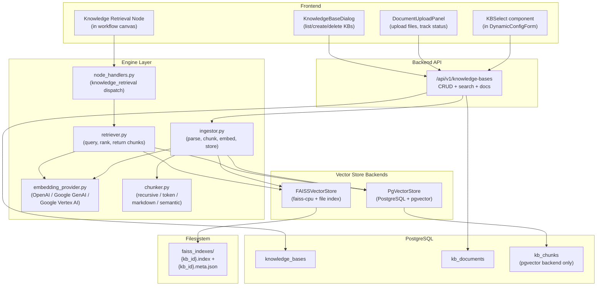
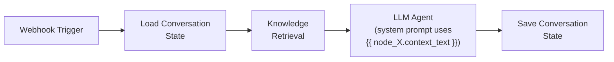

# RAG / Knowledge Base / Vector Store

## Architecture Overview



## Design Decisions

### Vector Store — pluggable backend

- **Abstract `VectorStore` base class** with methods: `add_embeddings()`, `search()`, `delete_by_document()`, `delete_by_kb()`. Each KB chooses its backend at creation time (stored in `knowledge_bases.vector_store` column).
- **pgvector** (default) — uses the existing PostgreSQL 16 instance, stores embeddings in `kb_chunks` table with HNSW index. Best for production, multi-tenant, and shared deployments.
- **FAISS** — `faiss-cpu` with file-persisted indexes (`{kb_id}.index` + `{kb_id}.meta.json` sidecar for chunk metadata). Best for local dev, single-tenant, or GPU-accelerated deployments. Indexes stored under a configurable `ORCHESTRATOR_FAISS_INDEX_DIR`.
- The retriever and ingestor are **backend-agnostic** — they call the `VectorStore` interface, never raw SQL or FAISS directly.

### Embedding Providers — three providers

- **OpenAI**: `text-embedding-3-small` (1536d), `text-embedding-3-large` (3072d). Uses existing `settings.openai_api_key`.
- **Google GenAI**: `text-embedding-004` (768d). Uses existing `settings.google_api_key` via the `google-genai` SDK already in requirements.
- **Google Vertex AI**: `gemini-embedding-001` (up to 3072d), `text-embedding-005` (768d), `text-multilingual-embedding-002` (768d). Uses `google-cloud-aiplatform` SDK with Application Default Credentials (ADC) or service account. Requires new settings: `ORCHESTRATOR_VERTEX_PROJECT`, `ORCHESTRATOR_VERTEX_LOCATION`.
- A **provider registry** maps `(provider, model) -> embedding_dimension` so the system knows the vector size at KB creation time and validates that all documents in a KB use the same dimension.

### Chunking Strategies — four options, selectable per KB

Each KB stores its `chunking_strategy` (enum column). The ingestor dispatches to the chosen strategy. All strategies share the `chunk_size` and `chunk_overlap` parameters.

- **`recursive`** (default) — recursive character splitting on a hierarchy of separators: `\n\n` -> `\n` -> `. ` -> ` ` -> character. Best general-purpose strategy for 80% of use cases.
- **`token`** — splits by token count using `tiktoken` (cl100k_base tokenizer). Ensures precise token budgets for LLMs. Useful when embedding model has a strict token limit.
- **`markdown`** — structure-aware splitting that respects heading boundaries (`#`, `##`, etc.), code fences, and list blocks. Chunks stay within a single section when possible. Ideal for documentation and structured content.
- **`semantic`** — uses the KB's embedding model to compute sentence-level embeddings, then splits where cosine similarity between consecutive sentences drops below a threshold. Produces the most coherent chunks but is more expensive (requires an embedding call during chunking). Adds a `semantic_threshold` parameter (default 0.5).

### Other decisions (unchanged)

- **Document parsing**: Plain text, Markdown, and PDF (`pymupdf`).
- **Ingestion**: Upload returns 202, Celery task processes in background.
- **Tenant isolation**: `tenant_id` on `knowledge_bases`; chunks/documents inherit via FK.

---

## 1. Database Layer

### New models in `backend/app/models/knowledge.py`

Three new tables:

**`knowledge_bases`**
- `id` UUID PK, `tenant_id` String(64) indexed, `name` String(256), `description` Text nullable
- `embedding_provider` String(32) default "openai" — enum: `openai`, `google`, `vertex`
- `embedding_model` String(128) default "text-embedding-3-small"
- `embedding_dimension` Integer default 1536 — auto-set from provider registry at creation
- `vector_store` String(32) default "pgvector" — enum: `pgvector`, `faiss`
- `chunking_strategy` String(32) default "recursive" — enum: `recursive`, `token`, `markdown`, `semantic`
- `chunk_size` Integer default 1000, `chunk_overlap` Integer default 200
- `semantic_threshold` Float nullable (only used when `chunking_strategy = "semantic"`)
- `document_count` Integer default 0, `status` String(32) default "ready"
- `created_at`, `updated_at` timestamptz

**`kb_documents`**
- `id` UUID PK, `kb_id` UUID FK -> knowledge_bases CASCADE, `tenant_id` String(64) indexed
- `filename` String(512), `content_type` String(128), `file_size` Integer
- `chunk_count` Integer default 0, `status` String(32) default "pending" (pending/processing/ready/failed)
- `error` Text nullable, `metadata_json` JSONB nullable
- `created_at` timestamptz

**`kb_chunks`** (used by pgvector backend; FAISS backend stores data in files)
- `id` UUID PK, `document_id` UUID FK -> kb_documents CASCADE
- `kb_id` UUID FK -> knowledge_bases CASCADE (denormalized for fast retrieval)
- `tenant_id` String(64) indexed (denormalized for RLS)
- `content` Text, `chunk_index` Integer
- `embedding` Vector(dim) — pgvector column; dimension set per-KB (1536/768/3072)
- `metadata_json` JSONB nullable (source page, section, heading path, etc.)
- `created_at` timestamptz
- **Index**: HNSW index on `embedding` column for cosine similarity

**Note on variable dimensions**: pgvector supports variable-dimension vectors per row. The HNSW index works on a per-expression basis. We store the `embedding_dimension` on the KB and validate consistency at insert time. A single HNSW index on the column handles mixed dimensions since queries always filter by `kb_id` (same dimension within a KB).

### Alembic migration: `backend/alembic/versions/0009_add_knowledge_base_tables.py`

- `CREATE EXTENSION IF NOT EXISTS vector`
- Create all three tables with the columns above
- HNSW index: `CREATE INDEX ix_kb_chunks_embedding ON kb_chunks USING hnsw (embedding vector_cosine_ops)`
- RLS policies for `knowledge_bases` (follow pattern from `0001_enable_rls_policies.py`)

### Docker Compose update: `docker-compose.yml`

- Change `postgres:16` to `pgvector/pgvector:pg16` (drop-in replacement, same config)

---

## 2. Engine Layer

### `backend/app/engine/vector_store/__init__.py` (new package)

Abstract base class:

```python
class VectorStore(ABC):
    @abstractmethod
    async def add_embeddings(self, kb_id, doc_id, chunks: list[ChunkData]) -> int: ...
    
    @abstractmethod
    async def search(self, kb_id, query_embedding: list[float], top_k: int, score_threshold: float) -> list[ChunkResult]: ...
    
    @abstractmethod
    async def delete_by_document(self, kb_id, doc_id) -> int: ...
    
    @abstractmethod
    async def delete_by_kb(self, kb_id) -> None: ...

def get_vector_store(backend: str, **kwargs) -> VectorStore:
    # Factory: "pgvector" -> PgVectorStore, "faiss" -> FAISSVectorStore
```

### `backend/app/engine/vector_store/pgvector_store.py`

- Uses SQLAlchemy + `kb_chunks` table
- `add_embeddings`: bulk insert into `kb_chunks`
- `search`: raw SQL with `embedding <=> query_vector` cosine distance, filtered by `kb_id` and `tenant_id`
- `delete_by_document` / `delete_by_kb`: DELETE queries

### `backend/app/engine/vector_store/faiss_store.py`

- Uses `faiss-cpu` (`IndexFlatIP` for cosine similarity after L2-normalization, or `IndexHNSWFlat` for large KBs)
- Index persisted at `{FAISS_INDEX_DIR}/{kb_id}.index`
- Metadata sidecar at `{FAISS_INDEX_DIR}/{kb_id}.meta.json` — maps FAISS integer IDs to `{chunk_id, doc_id, content, chunk_index, metadata}`
- `add_embeddings`: load index, add vectors, save. Creates new index if none exists.
- `search`: load index, `index.search(query, top_k)`, map results via sidecar
- `delete_by_document`: rebuild index excluding document's vectors (FAISS does not support selective deletion natively)
- `delete_by_kb`: delete index + sidecar files
- Thread lock per `kb_id` for concurrent access safety

### `backend/app/engine/embedding_provider.py` (new file)

Provider abstraction:

```python
EMBEDDING_REGISTRY = {
    ("openai", "text-embedding-3-small"): 1536,
    ("openai", "text-embedding-3-large"): 3072,
    ("google", "text-embedding-004"): 768,
    ("vertex", "gemini-embedding-001"): 3072,
    ("vertex", "text-embedding-005"): 768,
    ("vertex", "text-multilingual-embedding-002"): 768,
}

async def get_embedding(text: str, provider: str, model: str) -> list[float]: ...
async def get_embeddings_batch(texts: list[str], provider: str, model: str) -> list[list[float]]: ...
def get_embedding_dimension(provider: str, model: str) -> int: ...
```

- **OpenAI**: `openai.embeddings.create(model=model, input=texts)` — uses `settings.openai_api_key`
- **Google GenAI**: `google.genai` embed content API — uses `settings.google_api_key`
- **Google Vertex AI**: `vertexai.language_models.TextEmbeddingModel.from_pretrained(model)` with `get_embeddings()`, passing `task_type="RETRIEVAL_DOCUMENT"` for ingestion and `"RETRIEVAL_QUERY"` for queries. Uses `settings.vertex_project` + `settings.vertex_location` for `vertexai.init()`.
- Sync wrappers for Celery workers (same `_get_or_create_loop` pattern as `mcp_client.py`)
- Batch size respects `settings.embedding_batch_size` with automatic sub-batching

### `backend/app/engine/chunker.py` (new file)

Chunking strategy registry:

```python
class ChunkResult:
    content: str
    chunk_index: int
    metadata: dict  # {heading_path, page_number, etc.}

def chunk_text(text: str, strategy: str, chunk_size: int, chunk_overlap: int, **kwargs) -> list[ChunkResult]:
    return STRATEGY_REGISTRY[strategy](text, chunk_size, chunk_overlap, **kwargs)
```

**Strategies:**

- **`recursive`**: Split on `["\n\n", "\n", ". ", " ", ""]` hierarchy. When a chunk exceeds `chunk_size`, recurse with the next separator. Overlap by `chunk_overlap` characters.
- **`token`**: Use `tiktoken` (`cl100k_base` encoding). Count tokens per segment, split at token boundaries. Overlap by `chunk_overlap` tokens.
- **`markdown`**: Parse headings (`#`-`######`), code fences, horizontal rules as split points. Keep chunks within a single section. Track `heading_path` in metadata (e.g. `["Installation", "Prerequisites"]`). Fall back to recursive within sections that exceed `chunk_size`.
- **`semantic`**: Split text into sentences (regex-based). Compute embeddings for each sentence. Walk the sentence list, computing cosine similarity between consecutive sentence embeddings. Split where similarity drops below `semantic_threshold`. Merge very small chunks. Requires an `embed_fn` callback (wired to `embedding_provider` by the ingestor).

### `backend/app/engine/ingestor.py` (new file)

Orchestrates the full pipeline:

```python
async def ingest_document(db, document_id: UUID, file_bytes: bytes, kb: KnowledgeBase):
    # 1. parse_document(file_bytes, content_type) -> raw text
    # 2. chunk_text(text, kb.chunking_strategy, kb.chunk_size, kb.chunk_overlap,
    #               embed_fn=..., semantic_threshold=kb.semantic_threshold)
    # 3. get_embeddings_batch(chunk_texts, kb.embedding_provider, kb.embedding_model)
    # 4. vector_store = get_vector_store(kb.vector_store, db=db)
    #    vector_store.add_embeddings(kb.id, document_id, chunk_data_list)
    # 5. Update kb_documents.chunk_count, kb_documents.status
```

- `parse_document`: PDF via `pymupdf`, text/markdown as-is
- For pgvector backend, also writes rows to `kb_chunks` table (via `PgVectorStore`)
- For FAISS backend, stores in file index (via `FAISSVectorStore`)

### `backend/app/engine/retriever.py` (new file)

Backend-agnostic retrieval:

```python
async def retrieve_chunks(
    db, kb_ids: list[UUID], query: str,
    tenant_id: str,
    top_k: int = 5, score_threshold: float = 0.0
) -> list[dict]:
    # 1. Look up KB configs (embedding provider/model, vector_store) from DB
    # 2. Group kb_ids by vector_store backend
    # 3. Embed query with the KB's embedding provider
    # 4. For each backend group:
    #      store = get_vector_store(backend, db=db)
    #      results += store.search(kb_id, query_embedding, top_k, score_threshold)
    # 5. Merge, re-rank by score, return top_k overall
```

**Note**: All KBs selected in a single retrieval node should use the same embedding provider/model (validated in the node handler). Cross-provider retrieval would produce incomparable similarity scores.

### Node handler addition in `backend/app/engine/node_handlers.py`

Add label match in `dispatch_node`:

```python
if label == "Knowledge Retrieval":
    return _handle_knowledge_retrieval(node_data, context, tenant_id)
```

The handler:
1. Resolves `queryExpression` from context (via `safe_eval`)
2. Loads KB configs from DB, validates same embedding provider across selected KBs
3. Calls `retriever.retrieve_chunks(...)`
4. Returns `{"chunks": [...], "context_text": "joined relevant text", "query": "...", "chunk_count": N}`

---

## 3. API Layer

### `backend/app/api/knowledge.py` (new router)

Endpoints (all tenant-scoped):

- **POST** `/api/v1/knowledge-bases` — Create KB (name, description, embedding_provider, embedding_model, vector_store, chunking_strategy, chunk_size, chunk_overlap, semantic_threshold). Auto-sets `embedding_dimension` from the provider registry.
- **GET** `/api/v1/knowledge-bases` — List KBs for tenant
- **GET** `/api/v1/knowledge-bases/{kb_id}` — Get KB detail + document summary
- **PUT** `/api/v1/knowledge-bases/{kb_id}` — Update KB metadata (name/description only; changing embedding/chunking requires re-ingestion)
- **DELETE** `/api/v1/knowledge-bases/{kb_id}` — Delete KB + all docs + chunks (both DB and FAISS files)
- **POST** `/api/v1/knowledge-bases/{kb_id}/documents` — Upload document (multipart form)
- **GET** `/api/v1/knowledge-bases/{kb_id}/documents` — List documents with status
- **DELETE** `/api/v1/knowledge-bases/{kb_id}/documents/{doc_id}` — Delete document + its chunks
- **POST** `/api/v1/knowledge-bases/{kb_id}/search` — Test search (query, top_k) -- returns ranked chunks
- **GET** `/api/v1/knowledge-bases/embedding-options` — Returns available providers, models, dimensions, chunking strategies (drives frontend dropdowns)

### Register in `backend/main.py`

Add `app.include_router(knowledge_router, prefix="/api/v1/knowledge-bases", tags=["knowledge"])`.

---

## 4. Celery Worker

### Add to `backend/app/workers/tasks.py`

```python
@celery_app.task(name="ingest_document")
def ingest_document_task(document_id: str, file_bytes_b64: str):
    # 1. Decode bytes
    # 2. Load KB config from DB (vector_store, chunking_strategy, embedding provider, etc.)
    # 3. Call ingestor.ingest_document(db, document_id, file_bytes, kb)
    # 4. Update status: pending -> processing -> ready/failed
```

---

## 5. Node Registry

### Update `shared/node_registry.json`

**New category:**
```json
{ "id": "knowledge", "label": "Knowledge", "description": "RAG knowledge base retrieval and management" }
```

**New node type:**
```json
{
  "type": "knowledge_retrieval",
  "category": "knowledge",
  "label": "Knowledge Retrieval",
  "description": "Search knowledge bases and return relevant document chunks for RAG",
  "icon": "database",
  "config_schema": {
    "knowledgeBaseIds": {
      "type": "array",
      "items": { "type": "string" },
      "default": [],
      "description": "Knowledge bases to search. Select one or more from your tenant's KBs"
    },
    "queryExpression": {
      "type": "string",
      "default": "trigger.message",
      "description": "Expression that resolves to the search query text"
    },
    "topK": {
      "type": "integer",
      "default": 5,
      "min": 1,
      "max": 20,
      "description": "Maximum number of relevant chunks to return"
    },
    "scoreThreshold": {
      "type": "number",
      "default": 0.0,
      "min": 0,
      "max": 1,
      "description": "Minimum similarity score (0-1). 0 = no filtering"
    }
  }
}
```

---

## 6. Frontend Changes

### New components

**`KnowledgeBaseDialog.tsx`** — accessible from Toolbar:
- List existing KBs (name, vector store badge, doc count, status, created date)
- **Create form** with:
  - Name, description
  - Embedding provider dropdown (OpenAI / Google GenAI / Vertex AI)
  - Embedding model dropdown (filtered by selected provider, populated from `/embedding-options`)
  - Vector store dropdown (pgvector / FAISS)
  - Chunking strategy dropdown (Recursive / Token / Markdown / Semantic) with description tooltips
  - Chunk size + overlap inputs
  - Semantic threshold slider (shown only when strategy = "semantic")
- Delete KB
- Click into KB to manage documents

**`DocumentUploadPanel.tsx`** — within KB detail view (unchanged from prior plan)

**`KBMultiSelect.tsx`** — custom field renderer for `knowledgeBaseIds` (unchanged from prior plan)

### Modifications to existing files

- **`frontend/src/types/nodes.ts`** — add `"knowledge"` to `NodeCategory` union
- **`frontend/src/components/sidebar/NodePalette.tsx`** — add `"knowledge"` to `CATEGORIES`, `CATEGORY_META`, and `"database"` icon
- **`frontend/src/components/sidebar/DynamicConfigForm.tsx`** — add `KBMultiSelect` renderer for `knowledgeBaseIds`, add `"queryExpression"` to `EXPRESSION_KEYS`
- **`frontend/src/components/toolbar/Toolbar.tsx`** — add "Knowledge Bases" button
- **`frontend/src/lib/api.ts`** — add all KB endpoints including `getEmbeddingOptions()`

---

## 7. Dependencies

### `backend/requirements.txt` — add:
- `pgvector>=0.3.0` — SQLAlchemy pgvector column type
- `faiss-cpu>=1.9.0` — FAISS vector similarity search
- `pymupdf>=1.25.0` — PDF text extraction
- `tiktoken>=0.8.0` — token-based chunking (OpenAI tokenizer)
- `google-cloud-aiplatform>=1.114.0` — Vertex AI embeddings

### `docker-compose.yml`:
- Change `postgres:16` to `pgvector/pgvector:pg16`

---

## 8. Configuration

### `backend/app/config.py` — add settings:
- `embedding_default_provider: str = "openai"`
- `embedding_default_model: str = "text-embedding-3-small"`
- `embedding_batch_size: int = 100`
- `kb_max_file_size_mb: int = 50`
- `kb_default_vector_store: str = "pgvector"` — default backend for new KBs
- `kb_default_chunking_strategy: str = "recursive"`
- `faiss_index_dir: str = "./faiss_indexes"` — directory for FAISS index files
- `vertex_project: str = ""` — Google Cloud project ID for Vertex AI
- `vertex_location: str = "us-central1"` — Vertex AI region

---

## File Change Summary

- **New** `backend/app/models/knowledge.py`
- **New** `backend/app/engine/vector_store/__init__.py` (base class + factory)
- **New** `backend/app/engine/vector_store/pgvector_store.py`
- **New** `backend/app/engine/vector_store/faiss_store.py`
- **New** `backend/app/engine/embedding_provider.py`
- **New** `backend/app/engine/chunker.py`
- **New** `backend/app/engine/ingestor.py`
- **New** `backend/app/engine/retriever.py`
- **New** `backend/app/api/knowledge.py`
- **New** `backend/alembic/versions/0009_add_knowledge_base_tables.py`
- **New** `frontend/src/components/toolbar/KnowledgeBaseDialog.tsx`
- **New** `frontend/src/components/sidebar/KBMultiSelect.tsx`
- **Edit** `shared/node_registry.json` — add category + node type
- **Edit** `backend/main.py` — register knowledge router
- **Edit** `backend/app/models/__init__.py` — export new models
- **Edit** `backend/app/engine/node_handlers.py` — add Knowledge Retrieval dispatch
- **Edit** `backend/app/workers/tasks.py` — add ingest_document task
- **Edit** `backend/app/config.py` — add embedding/KB/Vertex/FAISS settings
- **Edit** `backend/requirements.txt` — add pgvector, faiss-cpu, pymupdf, tiktoken, google-cloud-aiplatform
- **Edit** `docker-compose.yml` — pgvector image
- **Edit** `frontend/src/types/nodes.ts` — add "knowledge" category
- **Edit** `frontend/src/components/sidebar/NodePalette.tsx` — add category + icon
- **Edit** `frontend/src/components/sidebar/DynamicConfigForm.tsx` — add KBMultiSelect renderer
- **Edit** `frontend/src/components/toolbar/Toolbar.tsx` — add KB button
- **Edit** `frontend/src/lib/api.ts` — add KB endpoints + embedding options
- **Edit** `backend/alembic/env.py` — import knowledge models

---

## Typical RAG Workflow Pattern (what users build)



The Knowledge Retrieval node outputs `context_text` (concatenated relevant chunks) which downstream LLM nodes consume via Jinja2 template variables.
