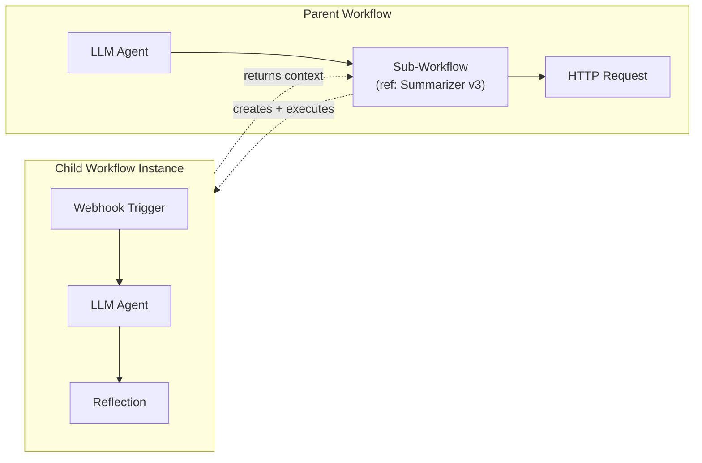

# Subgraphs / Nested Workflows

## Concept

A new **Sub-Workflow** node type that references a saved `WorkflowDefinition` by ID. When the DAG runner reaches this node, it creates a **child `WorkflowInstance`**, executes it inline, maps the child's output context back to the parent, and continues. Each child execution gets its own instance, logs, and checkpoints for full observability.



## Design Decisions

- **Child instance model**: Each sub-workflow run creates a real `WorkflowInstance` (not inline graph merging). This gives separate logs, checkpoints, and debuggability per sub-workflow invocation.
- **Synchronous inline execution**: The sub-workflow handler calls `execute_graph` directly within the parent's execution thread. No extra Celery task for the child.
- **Version policy**: Config supports `"latest"` (default) or a pinned version number. Pinned versions load from `workflow_snapshots`.
- **Recursion protection**: Before executing, walk the `parent_instance_id` chain and reject if the target `workflow_def_id` appears (cycle) or depth exceeds 10.
- **HITL limitation (v1)**: If a child workflow suspends (Human Approval node), the parent sub-workflow node **fails** with a clear error. Bubbling HITL through nested workflows is a v2 enhancement.
- **ForEach compatibility**: Sub-Workflow nodes work inside ForEach/Loop like any other node.

## Input / Output Mapping

- **Inputs**: The sub-workflow node config has an `inputMapping` object (`{ childTriggerKey: "expression" }`). Expressions are evaluated via `safe_eval` against parent context. The result becomes the child instance's `trigger_payload`, accessible as `{{ trigger.childTriggerKey }}` inside the child.
- **Outputs**: The child's cleaned `context_json` (all `node_*` keys) is returned as the sub-workflow node's output. Parent nodes downstream can reference `{{ node_X.node_Y.response }}` where `node_X` is the sub-workflow node and `node_Y` is a node inside the child.
- **Output key filter** (optional): Config allows specifying `outputNodeIds` to return only specific child node outputs instead of the entire child context.

---

## Phase 1: Data Model + Migration

### Add parent tracking to `WorkflowInstance`

File: [backend/app/models/workflow.py](backend/app/models/workflow.py)

Add two nullable columns to `WorkflowInstance`:

```python
parent_instance_id = Column(UUID(as_uuid=True), ForeignKey("workflow_instances.id"), nullable=True)
parent_node_id = Column(String, nullable=True)  # node_id in parent graph
```

These let us link child instances back to their parent for:
- Recursion detection (walk parent chain)
- UI drill-down (parent instance detail shows child instances)
- Cleanup (cancel parent cascades to children)

### New Alembic migration `0011_add_subworkflow_parent_tracking.py`

- Add `parent_instance_id` (UUID, FK to `workflow_instances.id`, nullable) and `parent_node_id` (String, nullable) to `workflow_instances`.
- Add index on `parent_instance_id` for fast child lookups.
- Apply RLS if the pattern from migration `0001` applies.

---

## Phase 2: Node Registry

### Add `sub_workflow` to `node_registry.json`

File: [shared/node_registry.json](shared/node_registry.json)

Add under a **new category** or under `logic`:

```json
{
  "type": "sub_workflow",
  "category": "logic",
  "label": "Sub-Workflow",
  "description": "Execute another saved workflow as a single step. Maps inputs from parent context to child trigger, and returns child outputs.",
  "icon": "Workflow",
  "config_schema": {
    "workflowId": {
      "type": "string",
      "description": "ID of the workflow definition to execute"
    },
    "versionPolicy": {
      "type": "string",
      "enum": ["latest", "pinned"],
      "default": "latest",
      "description": "Use the latest version or pin to a specific version"
    },
    "pinnedVersion": {
      "type": "integer",
      "default": 1,
      "description": "Version number to use when versionPolicy is pinned",
      "visibleWhen": { "field": "versionPolicy", "values": ["pinned"] }
    },
    "inputMapping": {
      "type": "object",
      "default": {},
      "description": "Map of child trigger keys to parent context expressions (evaluated via safe_eval)"
    },
    "outputNodeIds": {
      "type": "array",
      "items": { "type": "string" },
      "default": [],
      "description": "If set, only return outputs from these child node IDs. Empty = return all."
    },
    "maxDepth": {
      "type": "integer",
      "default": 10,
      "min": 1,
      "max": 20,
      "description": "Maximum nesting depth for recursion protection"
    }
  }
}
```

---

## Phase 3: Engine -- Execution Handler

### Add sub-workflow handler in `node_handlers.py`

File: [backend/app/engine/node_handlers.py](backend/app/engine/node_handlers.py)

New function `_handle_sub_workflow(node_data, context, tenant_id) -> dict`:

1. **Extract config**: `workflowId`, `versionPolicy`, `pinnedVersion`, `inputMapping`, `outputNodeIds`, `maxDepth`.
2. **Validate**: Ensure `workflowId` is set and the definition exists for this tenant.
3. **Resolve graph_json**: If `versionPolicy == "pinned"`, load from `workflow_snapshots` for that version (same logic as `_resolve_graph_json_for_version` in workflows.py). Otherwise use the live `graph_json`.
4. **Build trigger_payload**: For each key in `inputMapping`, evaluate the expression string against the parent `context` using `safe_eval`. Collect into a dict.
5. **Recursion check**: Read `_parent_chain` from context (list of `workflow_def_id`s). If `workflowId` is in it, or `len(_parent_chain) >= maxDepth`, raise error.
6. **Create child WorkflowInstance**: `status="running"`, `workflow_def_id=workflowId`, `trigger_payload=mapped_payload`, `parent_instance_id=context["_instance_id"]`, `parent_node_id=context["_current_node_id"]`.
7. **Set child context runtime keys**: Inject `_parent_chain = parent_chain + [workflowId]` so nested children inherit the chain.
8. **Call `execute_graph(db, child_instance_id)`**.
9. **Read result**: Reload child instance. If `status == "completed"`, extract `context_json`. If `outputNodeIds` is set, filter to only those keys. Return the filtered context as the node output. If `status == "suspended"`, raise an error with message about HITL limitation. If `status == "failed"`, raise with child error details.

### Wire dispatch in `node_handlers.py`

In the `dispatch_node` function, add a case before the category-based routing:

```python
if category == "logic" and label == "Sub-Workflow":
    return _handle_sub_workflow(node_data, context, tenant_id)
```

### Pass DB session to handler

Currently `dispatch_node` receives `(node_data, context, tenant_id)` but not `db`. The sub-workflow handler needs DB access to:
- Load the workflow definition
- Create the child instance
- Call `execute_graph`

**Approach**: Add an optional `db` parameter to `dispatch_node` signature. The `_execute_single_node` function in `dag_runner.py` already has `db` — pass it through. Non-sub-workflow handlers ignore it.

Updated signature:

```python
def dispatch_node(node_data, context, tenant_id, db=None) -> dict:
```

Update calls in `dag_runner.py`:
- `_execute_single_node`: pass `db=db` to `dispatch_node`
- `_run_node` (parallel): needs a DB session — create one from `SessionLocal` within the thread (already done for logging; extend to pass to dispatch)

---

## Phase 4: DAG Runner Adjustments

File: [backend/app/engine/dag_runner.py](backend/app/engine/dag_runner.py)

### Propagate `_parent_chain` through context

In `execute_graph`, before calling `_execute_ready_queue`, initialize `context["_parent_chain"]` from the instance's parent chain:

```python
# Build parent chain for recursion detection
parent_chain = []
inst = instance
while inst.parent_instance_id:
    parent_def = db.query(WorkflowInstance).get(inst.parent_instance_id)
    parent_chain.append(str(parent_def.workflow_def_id))
    inst = parent_def
context["_parent_chain"] = parent_chain
```

This is automatically available to the sub-workflow handler via context.

### Child instance cancellation

In the cancel flow, after setting `instance.cancel_requested = True`, also query and cancel any running child instances:

```python
children = db.query(WorkflowInstance).filter(
    WorkflowInstance.parent_instance_id == instance.id,
    WorkflowInstance.status.in_(["running", "queued"])
).all()
for child in children:
    child.cancel_requested = True
```

---

## Phase 5: API Enhancements

File: [backend/app/api/workflows.py](backend/app/api/workflows.py)

### Expose child instances in instance detail

When returning instance detail, include a `children` field listing any child instances (id, workflow name, status, node_id):

```python
children = db.query(WorkflowInstance).filter(
    WorkflowInstance.parent_instance_id == instance.id
).all()
```

File: [backend/app/api/schemas.py](backend/app/api/schemas.py)

Add `parent_instance_id`, `parent_node_id`, and `children` to `InstanceOut`.

### Add workflow list endpoint for sub-workflow picker

The existing `GET /api/v1/workflows` already returns all workflows for a tenant. The frontend sub-workflow picker can use this. No new endpoint needed, but consider adding a query param `?exclude_id={id}` to prevent a workflow from referencing itself.

---

## Phase 6: Frontend -- Sub-Workflow Node UI

### Workflow Selector Widget

File: [frontend/src/components/sidebar/DynamicConfigForm.tsx](frontend/src/components/sidebar/DynamicConfigForm.tsx)

Add a new form field type for `sub_workflow` nodes when the field key is `workflowId`:

- Fetch workflows via `api.listWorkflows()`
- Render a searchable `Select` dropdown showing workflow name + version
- Exclude the currently open workflow (prevent self-reference in UI)
- Show a small "Open" link/button to navigate to the selected child workflow

### Input Mapping Editor

For the `inputMapping` field (type `object`):

- Render a key-value pair editor
- **Key**: text input for the child trigger field name
- **Value**: `ExpressionInput` component (already exists) for parent context expressions
- Add/remove row buttons

### Output Node ID Picker

For `outputNodeIds` (type `array`):

- After a `workflowId` is selected, fetch that workflow's graph_json
- List the child workflow's node IDs/labels as checkboxes
- Selected nodes' outputs will be returned

### Node Rendering

File: [frontend/src/components/nodes/AgenticNode.tsx](frontend/src/components/nodes/AgenticNode.tsx)

- Show the referenced workflow name as a badge (fetch from workflow list or cache)
- Show version policy badge ("latest" or "v3")
- Standard input/output handles (like any action node)
- During execution, show child instance status

### Execution Panel -- Child Drill-Down

File: [frontend/src/components/toolbar/ExecutionPanel.tsx](frontend/src/components/toolbar/ExecutionPanel.tsx)

- When a sub-workflow node's log is expanded, show a "View Child Execution" link
- Clicking opens the child instance's logs inline (expandable) or in a new panel
- Child logs are fetched via `api.getInstanceDetail(childInstanceId)`

---

## Phase 7: Validation

File: [backend/app/engine/config_validator.py](backend/app/engine/config_validator.py)

Add validation for `Sub-Workflow` nodes:

- `workflowId` must reference an existing `WorkflowDefinition` for the tenant
- If `versionPolicy == "pinned"`, the `pinnedVersion` must exist in `workflow_snapshots`
- Static cycle detection: walk referenced workflows' `graph_json` for transitive sub-workflow references. Flag if a cycle is found.

File: [frontend/src/lib/validation.ts](frontend/src/lib/validation.ts) (or wherever `validateWorkflow` lives)

- Warning if `workflowId` is empty
- Warning if child workflow contains Human Approval nodes (HITL not supported in v1)

---

## v1 Limitations (documented, addressed in future iterations)

1. **No HITL bubbling**: Child workflows with Human Approval nodes will cause the sub-workflow node to fail. Workaround: avoid Human Approval in workflows intended as sub-workflows.
2. **No live streaming from child**: Token streaming SSE events only emit for the parent instance. Child LLM streaming is not forwarded to the parent's SSE channel.
3. **Sequential only**: If a ForEach iterates over sub-workflow nodes, each child executes sequentially (thread pool parallelism applies at the parent level, but each sub-workflow node's handler is blocking).
4. **No visual nesting**: The canvas does not render the child graph inline. Users must "Open" the child workflow in a separate view.

---

## File Change Summary

| File | Change |
|------|--------|
| [shared/node_registry.json](shared/node_registry.json) | Add `sub_workflow` node type with config schema |
| [backend/app/models/workflow.py](backend/app/models/workflow.py) | Add `parent_instance_id`, `parent_node_id` columns |
| `backend/alembic/versions/0011_*.py` | New migration for parent tracking columns |
| [backend/app/engine/node_handlers.py](backend/app/engine/node_handlers.py) | Add `_handle_sub_workflow`, update `dispatch_node` signature to accept `db` |
| [backend/app/engine/dag_runner.py](backend/app/engine/dag_runner.py) | Pass `db` to `dispatch_node`, init `_parent_chain`, cascade cancel to children |
| [backend/app/engine/config_validator.py](backend/app/engine/config_validator.py) | Validate sub-workflow references and detect static cycles |
| [backend/app/api/workflows.py](backend/app/api/workflows.py) | Expose children in instance detail |
| [backend/app/api/schemas.py](backend/app/api/schemas.py) | Add parent/children fields to instance schema |
| [frontend/src/components/sidebar/DynamicConfigForm.tsx](frontend/src/components/sidebar/DynamicConfigForm.tsx) | Workflow selector, input mapping editor, output node picker |
| [frontend/src/components/nodes/AgenticNode.tsx](frontend/src/components/nodes/AgenticNode.tsx) | Sub-workflow badge rendering |
| [frontend/src/components/toolbar/ExecutionPanel.tsx](frontend/src/components/toolbar/ExecutionPanel.tsx) | Child instance drill-down |
| [frontend/src/lib/validation.ts](frontend/src/lib/validation.ts) | Sub-workflow validation rules |
