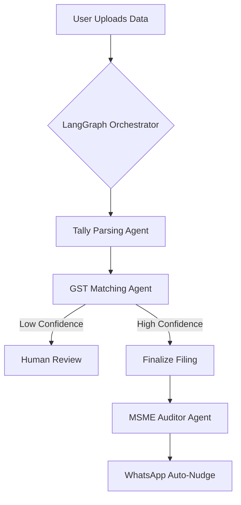

# Plan: Unified Agentic Compliance Transformation

This plan replaces the manual, rule-heavy logic in `sraralreturns3` and `tallyconnector` with an Agentic AI architecture. We will use **LangGraph** for workflow orchestration (state management, retries, human-in-the-loop) and **PydanticAI** for structured, type-safe agent interactions.

## Phase 1: Infrastructure & Core Service Updates

1. **Update Dependencies**: Add `langgraph`, `pydantic-ai`, and `google-cloud-aiplatform` to `django_backend/requirements.txt`.
2. **Core Agent Service**: Create [`django_backend/apps/core/services/base_agent.py`](django_backend/apps/core/services/base_agent.py) to wrap Gemini 2.5 with PydanticAI configurations, ensuring all agent outputs follow strict schemas.

## Phase 2: Agentic GST Reconciliation

1. **Match Agent**: Build a PydanticAI agent in [`django_backend/apps/gst/modules/agentic_matcher.py`](django_backend/apps/gst/modules/agentic_matcher.py) that reasons about invoice discrepancies (prefixes, dates, rounded amounts).
2. **LangGraph Workflow**: Replace the loop in [`django_backend/apps/gst/modules/reconciliation_module.py`](django_backend/apps/gst/modules/reconciliation_module.py) with a state machine:

    - **Node 1 (Exact)**: Fast lookup for identical matches.
    - **Node 2 (Search)**: Identify potential candidates in GSTR-2B.
    - **Node 3 (Reason)**: The Match Agent analyzes candidates.
    - **Node 4 (Human-in-the-loop)**: Pauses execution for CA approval if confidence < 85%.

## Phase 3: Intelligent Tally Connector

1. **Semantic Mapper**: Replace the hardcoded `column_mappings` in [`django_backend/apps/gst/modules/tally_parser.py`](django_backend/apps/gst/modules/tally_parser.py) with an agent that identifies columns semantically (e.g., "Vch No" -> "invoice_no").
2. **Entity Extractor**: Update [`connector/jobs.py`](connector/jobs.py) to use an LLM-based tool for extracting `VOUCHERKEY` and `MASTERID` from complex Tally XML, replacing current regex patterns.

## Phase 4: MSME Compliance Auditor (Section 43B(h))

1. **Compliance Agent**: Create an agent to analyze `PULL_PAYMENTS` and `PULL_PURCHASE` data.
2. **Logic**:

    - Identify MSME status using `SurepassService`.
    - Calculate payment delays (45-day rule).
    - Generate proactive "Nudge" messages via `WhatsAppService` for pending payments.

## Phase 5: Persistence & UI

1. **Agent State Store**: Use Django models to persist LangGraph checkpoints so reconciliations can be resumed across sessions.
2. **Review Dashboard**: Add a "Review Required" tab in the frontend [`frontend/web/src/components/gst/ReconciliationResults.tsx`](frontend/web/src/components/gst/ReconciliationResults.tsx) to display agent reasoning and allow one-click approvals.

### Visual Workflow

